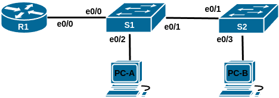
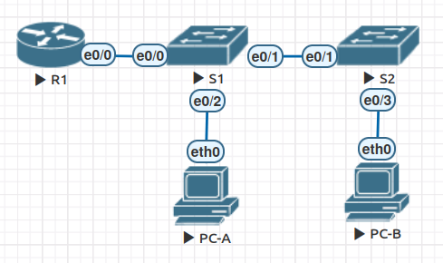

# Домашнее задание №1 «VLAN и маршрутизация между VLAN»

## Топология



## Таблица адресации

| Устройство | Интерфейс | IP-адрес     | Маска подсети | Шлюз по умолчанию |
| ---------- | --------- | ------------ | ------------- | ----------------- |
| R1         | e0/0.3    | 192.168.3.1  | 255.255.255.0 | N/A               |
|            | e0/0.4    | 192.168.4.1  | 255.255.255.0 |                   |
|            | e0/0.8    | N/A          | N/A           |                   |
| S1         | VLAN 3    | 192.168.3.11 | 255.255.255.0 | 192.168.3.1       |
| S2         | VLAN 3    | 192.168.3.12 | 255.255.255.0 | 192.168.3.1       |
| PC-A       | NIC       | 192.168.3.3  | 255.255.255.0 | 192.168.3.1       |
| PC-B       | NIC       | 192.168.4.3  | 255.255.255.0 | 192.168.4.1       |

## Таблица VLAN

| VLAN | Имя         | Назначенный интерфейс                |
| ---- | ----------- | ------------------------------------ |
| 3    | Management  | S1: VLAN 3<br>S2: VLAN 3<br>S1: e0/2 |
| 4    | Operations  | S2: e0/3                             |
| 7    | Parking_Lot | S1: e0/4<br>S2: e0/0, e0/2           |
| 8    | Native      | N/A                                  |

## Задачи

* [Часть 1. Создание сети и настройка основных параметров устройства.](#часть-1-создание-сети-и-настройка-основных-параметров-устройства)
* [Часть 2. Создание сетей VLAN и назначение портов коммутаторов.](#часть-2-создание-сетей-vlan-и-назначение-портов-коммутаторов)
* [Часть 3. Настройка магистрального канала между коммутаторами.](#часть-3-настройка-магистрального-канала-между-коммутаторами)
* [Часть 4. Настройка маршрутизации между сетями VLAN.](#часть-4-настройка-маршрутизации-между-сетями-vlan)
* [Часть 5. Проверка маршрутизации между сетями VLAN.](#часть-5-проверка-маршрутизации-между-сетями-vlan)

## Общие сведения/сценарий

Современные коммутаторы используют виртуальные локальные сети (VLAN) для
предоставления услуг сегментации, традиционно предоставляемых маршрутизаторами в
конфигурациях LAN. VLAN решают вопросы масштабируемости, безопасности и управления
сетью. В целом, VLAN облегчают проектирование сети для поддержки целей организации.
Для связи между VLAN требуется устройство, работающее на уровне 3 модели OSI.
Маршрутизаторы в топологиях VLAN обеспечивают дополнительную безопасность и
управление потоками трафика.

Транки VLAN используются для охвата VLAN несколькими устройствами. Транки позволяют
трафику из нескольких VLAN перемещаться по одному каналу, сохраняя при этом
идентификацию и сегментацию VLAN нетронутыми. Особый вид маршрутизации между VLAN,
называемый «Роутер-на-палочке» («Router-On-A-Stick»), использует транк от
маршрутизатора к коммутатору, чтобы все VLAN могли пройти к маршрутизатору.

В этой лабораторной работе мы создадим VLAN на обоих коммутаторах в топологии,
назначим VLAN портам доступа коммутатора, проверим, что VLAN работают должным
образом, создадим каналы VLAN между двумя коммутаторами и между S1 и R1 и
настроим межвлановую маршрутизацию на R1, чтобы позволить хостам в разных VLAN
взаимодействовать, независимо от того, в какой подсети находится хост.

**Примечание:** Маршрутизаторы, используемые в практических лабораторных работах
CCNA, — Cisco 4221 с Cisco IOS XE версии 16.9.4 (образ universalk9). Коммутаторы,
используемые в лабораторных работах, — Cisco Catalyst 2960 с Cisco IOS версии 15.2(2)
(образ lanbasek9). Могут использоваться другие маршрутизаторы, коммутаторы и версии
Cisco IOS. В зависимости от модели и версии Cisco IOS доступные команды и выводимые
результаты могут отличаться от показанных в лабораторных работах. Правильные
идентификаторы интерфейсов см. в сводной таблице интерфейсов маршрутизаторов в
конце лабораторной работы.

**Примечание:** убедитесь, что маршрутизаторы и коммутаторы стёрты и не имеют
конфигураций запуска. Если вы не уверены, обратитесь к инструктору.

**Примечание:** данная лабораторная работа, как и другие в этом курсе выполнялась
в среде EVE-NG. Названия интерфейсов изменены на фактически используемые (вместо
F0/0 или G0/0 используются e0/0 и т.п.).

## Часть 1. Создание сети и настройка основных параметров устройства

Для моделирования сети будем использовать ПО EVE-NG 5.0.1-24. Создадим
новую конфигурацию, используя следующие ресурсы:

* 1 маршрутизатор (Cisco IOL, образ L3-ADVENTERPRISEK9-M-15.4-2T);
* 2 коммутатора (Cisco IOL, образ L2-ADVENTERPRISEK9-M-15.2-20150703);
* 2 ПК (Eve-NG Virtual PC).

### Шаг 1. Создание сети

Соединим устройства согласно топологии.



### Шаг 2. Настройка маршрутизатора

Настроим базовые параметры для маршрутизатора.

#### a. Активация привилегированного режима

Подключимся к маршрутизатору с помощью консоли и активируем привилегированный
режим EXEC:

```text
Router>enable
Router#
```

#### b. Вход в режим конфигурации

Войдём в режим конфигурации:

```text
Router#conf t
Enter configuration commands, one per line.  End with CNTL/Z.
Router(config)#
```

#### c. Смена имени устройства

Для удобства сменим имя маршрутизатора на R1:

```text
Router(config)#host R1
R1(config)#
```

#### d. Отключение поиска DNS

Чтобы предотвратить попытки маршрутизатора неверно преобразовывать введённые
команды таким образом, как будто они являются именами узлов, отключим поиск DNS:

```text
R1(config)#no ip domain-lookup
R1(config)#
```

#### e. Установка пароля привилегированного режима

Назначим **class** в качестве зашифрованного пароля привилегированного режима EXEC:

```text
R1(config)#enable secret class
R1(config)#
```

#### f. Установка пароля консоли

Назначим **cisco** в качестве пароля консоли и включим вход в систему по паролю:

```text
R1(config)#line con 0
R1(config-line)#passw cisco
R1(config-line)#login
R1(config-line)#exit
R1(config)#
```

#### g. Установка пароля VTY

Назначим **cisco** в качестве пароля VTY и включим вход в систему по паролю:

```text
R1(config)#line vty 0 4
R1(config-line)#passw cisco
R1(config-line)#login
R1(config-line)#exit
R1(config)#
```

#### h. Включение шифрования паролей

Зашифруем открытые пароли в файле конфигурации:

```text
R1(config)#service password-encryption
R1(config)#
```

#### i. Создание баннера

Создадим баннер, который предупреждает о запрете несанкционированного доступа:

```text
R1(config)#
R1(config)#banner motd $ ATTENTION! Unauthorized access is strictly prohibited. $
R1(config)#
```

#### j. Сохранение конфигурации

```text
R1#copy run start
Destination filename [startup-config]? 
Building configuration...
[OK]
R1#
```

<details>
<summary>show running-config</summary>

```text
R1#show run
Building configuration...

Current configuration : 1128 bytes
!
! Last configuration change at 21:54:31 UTC Wed Apr 30 2025
! NVRAM config last updated at 21:54:39 UTC Wed Apr 30 2025
!
version 15.4
service timestamps debug datetime msec
service timestamps log datetime msec
service password-encryption
!
hostname R1
!
boot-start-marker
boot-end-marker
!
!
enable secret 5 $1$cAKq$ALs4Jn4zeIluqaZywN8AT.
!
no aaa new-model
mmi polling-interval 60
no mmi auto-configure
no mmi pvc
mmi snmp-timeout 180
!
!
!
!
!
!
!
!


!
!
!
!
no ip domain lookup
ip cef
no ipv6 cef
!
multilink bundle-name authenticated
!
!
!
!         
!
!
!
!
!
redundancy
!
!
! 
!
!
!
!
!
!
!
!
!
!
!
!
interface Ethernet0/0
 no ip address
 shutdown
!
interface Ethernet0/1
 no ip address
 shutdown
!
interface Ethernet0/2
 no ip address
 shutdown
!
interface Ethernet0/3
 no ip address
 shutdown
!
ip forward-protocol nd
!
!
no ip http server
no ip http secure-server
!
!
!
!         
control-plane
!
!
!
!
!
!
!
banner motd ^C ATTENTION! Unauthorized access is strictly prohibited. ^C
!
line con 0
 password 7 1511021F0725
 logging synchronous
 login
line aux 0
line vty 0 4
 password 7 070C285F4D06
 login
 transport input none
!
!
end
          
R1#
```

</details>

#### k. Настройка часов

Зададим актуальное время на роутере.

```text
R1#clock set 21:47:00 30 Apr 2025  
R1#
*Apr 30 21:47:00.000: %SYS-6-CLOCKUPDATE: System clock has been updated from 11:47:19 UTC Wed Apr 30 2025 to 21:47:00 UTC Wed Apr 30 2025, configured from console by console.
R1#show clock
21:47:06.306 UTC Wed Apr 30 2025
R1#
```

### Шаг 3. Настройка коммутаторов

Настроим базовые параметры каждого коммутатора.

#### a. Установка имени устройства

Подключимся к коммутатору с помощью консольного подключения и активируем
привилегированный режим:

```text
Switch>en
Switch#
```

#### b. Вход в режим конфигурации

Войдём в режим конфигурации:

```text
Switch#conf t
Enter configuration commands, one per line.  End with CNTL/Z.
Switch(config)#
```

#### c. Смена имени устройства

Для удобства сменим имена коммутаторов на S1 и S2:

```text
Switch(config)#host S1
S1(config)#
```

#### d. Отключение поиска DNS

Чтобы предотвратить попытки коммутатора неверно преобразовывать введённые
команды таким образом, как будто они являются именами узлов, отключим поиск DNS:

```text
S1(config)#no ip domain-lookup
S1(config)#
```

#### e. Установка пароля привилегированного режима

Назначим **class** в качестве зашифрованного пароля привилегированного режима EXEC:

```text
S1(config)#enable secret class
S1(config)#
```

#### f. Установка пароля консоли

Назначим **cisco** в качестве пароля консоли и включим вход в систему по паролю:

```text
S1(config)#line con 0
S1(config-line)#passw cisco
S1(config-line)#login
S1(config-line)#exit
S1(config)#
```

#### g. Установка пароля VTY

Назначим **cisco** в качестве пароля VTY и включим вход в систему по паролю:

```text
S1(config)#line vty 0 4
S1(config-line)#passw cisco
S1(config-line)#login
S1(config-line)#exit
S1(config)#
```

#### h. Включение шифрования паролей

Зашифруем открытые пароли в файле конфигурации:

```text
S1(config)#service password-encryption
S1(config)#
```

#### i. Создание баннера

Создадим баннер, который предупреждает о запрете несанкционированного доступа:

```text
S1(config)#banner motd $ ATTENTION! Unauthorized access is strictly prohibited. $
S1(config)#
```

#### j. Настройка часов

Зададим актуальное время на коммутаторах.

```text
S1#clock set 22:31:00 30 Apr 2025
S1#
*Apr 30 22:31:00.000: %SYS-6-CLOCKUPDATE: System clock has been updated from 12:31:39 UTC Wed Apr 30 2025 to 22:31:00 UTC Wed Apr 30 2025, configured from console by console.
S1#
```

#### j. Сохранение конфигурации

```text
S1#copy run start
Destination filename [startup-config]? 
Building configuration...
Compressed configuration from 964 bytes to 703 bytes[OK]
S1#
```

<details>
<summary>show run</summary>

```text
S1#show run
Building configuration...

Current configuration : 964 bytes
!
! Last configuration change at 12:28:53 UTC Wed Apr 30 2025
! NVRAM config last updated at 22:31:34 UTC Wed Apr 30 2025
!
version 15.2
service timestamps debug datetime msec
service timestamps log datetime msec
service password-encryption
service compress-config
!
hostname S1
!
boot-start-marker
boot-end-marker
!
!
enable secret 5 $1$fED0$8szIU9m46w4nor.r2gzZD0
!
no aaa new-model
!
!
!         
!
!
!
!
!
no ip domain-lookup
ip cef
no ipv6 cef
!
!
spanning-tree mode pvst
spanning-tree extend system-id
!
vlan internal allocation policy ascending
!
! 
!
!
!
!
!
!
!         
!
!
!
!
interface Ethernet0/0
!
interface Ethernet0/1
!
interface Ethernet0/2
!
interface Ethernet0/3
!
ip forward-protocol nd
!
no ip http server
no ip http secure-server
!
!
!
!
!
!
control-plane
!
banner motd ^C ATTENTION! Unauthorized access is strictly prohibited. ^C
!
line con 0
 password 7 13061E010803
 logging synchronous
 login
line aux 0
line vty 0 4
 password 7 14141B180F0B
 login
!
!
end

S1# 
```

</details>

Аналогичным образом настроим второй коммутатор. Так как команды и вывод будут
идентичными первому, то опустим их.

### Шаг 4. Настройка узлов ПК

Зададим IP-адреса, маску подсети и шлюз по умолчанию для компьютеров PC-A и
PC-B согласно таблице адресации.

```text
VPCS> set pcname PC-A

PC-A> ip 192.168.3.3 255.255.255.0 192.168.3.1
Checking for duplicate address...
PC-A : 192.168.3.3 255.255.255.0 gateway 192.168.3.1

PC-A> show ip

NAME        : PC-A[1]
IP/MASK     : 192.168.3.3/24
GATEWAY     : 192.168.3.1
DNS         : 
MAC         : 00:50:79:66:68:04
LPORT       : 20000
RHOST:PORT  : 127.0.0.1:30000
MTU         : 1500

PC-A> save
Saving startup configuration to startup.vpc
.  done

PC-A> 
```

Аналогично для PC-B.

## Часть 2. Создание сетей VLAN и назначение портов коммутаторов

Во второй части создадим на обоих коммутаторах VLAN, как указано в таблице выше.
Затем назначим VLAN соответствующему интерфейсу и проверим настройки
конфигурации.

### Шаг 1. Настройка сети VLAN на коммутаторах

#### a. Создание VLAN

Создадим и настроим необходимые VLAN на каждом коммутаторе согласно таблице
адресации.

```text
S1(config)#vlan 3
S1(config-vlan)#name Management
S1(config-vlan)#exit
S1(config)#vlan 4
S1(config-vlan)#name Operations
S1(config-vlan)#exit
S1(config)#vlan 7
S1(config-vlan)#name ParkingLot
S1(config-vlan)#exit
S1(config)#vlan 8
S1(config-vlan)#name Native
S1(config-vlan)#end
S1#
*May  1 00:28:26.390: %SYS-5-CONFIG_I: Configured from console by console
S1#
```

#### b. Настройка SVI

Настроим интерфейс управления и шлюз по умолчанию на каждом коммутаторе,
используя информацию об IP-адресе в таблице адресации.

Определение маршрута по умолчанию зависит от используемой среды эмуляции. Т.к. мы
работаем в EVE-NG, то вместо традиционной для Cisco Packet Tracer команды
**ip default-gateway**, зададим маршрут явно с помощью **ip route**.

Коммутатор **S1**:

```text
S1(config)#int vl 3 
S1(config-if)#
*May  1 00:46:07.489: %LINEPROTO-5-UPDOWN: Line protocol on Interface Vlan3, changed state to down
S1(config-if)#ip addr 192.168.3.11 255.255.255.0
S1(config-if)#no shut
S1(config-if)#exit
S1(config)#ip route 0.0.0.0 0.0.0.0 192.168.3.1
S1(config)#
```

Коммутатор **S2**:

```text
S2(config)#int vl 3
S2(config-if)#
*May  1 00:48:20.698: %LINEPROTO-5-UPDOWN: Line protocol on Interface Vlan3, changed state to down
S2(config-if)#ip addr 192.168.3.12 255.255.255.0
S2(config-if)#no shut
S2(config-if)#exit
S2(config)#ip route 0.0.0.0 0.0.0.0 192.168.3.1
S2(config)#end
S2#
```

#### c. Назначение неиспользуемых портов

Назначим все неиспользуемые порты коммутатора VLAN ParkingLot, настроим их для
статического режима доступа и административно деактивируем их.

**Примечание:** команда **interface range** полезна для выполнения этой задачи с
минимальным количеством команд.

Коммутатор **S1** (сообщения о деактивации интерфейса опущены для краткости):

```text
S1(config)#int e0/3
S1(config-if)#sw m ac
S1(config-if)#sw ac vl 7
S1(config-if)#shut
S1(config-if)#end
S1#
```

Коммутатор **S2** (сообщения о деактивации интерфейса опущены для краткости):

```text
S2(config)#int e0/0
S2(config-if)#sw m ac
S2(config-if)#sw ac vl 7
S2(config-if)#shut
S2(config-if)#exit
S2(config)#int e0/2
S2(config-if)#sw m ac
S2(config-if)#sw ac vl 7
S2(config-if)#shut
S2(config-if)#end
S2#
```

### Шаг 2. Присвоение VLAN соответствующим интерфейсам коммутатора

#### a. Назначение используемых портов

Назначим используемые порты соответствующей VLAN (указанной в таблице VLAN выше)
и настроим их для режима статического доступа.

Коммутатор **S1**:

```text
S1(config)#int e0/2
S1(config-if)#sw m ac
S1(config-if)#sw ac vl 3
S1(config-if)#no shut
S1(config-if)#end
S1#
```

Коммутатор **S2**:

```text
S2(config)#int e0/3
S2(config-if)#sw m ac 
S2(config-if)#sw ac vl 4
S2(config-if)#no shut
S2(config-if)#end
S2#
```

#### b. Проверка настроек VLAN

Убедимся, что VLAN назначены на правильные интерфейсы, выполнив команду
**show vlan brief**.

Коммутатор **S1**:

```text
S1#show vlan brief

VLAN Name                             Status    Ports
---- -------------------------------- --------- -------------------------------
1    default                          active    Et0/0, Et0/1
3    Management                       active    Et0/2
4    Operations                       active    
7    ParkingLot                       active    Et0/3
8    Native                           active    
1002 fddi-default                     act/unsup 
1003 token-ring-default               act/unsup 
1004 fddinet-default                  act/unsup 
1005 trnet-default                    act/unsup 
S1#
```

Коммутатор **S2**:

```text
S2#show vlan brief

VLAN Name                             Status    Ports
---- -------------------------------- --------- -------------------------------
1    default                          active    Et0/1
3    Management                       active    
4    Operations                       active    Et0/3
7    ParkingLot                       active    Et0/0, Et0/2
8    Native                           active    
1002 fddi-default                     act/unsup 
1003 token-ring-default               act/unsup 
1004 fddinet-default                  act/unsup 
1005 trnet-default                    act/unsup 
S2#
```

## Часть 3. Настройка магистрального канала между коммутаторами

В части 3 мы вручную настроим интерфейс **F0/1** как магистральный канал (транк).

### Шаг 1. Настройка магистрального интерфейса на коммутаторах

Вручную настроим магистральный интерфейс **F0/1** на коммутаторах **S1** и **S2**.

#### a. Настройка транка на интерфейсе e0/1

Зададим статический транкинг на интерфейсе e0/1 для обоих коммутаторов.

В отличие от Cisco Packet Tracer при работе с используемым образом свитча в
EVE-NG потребовалось явно задать тип инкапсуляции
(**switchport trunk encapsulation dot1q**) перед переводом порта в транк.

```text
S1(config)#int e0/1              
S1(config-if)#sw tr enc dot1q
S1(config-if)#sw m tr
S1(config-if)#
```

#### b. Установка native VLAN 1000

Определим VLAN 8 в качестве native на обоих коммутаторах:

```text
S1(config-if)#sw tr nat vl 8
S1(config-if)#
```

#### c. Настройка допустимых VLAN для транка

Укажем, что только VLAN 3, 4 и 8 могут проходить по транку:

```text
S1(config-if)#sw tr all vl 3,4,8
S1(config-if)#end
S1#
```

#### d. Проверка настроек

Проверим транки, native VLAN и разрешённые VLAN.

```text
S1#show interfaces trunk

Port        Mode             Encapsulation  Status        Native vlan
Et0/1       on               802.1q         trunking      8

Port        Vlans allowed on trunk
Et0/1       3-4,8

Port        Vlans allowed and active in management domain
Et0/1       3-4,8

Port        Vlans in spanning tree forwarding state and not pruned
Et0/1       3-4,8
S1#
```

### Шаг 2. Настройка магистрального интерфейса до маршрутизатора

Настроим вручную магистральный интерфейс **e0/0** на коммутаторе **S1**.

#### a. Настройка интерфейса S1 e0/0

Настроим **S1** **e0/0** (транк до маршрутизатора) с теми же параметрами,
что и **e0/1**.

```text
S1(config)#int e0/0
S1(config-if)#sw tr enc dot1q
S1(config-if)#sw m tr
S1(config-if)#sw tr nat vl 8
S1(config-if)#sw tr all vl 3,4,8
S1(config-if)#end
S1#
```

#### b. Сохранение конфигурации

Сохраним текущую конфигурацию в файл загрузочной конфигурации.

```text
S1#copy run start  
Destination filename [startup-config]? 
Building configuration...
Compressed configuration from 1367 bytes to 913 bytes[OK]
S1#
```

```text
S2#copy run start
Destination filename [startup-config]? 
Building configuration...
Compressed configuration from 1297 bytes to 881 bytes[OK]
S2#
```

<details>
<summary>S1# show running-config</summary>

```text
S1#sh run          
Building configuration...

Current configuration : 1367 bytes
!
! Last configuration change at 05:34:05 UTC Thu May 1 2025
!
version 15.2
service timestamps debug datetime msec
service timestamps log datetime msec
service password-encryption
service compress-config
!
hostname S1
!
boot-start-marker
boot-end-marker
!
!
enable secret 5 $1$fED0$8szIU9m46w4nor.r2gzZD0
!
no aaa new-model
!
!
!
!         
!
!
!
!
no ip domain-lookup
ip cef
no ipv6 cef
!
!
spanning-tree mode pvst
spanning-tree extend system-id
!
vlan internal allocation policy ascending
!
! 
!
!
!
!
!
!
!
!         
!
!
!
interface Ethernet0/0
 switchport trunk allowed vlan 3,4,8
 switchport trunk encapsulation dot1q
 switchport trunk native vlan 8
 switchport mode trunk
!
interface Ethernet0/1
 switchport trunk allowed vlan 3,4,8
 switchport trunk encapsulation dot1q
 switchport trunk native vlan 8
 switchport mode trunk
!
interface Ethernet0/2
 switchport access vlan 3
 switchport mode access
!
interface Ethernet0/3
 switchport access vlan 7
 switchport mode access
 shutdown 
!
interface Vlan3
 ip address 192.168.3.11 255.255.255.0
!
ip forward-protocol nd
!
no ip http server
no ip http secure-server
!
ip route 0.0.0.0 0.0.0.0 192.168.3.1
!
!
!
!
!
control-plane
!
banner motd ^C ATTENTION! Unauthorized access is strictly prohibited. ^C
!
line con 0
 password 7 13061E010803
 logging synchronous
 login    
line aux 0
line vty 0 4
 password 7 14141B180F0B
 login
!
!
end

S1#
```

</details>

<details>
<summary>S2# show running-config</summary>

```text
S2#sh run
Building configuration...

Current configuration : 1297 bytes
!
! Last configuration change at 05:35:53 UTC Thu May 1 2025
!
version 15.2
service timestamps debug datetime msec
service timestamps log datetime msec
service password-encryption
service compress-config
!
hostname S2
!
boot-start-marker
boot-end-marker
!
!
enable secret 5 $1$cC/x$g2zcLWqTI1aTE9KYrCDdD.
!
no aaa new-model
!
!
!
!         
!
!
!
!
no ip domain-lookup
ip cef
no ipv6 cef
!
!
spanning-tree mode pvst
spanning-tree extend system-id
!
vlan internal allocation policy ascending
!
! 
!
!
!
!
!
!
!
!         
!
!
!
interface Ethernet0/0
 switchport access vlan 7
 switchport mode access
 shutdown
!
interface Ethernet0/1
 switchport trunk allowed vlan 3,4,8
 switchport trunk encapsulation dot1q
 switchport trunk native vlan 8
 switchport mode trunk
!
interface Ethernet0/2
 switchport access vlan 7
 switchport mode access
 shutdown
!
interface Ethernet0/3
 switchport access vlan 4
 switchport mode access
!         
interface Vlan3
 ip address 192.168.3.12 255.255.255.0
!
ip forward-protocol nd
!
no ip http server
no ip http secure-server
!
ip route 0.0.0.0 0.0.0.0 192.168.3.1
!
!
!
!
!
control-plane
!
banner motd ^C ATTENTION! Unauthorized access is strictly prohibited. ^C
!
line con 0
 password 7 00071A150754
 logging synchronous
 login
line aux 0
line vty 0 4
 password 7 00071A150754
 login
!
!
end

S2#
```

</details>

#### c. Проверка транкинга

Проверим настройки магистральных портов на **S1**:

```text
S1#show interfaces trunk

Port        Mode             Encapsulation  Status        Native vlan
Et0/0       on               802.1q         trunking      8
Et0/1       on               802.1q         trunking      8

Port        Vlans allowed on trunk
Et0/0       3-4,8
Et0/1       3-4,8

Port        Vlans allowed and active in management domain
Et0/0       3-4,8
Et0/1       3-4,8

Port        Vlans in spanning tree forwarding state and not pruned
Et0/0       3-4,8
Et0/1       3-4,8
S1#
```

В методичке спрашивалось, почему магистральный порт до маршрутизатора не
присутствует в списке транков. В моём случае он там есть, возможно разница
в реализации между CPT и EVE-NG.

## Часть 4. Настройка маршрутизации между сетями VLAN

Настроим маршрутизацию между сетями VLAN, используя **R1** в качестве "Router-on-a-Stick".

### Шаг 1. Настройка маршрутизатора

#### a. Активация интерфейса на маршрутизаторе

Активируем интерфейс **e0/1** на маршрутизаторе **R1**:

```text
R1(config)#int e0/0
R1(config-if)#desc Trunk link to S1
R1(config-if)#no shut
R1(config-if)#exit
R1(config)#
```

#### b. Настройка подинтерфейсов

Настроим подинтерфейсы (сабинтерфейсы) для каждой VLAN, как указано в таблице
IP-адресации. Все подинтерфейсы используют инкапсуляцию 802.1Q. Убедимся, что
подинтерфейсу для native VLAN не назначен IP-адрес. Включим описание для
каждого подинтерфейса.

**VLAN 3**:

```text
R1(config)#int e0/0.3
R1(config-subif)#desc Default GW for VLAN 3
R1(config-subif)#enc dot1q 3
R1(config-subif)#ip addr 192.168.3.1 255.255.255.0
R1(config-subif)#exit
R1(config)#
```

Для VLAN 4 команды будут аналогичны, только изменится номер VLAN и IP адрес.
Для нативной VLAN адреса не будет, также укажем тип инкапсуляции native.

**VLAN 8**:

```text
R1(config)#int e0/0.8
R1(config-subif)#desc Native VLAN
R1(config-subif)#enc dot1q 8 native
R1(config-subif)#exit
R1(config)#
```

#### c. Проверка сабинтерфейсов

Убедимся, что подинтерфейсы работают.

```text
R1#show ip interface brief
Interface                  IP-Address      OK? Method Status                Protocol
Ethernet0/0                unassigned      YES NVRAM  up                    up      
Ethernet0/0.3              192.168.3.1     YES manual up                    up      
Ethernet0/0.4              192.168.4.1     YES manual up                    up      
Ethernet0/0.8              unassigned      YES unset  up                    up      
Ethernet0/1                unassigned      YES NVRAM  administratively down down    
Ethernet0/2                unassigned      YES NVRAM  administratively down down    
Ethernet0/3                unassigned      YES NVRAM  administratively down down    
R1#
```

```text
R1#copy run start
Destination filename [startup-config]? 
Building configuration...
[OK]
R1#
```

<details>
<summary>R1# show running-config</summary>

```text
R1#sh run
Building configuration...

Current configuration : 1412 bytes
!
! Last configuration change at 05:04:37 UTC Thu May 1 2025
!
version 15.4
service timestamps debug datetime msec
service timestamps log datetime msec
service password-encryption
!
hostname R1
!
boot-start-marker
boot-end-marker
!
!
enable secret 5 $1$cAKq$ALs4Jn4zeIluqaZywN8AT.
!
no aaa new-model
mmi polling-interval 60
no mmi auto-configure
no mmi pvc
mmi snmp-timeout 180
!         
!
!
!
!
!
!
!


!
!
!
!
no ip domain lookup
ip cef
no ipv6 cef
!
multilink bundle-name authenticated
!
!
!
!
!         
!
!
!
!
redundancy
!
!
! 
!
!
!
!
!
!
!
!
!
!
!
!
interface Ethernet0/0
 description Trunk link to S1
 no ip address
!
interface Ethernet0/0.3
 description Default GW for VLAN 3
 encapsulation dot1Q 3
 ip address 192.168.3.1 255.255.255.0
!
interface Ethernet0/0.4
 description Default GW for VLAN 4
 encapsulation dot1Q 4
 ip address 192.168.4.1 255.255.255.0
!
interface Ethernet0/0.8
 description Native VLAN
 encapsulation dot1Q 8 native
!
interface Ethernet0/1
 no ip address
 shutdown
!
interface Ethernet0/2
 no ip address
 shutdown
!         
interface Ethernet0/3
 no ip address
 shutdown
!
ip forward-protocol nd
!
!
no ip http server
no ip http secure-server
!
!
!
!
control-plane
!
!
!
!
!
!
!
banner motd ^C ATTENTION! Unauthorized access is strictly prohibited. ^C
!         
line con 0
 password 7 1511021F0725
 logging synchronous
 login
line aux 0
line vty 0 4
 password 7 070C285F4D06
 login
 transport input none
!
!
end

R1#

```

</details>

## Часть 5. Проверка маршрутизации между сетями VLAN

### Шаг 1. Проверка маршрутизации с ПК PC-A

Выполним тесты маршрутизации с **PC-A**. Всё должно быть успешно.

**Примечание:** возможно, придётся отключить брандмауэр ПК для работы **ping**.

#### a. Проверка связи с шлюзом по умолчанию

Отправим эхо-запрос с **PC-A** на шлюз по умолчанию:

```text
PC-A> ping 192.168.3.1

84 bytes from 192.168.3.1 icmp_seq=1 ttl=255 time=0.619 ms
84 bytes from 192.168.3.1 icmp_seq=2 ttl=255 time=0.541 ms
84 bytes from 192.168.3.1 icmp_seq=3 ttl=255 time=0.615 ms
84 bytes from 192.168.3.1 icmp_seq=4 ttl=255 time=0.652 ms
84 bytes from 192.168.3.1 icmp_seq=5 ttl=255 time=0.671 ms

PC-A> 
```

#### b. Проверка связи с ПК PC-B

Отправим эхо-запрос с **PC-A** на **PC-B**:

```text
PC-A> ping 192.168.4.3

84 bytes from 192.168.4.3 icmp_seq=1 ttl=63 time=6.759 ms
84 bytes from 192.168.4.3 icmp_seq=2 ttl=63 time=0.928 ms
84 bytes from 192.168.4.3 icmp_seq=3 ttl=63 time=1.025 ms
84 bytes from 192.168.4.3 icmp_seq=4 ttl=63 time=1.574 ms
84 bytes from 192.168.4.3 icmp_seq=5 ttl=63 time=0.824 ms

PC-A> 
```

#### c. Проверка связи с коммутатором S2

Отправим команду **ping** с компьютера **PC-A** на коммутатор **S2**:

```text
PC-A> ping 192.168.3.12

84 bytes from 192.168.3.12 icmp_seq=1 ttl=255 time=0.325 ms
84 bytes from 192.168.3.12 icmp_seq=2 ttl=255 time=0.538 ms
84 bytes from 192.168.3.12 icmp_seq=3 ttl=255 time=0.743 ms
84 bytes from 192.168.3.12 icmp_seq=4 ttl=255 time=0.566 ms
84 bytes from 192.168.3.12 icmp_seq=5 ttl=255 time=0.659 ms

PC-A> 
```

### Шаг 2. Проверка маршрутизации с ПК PC-B

В окне командной строки на **PC-B** выполним команду **tracert** на адрес **PC-A**.

```text
PC-B> trace 192.168.3.3
trace to 192.168.3.3, 8 hops max, press Ctrl+C to stop
 1   192.168.4.1   0.727 ms  0.461 ms  0.449 ms
 2   *192.168.3.3   0.651 ms (ICMP type:3, code:3, Destination port unreachable)

PC-B> 
```

**Вопрос:** какие промежуточные IP-адреса отображаются в результатах?

**Ответ:** адрес шлюза по умолчанию для VLAN 4 (192.168.4.1), расположенный на
сабинтерфейсе **e0/0.4** маршрутизатора **R1**.

## Сводная таблица по интерфейсам маршрутизаторов

| Модель маршрутизатора | Интерфейс Ethernet №1           | Интерфейс Ethernet №2           | Последовательный интерфейс №1 | Последовательный интерфейс №2 |
| --------------------- | ------------------------------- | ------------------------------- | ----------------------------- | ----------------------------- |
| 1800                  | Fast Ethernet 0/0 (F0/0)        | Fast Ethernet 0/1 (F0/1)        | Serial 0/0/0 (S0/0/0)         | Serial 0/0/1 (S0/0/1)         |
| 1900                  | Gigabit Ethernet 0/0 (G0/0)     | Gigabit Ethernet 0/1 (G0/1)     | Serial 0/0/0 (S0/0/0)         | Serial 0/0/1 (S0/0/1)         |
| 2801                  | Fast Ethernet 0/0 (F0/0)        | Fast Ethernet 0/1 (F0/1)        | Serial 0/1/0 (S0/1/0)         | Serial 0/1/1 (S0/1/1)         |
| 2811                  | Fast Ethernet 0/0 (F0/0)        | Fast Ethernet 0/1 (F0/1)        | Serial 0/0/0 (S0/0/0)         | Serial 0/0/1 (S0/0/1)         |
| 2900                  | Gigabit Ethernet 0/0 (G0/0)     | Gigabit Ethernet 0/1 (G0/1)     | Serial 0/0/0 (S0/0/0)         | Serial 0/0/1 (S0/0/1)         |
| 4221                  | Gigabit Ethernet 0/0/0 (G0/0/0) | Gigabit Ethernet 0/0/1 (G0/0/1) | Serial 0/1/0 (S0/1/0)         | Serial 0/1/1 (S0/1/1)         |
| 4300                  | Gigabit Ethernet 0/0/0 (G0/0/0) | Gigabit Ethernet 0/0/1 (G0/0/1) | Serial 0/1/0 (S0/1/0)         | Serial 0/1/1 (S0/1/1)         |

**Примечание:** чтобы определить конфигурацию маршрутизатора, можно посмотреть
на интерфейсы и установить тип маршрутизатора и количество его интерфейсов.
Перечислить все комбинации конфигураций для каждого класса маршрутизаторов
невозможно. Эта таблица содержит идентификаторы для возможных комбинаций
интерфейсов Ethernet и последовательных интерфейсов на устройстве. Другие типы
интерфейсов в таблице не представлены, хотя они могут присутствовать в данном
конкретном маршрутизаторе. В качестве примера можно привести интерфейс ISDN BRI.
Строка в скобках — это официальное сокращение, которое можно использовать в
командах Cisco IOS для обозначения интерфейса.
