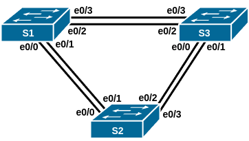
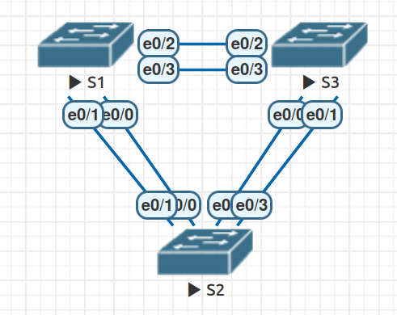
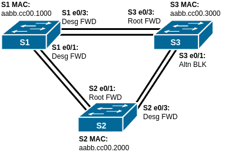

# Домашнее задание №2 «Развёртывание коммутируемой сети с резервными каналами»

## Топология



## Таблица адресации

| Устройство | Интерфейс | IP-адрес    | Маска подсети |
| ---------- | --------- | ----------- | ------------- |
| S1         | VLAN 1    | 192.168.1.1 | 255.255.255.0 |
| S2         | VLAN 1    | 192.168.1.2 | 255.255.255.0 |
| S3         | VLAN 1    | 192.168.1.3 | 255.255.255.0 |

## Цели

* [Часть 1. Создание сети и настройка основных параметров устройства.](#часть-1-создание-сети-инастройка-основных-параметров-устройства)
* [Часть 2. Выбор корневого моста.](#часть-2-определение-корневого-моста)
* [Часть 3. Наблюдение за процессом выбора протоколом STP порта, исходя из стоимости портов.](#часть-3-наблюдение-за-процессом-выбора-протоколом-stp-порта-исходя-из-стоимости-портов)
* [Часть 4. Наблюдение за процессом выбора протоколом STP порта, исходя из приоритета портов.](#часть-4-наблюдение-за-процессом-выбора-протоколом-stp-порта-исходя-из-приоритета-портов)

## Общие сведения/сценарий

Избыточность позволяет увеличить доступность устройств в топологии сети за счёт
устранения единой точки отказа. Избыточность в коммутируемой сети обеспечивается
посредством использования нескольких коммутаторов или нескольких каналов между
коммутаторами. Когда в проекте сети используется физическая избыточность, возможно
возникновение петель и дублирование кадров.

Протокол spanning-tree (STP) был разработан как механизм предотвращения возникновения
петель на 2-м уровне для избыточных каналов коммутируемой сети. Протокол STP
обеспечивает наличие только одного логического пути между всеми узлами назначения
в сети путём намеренного блокирования резервных путей, которые могли бы вызвать петлю.

В этой лабораторной работе команда **show spanning-tree** используется для наблюдения
за процессом выбора протоколом STP корневого моста. Также мы будем наблюдать за
процессом выбора портов с учётом стоимости и приоритета.

**Примечание:** используются коммутаторы Cisco Catalyst 2960s с Cisco IOS версии
15.0(2) (образ lanbasek9). Допускается использование других моделей коммутаторов
и других версий Cisco IOS. В зависимости от модели устройства и версии Cisco IOS
доступные команды и результаты их выполнения могут отличаться от тех, которые
показаны в лабораторных работах.

**Примечание:** убедитесь, что все настройки коммутаторов удалены и загрузочная
конфигурация отсутствует. Если вы не уверены, обратитесь к инструктору.

**Примечание:** данная лабораторная работа, как и другие в этом курсе выполнялась
в среде EVE-NG. Названия интерфейсов изменены на фактически используемые (вместо
F0/0 или G0/0 используются e0/0 и т.п.).

## Часть 1. Создание сети и настройка основных параметров устройства

Для моделирования сети будем использовать ПО EVE-NG 5.0.1-24. Создадим
новую конфигурацию, используя следующие ресурсы:

* 1 маршрутизатор (Cisco IOL, образ L3-ADVENTERPRISEK9-M-15.4-2T);
* 2 коммутатора (Cisco IOL, образ L2-ADVENTERPRISEK9-M-15.2-20150703);
* 2 ПК (Eve-NG Virtual PC).

### Шаг 1. Создание сети

Соединим устройства согласно топологии.



### Шаг 2. Инициализация и перезагрузка коммутаторов

Для того, чтобы убедиться, что коммутаторы не содержат никаких предыдущих настроек,
выполним их инициализацию и перезагрузку.

Для удаления загрузочной конфигурации служит команда **erase startup-config**
привилегированного режима EXEC, а для перезагрузки устройства команда **reload**.

<details>
<summary>Лог перезагрузки коммутатора</strong>:</summary>

```text
Switch#erase startup-config 
Erasing the nvram filesystem will remove all configuration files! Continue? [confirm]
[OK]
Erase of nvram: complete
Switch#
*May  1 12:26:58.062: %SYS-7-NV_BLOCK_INIT: Initialized the geometry of nvram
Switch#reload
Proceed with reload? [confirm]

*May  1 12:27:01.960: %SYS-5-RELOAD: Reload requested by console. Reload Reason: Reload command.
unix_reload()
UNIX ERR:tcgetattr:Inappropriate ioctl for device

              Restricted Rights Legend

Use, duplication, or disclosure by the Government is
subject to restrictions as set forth in subparagraph
(c) of the Commercial Computer Software - Restricted
Rights clause at FAR sec. 52.227-19 and subparagraph
(c) (1) (ii) of the Rights in Technical Data and Computer
Software clause at DFARS sec. 252.227-7013.

           cisco Systems, Inc.
           170 West Tasman Drive
           San Jose, California 95134-1706


Cisco IOS Software, Linux Software (I86BI_LINUXL2-ADVENTERPRISEK9-M), Version 15.2(CML_NIGHTLY_20150703)FLO_DSGS7, EARLY DEPLOYMENT DEVELOPMENT BUILD, synced to  DSGS_PI5_POSTCOLLAPSE_TEAM_TRACK_CLONE
Technical Support: http://www.cisco.com/techsupport
Copyright (c) 1986-2015 by Cisco Systems, Inc.
Compiled Sat 04-Jul-15 01:30 by mmen
This product contains cryptographic features and is subject to United
States and local country laws governing import, export, transfer and
use. Delivery of Cisco cryptographic products does not imply
third-party authority to import, export, distribute or use encryption.
Importers, exporters, distributors and users are responsible for
compliance with U.S. and local country laws. By using this product you
agree to comply with applicable laws and regulations. If you are unable
to comply with U.S. and local laws, return this product immediately.

A summary of U.S. laws governing Cisco cryptographic products may be found at:
http://www.cisco.com/wwl/export/crypto/tool/stqrg.html

If you require further assistance please contact us by sending email to
export@cisco.com.

Linux Unix (Intel-x86) processor with 936804K bytes of memory.
Processor board ID 67108880
4 Ethernet interfaces
1024K bytes of NVRAM.


Press RETURN to get started!


*May  1 12:27:05.516: %SPANTREE-5-EXTENDED_SYSID: Extended SysId enabled for type vlan
*May  1 12:27:05.746: %SYS-5-RESTART: System restarted --
Cisco IOS Software, Linux Software (I86BI_LINUXL2-ADVENTERPRISEK9-M), Version 15.2(CML_NIGHTLY_20150703)FLO_DSGS7, EARLY DEPLOYMENT DEVELOPMENT BUILD, synced to  DSGS_PI5_POSTCOLLAPSE_TEAM_TRACK_CLONE
Technical Support: http://www.cisco.com/techsupport
Copyright (c) 1986-2015 by Cisco Systems, Inc.
Compiled Sat 04-Jul-15 01:30 by mmen
*May  1 12:27:07.131: %LINK-3-UPDOWN: Interface Ethernet0/0, changed state to up
*May  1 12:27:07.144: %LINK-3-UPDOWN: Interface Ethernet0/1, changed state to up
*May  1 12:27:07.156: %LINK-3-UPDOWN: Interface Ethernet0/2, changed state to up
*May  1 12:27:07.169: %LINK-3-UPDOWN: Interface Ethernet0/3, changed state to up
*May  1 12:27:08.139: %LINEPROTO-5-UPDOWN: Line protocol on Interface Ethernet0/0, changed state to up
*May  1 12:27:08.151: %LINEPROTO-5-UPDOWN: Line protocol on Interface Ethernet0/1, changed state to up
*May  1 12:27:08.160: %LINEPROTO-5-UPDOWN: Line protocol on Interface Ethernet0/2, changed state to up
*May  1 12:27:08.176: %LINEPROTO-5-UPDOWN: Line protocol on Interface Ethernet0/3, changed state to up
Switch>

```

</details>

### Шаг 3. Настройка коммутаторов

Настроим базовые параметры каждого коммутатора.

#### a. Отключение поиска DNS

Чтобы предотвратить попытки коммутатора неверно преобразовывать введённые
команды таким образом, как будто они являются именами узлов, отключим поиск DNS:

```text
Switch>en
Switch#conf t
Enter configuration commands, one per line.  End with CNTL/Z.
Switch(config)#no ip domain-lookup
Switch(config)#
```

#### b. Установка имени устройства

Подключимся к коммутатору с помощью консольного подключения, активируем
привилегированный режим и сменим имя коммутатора:

```text
Switch(config)#host S1
S1(config)#
```

#### c. Установка пароля привилегированного режима

Назначим **class** в качестве зашифрованного пароля привилегированного режима EXEC:

```text
S1(config)#enable secret class
S1(config)#
```

Зашифруем открытые пароли в файле конфигурации:

```text
S1(config)#service password-encryption
S1(config)#
```

#### d. Установка паролей консоли и VTY

Назначим **cisco** в качестве пароля консоли и VTY каналов, включим вход в систему
по паролю:

```text
S1(config)#line console 0
S1(config-line)#passw cisco
S1(config-line)#login
S1(config-line)#exit
S1(config)#line vty 0 4
S1(config-line)#passw cisco
S1(config-line)#login
S1(config-line)#exit
S1(config)#
```

#### e. Настройте logging synchronous для консольного канала

Чтобы консольные сообщения не прерывали выполнение команд, установим
параметр **logging synchronous**:

```text
S1(config)#line console 0
S1(config-line)#logging synchronous
S1(config-line)#exit
S1(config)#line vty 0 4
S1(config-line)#logging synchronous
S1(config-line)#exit
S1(config)#
```

#### f. Создание баннера

Для предупреждения пользователей о запрете несанкционированного доступа, настроим
баннерное сообщение дня (MOTD):

```text
S1(config)#banner motd # ATTENTION! Unauthorized access is strictly prohibited. #
S1(config)#
```

#### g. Установка IP-адреса для SVI

Зададим на всех коммутаторах IP-адрес, указанный в таблице адресации для VLAN 1:

```text
S1(config)#int vlan 1
S1(config-if)#
*May  1 13:18:56.772: %LINEPROTO-5-UPDOWN: Line protocol on Interface Vlan1, changed state to down
S1(config-if)#ip addr 192.168.1.1 255.255.255.0
S1(config-if)#no shut
S1(config-if)#exit
*May  1 13:19:25.226: %LINK-3-UPDOWN: Interface Vlan1, changed state to up
*May  1 13:19:26.227: %LINEPROTO-5-UPDOWN: Line protocol on Interface Vlan1, changed state to up
S1(config-if)#exit
S1(config)#
```

Аналогично и на остальных.

#### h. Сохранение конфигурации

Скопируем текущую конфигурацию в файл загрузочной конфигурации.

```text
S1#copy run start
Destination filename [startup-config]? 
Building configuration...
Compressed configuration from 980 bytes to 719 bytes[OK]
S1#
```

<details>
<summary>S1# show running-config</summary>

```text
S1#sh run
Building configuration...

Current configuration : 980 bytes
!
! Last configuration change at 13:20:44 UTC Thu May 1 2025
!
version 15.2
service timestamps debug datetime msec
service timestamps log datetime msec
service password-encryption
service compress-config
!
hostname S1
!
boot-start-marker
boot-end-marker
!
!
enable secret 5 $1$aE7j$3eGNBaYoI2aFJTTqEar5v/
!
no aaa new-model
!
!
!
!         
!
!
!
!
no ip domain-lookup
ip cef
no ipv6 cef
!
!
spanning-tree mode pvst
spanning-tree extend system-id
!
vlan internal allocation policy ascending
!
! 
!
!
!
!
!
!
!
!         
!
!
!
interface Ethernet0/0
!
interface Ethernet0/1
!
interface Ethernet0/2
!
interface Ethernet0/3
!
interface Vlan1
 ip address 192.168.1.1 255.255.255.0
!
ip forward-protocol nd
!
no ip http server
no ip http secure-server
!
!
!
!
!         
!
control-plane
!
banner motd ^C ATTENTION! Unauthorized access is strictly prohibited. ^C
!
line con 0
 password 7 094F471A1A0A
 logging synchronous
 login
line aux 0
line vty 0 4
 password 7 070C285F4D06
 logging synchronous
 login
!
!
end

S1# 
```

</details>

<details>
<summary>S2# show running-config</summary>

```text
S2#sh run
Building configuration...

Current configuration : 980 bytes
!
! Last configuration change at 13:22:41 UTC Thu May 1 2025
!
version 15.2
service timestamps debug datetime msec
service timestamps log datetime msec
service password-encryption
service compress-config
!
hostname S2
!
boot-start-marker
boot-end-marker
!
!
enable secret 5 $1$pOtK$.vti30ZRVz9DQ8ZcoiNVs0
!
no aaa new-model
!
!
!
!         
!
!
!
!
no ip domain-lookup
ip cef
no ipv6 cef
!
!
spanning-tree mode pvst
spanning-tree extend system-id
!
vlan internal allocation policy ascending
!
! 
!
!
!
!
!
!
!
!         
!
!
!
interface Ethernet0/0
!
interface Ethernet0/1
!
interface Ethernet0/2
!
interface Ethernet0/3
!
interface Vlan1
 ip address 192.168.1.2 255.255.255.0
!
ip forward-protocol nd
!
no ip http server
no ip http secure-server
!
!
!
!
!         
!
control-plane
!
banner motd ^C ATTENTION! Unauthorized access is strictly prohibited. ^C
!
line con 0
 password 7 030752180500
 logging synchronous
 login
line aux 0
line vty 0 4
 password 7 121A0C041104
 logging synchronous
 login
!
!
end

S2#
```

</details>

<details>
<summary>S3# show running-config</summary>

```text
S3#sh run
Building configuration...

Current configuration : 980 bytes
!
! Last configuration change at 13:24:02 UTC Thu May 1 2025
!
version 15.2
service timestamps debug datetime msec
service timestamps log datetime msec
service password-encryption
service compress-config
!
hostname S3
!
boot-start-marker
boot-end-marker
!
!
enable secret 5 $1$gIP6$MGMIN/eAPnoWSwaW3kU2O/
!
no aaa new-model
!
!
!
!         
!
!
!
!
no ip domain-lookup
ip cef
no ipv6 cef
!
!
spanning-tree mode pvst
spanning-tree extend system-id
!
vlan internal allocation policy ascending
!
! 
!
!
!
!
!
!
!
!         
!
!
!
interface Ethernet0/0
!
interface Ethernet0/1
!
interface Ethernet0/2
!
interface Ethernet0/3
!
interface Vlan1
 ip address 192.168.1.3 255.255.255.0
!
ip forward-protocol nd
!
no ip http server
no ip http secure-server
!
!
!
!
!         
!
control-plane
!
banner motd ^C ATTENTION! Unauthorized access is strictly prohibited. ^C
!
line con 0
 password 7 070C285F4D06
 logging synchronous
 login
line aux 0
line vty 0 4
 password 7 14141B180F0B
 logging synchronous
 login
!
!
end

S3#
```

</details>

### Шаг 4. Проверка связи

Проверим способность коммутаторов обмениваться эхо-запросами.

Отправим эхо-запрос с **S1** на **S2**:

```text
S1#ping 192.168.1.2
Type escape sequence to abort.
Sending 5, 100-byte ICMP Echos to 192.168.1.2, timeout is 2 seconds:
.!!!!
Success rate is 80 percent (4/5), round-trip min/avg/max = 1/1/1 ms
S1#
```

Отправим эхо-запрос с **S1** на **S3**:

```text
S1#ping 192.168.1.3
Type escape sequence to abort.
Sending 5, 100-byte ICMP Echos to 192.168.1.3, timeout is 2 seconds:
.!!!!
Success rate is 80 percent (4/5), round-trip min/avg/max = 1/1/1 ms
S1#
```

Отправим эхо-запрос с **S2** на **S3**:

```text
S2#ping 192.168.1.3
Type escape sequence to abort.
Sending 5, 100-byte ICMP Echos to 192.168.1.3, timeout is 2 seconds:
.!!!!
Success rate is 80 percent (4/5), round-trip min/avg/max = 1/1/1 ms
S2#
```

Успешно ли выполняется эхо-запрос от коммутатора S1 на коммутатор S2? *<u>**да**</u>*

Успешно ли выполняется эхо-запрос от коммутатора S1 на коммутатор S3? *<u>**да**</u>*

Успешно ли выполняется эхо-запрос от коммутатора S2 на коммутатор S3? *<u>**да**</u>*

Будем выполнять отладку до тех пор, пока ответы на все вопросы не будут положительными.

## Часть 2. Определение корневого моста

Для каждого экземпляра протокола spanning-tree (коммутируемая сеть LAN или
широковещательный домен) существует коммутатор, выделенный в качестве корневого
моста. Корневой мост служит точкой привязки для всех расчётов протокола
spanning-tree, позволяя определить избыточные пути, которые следует заблокировать.

Процесс выбора определяет, какой из коммутаторов станет корневым мостом.
Коммутатор с наименьшим значением идентификатора моста (BID) становится корневым
мостом. Идентификатор BID состоит из значения приоритета моста, расширенного
идентификатора системы и MAC-адреса коммутатора. Значение приоритета может
находиться в диапазоне от 0 до 65535 с шагом 4096. По умолчанию используется
значение 32768.

### Шаг 1: Отключение портов

Отключим все порты на коммутаторах. Для этого воспользуемся командой **shutdown**
в сочетании с **interface range**.

<details>
<summary>Коммутатор <strong>S1</strong></summary>

```text
S1#conf t
Enter configuration commands, one per line.  End with CNTL/Z.
S1(config)#int range e0/0-3
S1(config-if-range)#shut
S1(config-if-range)#
*May  1 13:51:12.535: %LINK-5-CHANGED: Interface Ethernet0/0, changed state to administratively down
*May  1 13:51:12.535: %LINK-5-CHANGED: Interface Ethernet0/1, changed state to administratively down
*May  1 13:51:12.535: %LINK-5-CHANGED: Interface Ethernet0/2, changed state to administratively down
*May  1 13:51:12.535: %LINK-5-CHANGED: Interface Ethernet0/3, changed state to administratively down
*May  1 13:51:13.543: %LINEPROTO-5-UPDOWN: Line protocol on Interface Ethernet0/0, changed state to down
*May  1 13:51:13.543: %LINEPROTO-5-UPDOWN: Line protocol on Interface Ethernet0/1, changed state to down
*May  1 13:51:13.543: %LINEPROTO-5-UPDOWN: Line protocol on Interface Ethernet0/2, changed state to down
*May  1 13:51:13.543: %LINEPROTO-5-UPDOWN: Line protocol on Interface Ethernet0/3, changed state to down
S1(config-if-range)#exit
S1(config)#
```

</details>

Аналогично отключим и на остальных коммутаторах.

### Шаг 2: Настройка транковых портов

Настроим подключенные порты в качестве транковых.

```text
S1(config)#int r e0/0-3
S1(config-if-range)#sw tr enc dot1q
S1(config-if-range)#sw m tr        
S1(config-if-range)#exit
S1(config)#
```

Так как в рамках данной работы нас интересует только протокол STP, то настройку
native VLAN и ограничение списка разрешённых VLAN на транке мы опустим.

### Шаг 3: Включение части портов

Включим порты e0/1 и e0/3 на всех коммутаторах. Эти порты связывают коммутаторы
одинарным линком.

```text
S1(config)#int e0/1
S1(config-if)#no shut
S1(config-if)#
*May  1 13:57:27.522: %LINK-3-UPDOWN: Interface Ethernet0/1, changed state to up
S1(config-if)#
*May  1 13:57:29.539: %LINEPROTO-5-UPDOWN: Line protocol on Interface Ethernet0/1, changed state to up
S1(config-if)#exit
S1(config)#int e0/3
S1(config-if)#no shut
S1(config-if)#  
*May  1 13:57:55.885: %LINK-3-UPDOWN: Interface Ethernet0/3, changed state to up
S1(config-if)#
*May  1 13:57:57.893: %LINEPROTO-5-UPDOWN: Line protocol on Interface Ethernet0/3, changed state to up
S1(config-if)#exit
S1(config)#
```

### Шаг 4: Отображение данных протокола spanning-tree

Введём команду **show spanning-tree** на всех трёх коммутаторах. Приоритет
идентификатора моста рассчитывается путём сложения значений приоритета и
расширенного идентификатора системы. Расширенным идентификатором системы всегда
является номер сети VLAN. В примере ниже все три коммутатора имеют равные значения
приоритета идентификатора моста (32769 = 32768 + 1, где приоритет по умолчанию =
32768, номер сети VLAN = 1); следовательно, коммутатор с самым низким значением
MAC-адреса становится корневым мостом (в примере — **S1**).

Коммутатор **S1**:

```text
S1#show spanning-tree

VLAN0001
  Spanning tree enabled protocol ieee
  Root ID    Priority    32769
             Address     aabb.cc00.1000
             This bridge is the root
             Hello Time   2 sec  Max Age 20 sec  Forward Delay 15 sec

  Bridge ID  Priority    32769  (priority 32768 sys-id-ext 1)
             Address     aabb.cc00.1000
             Hello Time   2 sec  Max Age 20 sec  Forward Delay 15 sec
             Aging Time  15  sec

Interface           Role Sts Cost      Prio.Nbr Type
------------------- ---- --- --------- -------- --------------------------------
Et0/1               Desg FWD 100       128.2    Shr 
Et0/3               Desg FWD 100       128.4    Shr 
```

Коммутатор **S2**:

```text
S2#show spanning-tree

VLAN0001
  Spanning tree enabled protocol ieee
  Root ID    Priority    32769
             Address     aabb.cc00.1000
             Cost        100
             Port        2 (Ethernet0/1)
             Hello Time   2 sec  Max Age 20 sec  Forward Delay 15 sec

  Bridge ID  Priority    32769  (priority 32768 sys-id-ext 1)
             Address     aabb.cc00.2000
             Hello Time   2 sec  Max Age 20 sec  Forward Delay 15 sec
             Aging Time  300 sec

Interface           Role Sts Cost      Prio.Nbr Type
------------------- ---- --- --------- -------- --------------------------------
Et0/1               Root FWD 100       128.2    Shr 
Et0/3               Desg FWD 100       128.4    Shr 
```

Коммутатор **S3**:

```text
S3#show spanning-tree 

VLAN0001
  Spanning tree enabled protocol ieee
  Root ID    Priority    32769
             Address     aabb.cc00.1000
             Cost        100
             Port        4 (Ethernet0/3)
             Hello Time   2 sec  Max Age 20 sec  Forward Delay 15 sec

  Bridge ID  Priority    32769  (priority 32768 sys-id-ext 1)
             Address     aabb.cc00.3000
             Hello Time   2 sec  Max Age 20 sec  Forward Delay 15 sec
             Aging Time  300 sec

Interface           Role Sts Cost      Prio.Nbr Type
------------------- ---- --- --------- -------- --------------------------------
Et0/1               Altn BLK 100       128.2    Shr 
Et0/3               Root FWD 100       128.4    Shr 
```

**Примечание:** на коммутаторе 2960 режим STP по умолчанию — протокол STP для
каждой сети VLAN (PVST).

В схему ниже запишем роль и состояние (Sts) активных портов на каждом коммутаторе
в топологии.



С учётом выходных данных, поступающих с коммутаторов, ответим на следующие вопросы.

Какой коммутатор является корневым мостом? <u>**S1**</u>

**Вопрос:** почему этот коммутатор был выбран протоколом spanning-tree в качестве
корневого моста?

**Ответ**: потому что у него наименьший BID, который складывается из приоритета
(установлен по умолчанию и не изменялся нами), идентификатора VLAN (у всех трёх
одинаковый) и MAC-адреса (у коммутатора **S1** он наименьший).

Какие порты на коммутаторе являются корневыми портами? <u>**S2 e0/1** и **S3 e0/3**</u>

Какие порты на коммутаторе являются назначенными портами? <u>**S1 e0/1**, **S1 e0/3**
и **S2 e0/3**</u>

Какой порт отображается в качестве альтернативного и в настоящее время заблокирован?
<u>**S3 e0/1**</u>

**Вопрос:** почему протокол spanning-tree выбрал этот порт в качестве невыделенного
(заблокированного) порта?

**Ответ:** Так как коммутаторы соединены в кольцо, то траффик может идти по нему
двумя путями (по часовой стрелке и против). Чтобы избежать возникновения петли
один из портов на коммутаторе **S3** (у него BID больше, чем у **S2**) должен
быть заблокирован. Порт **e0/3** ведёт к корневому коммутатору кратчайшим путём
(путём с наименьшей стоимостью), поэтому он выбирается в качестве приоритетного.
Порт **e0/1** становится резервным и блокируется.

## Часть 3. Наблюдение за процессом выбора протоколом STP порта, исходя из стоимости портов

Алгоритм протокола spanning-tree (STA) использует корневой мост как точку привязки,
после чего определяет, какие порты будут заблокированы, исходя из стоимости пути.
Порт с более низкой стоимостью пути является предпочтительным. Если стоимости портов
равны, процесс сравнивает BID. Если BID равны, для определения корневого моста
используются приоритеты портов. Наиболее низкие значения являются предпочтительными.
В части 3 мы изменим стоимость порта, чтобы определить, какой порт будет заблокирован
протоколом spanning-tree.

### Шаг 1. Определение коммутатора с заблокированным портом

При текущей конфигурации только один коммутатор может содержать заблокированный
протоколом STP порт. Выполним команду **show spanning-tree** на обоих коммутаторах
некорневого моста. В примере ниже протокол spanning-tree блокирует порт **F0/4**
на коммутаторе с самым высоким идентификатором BID (**S2**).

Коммутатор **S2**:
```text
S2#show spanning-tree 

VLAN0001
  Spanning tree enabled protocol ieee
  Root ID    Priority    32769
             Address     aabb.cc00.1000
             Cost        100
             Port        2 (Ethernet0/1)
             Hello Time   2 sec  Max Age 20 sec  Forward Delay 15 sec

  Bridge ID  Priority    32769  (priority 32768 sys-id-ext 1)
             Address     aabb.cc00.2000
             Hello Time   2 sec  Max Age 20 sec  Forward Delay 15 sec
             Aging Time  300 sec

Interface           Role Sts Cost      Prio.Nbr Type
------------------- ---- --- --------- -------- --------------------------------
Et0/1               Root FWD 100       128.2    Shr 
Et0/3               Desg FWD 100       128.4    Shr 
```

Коммутатор **S3**:
```text
S3#show spanning-tree

VLAN0001
  Spanning tree enabled protocol ieee
  Root ID    Priority    32769
             Address     aabb.cc00.1000
             Cost        100
             Port        4 (Ethernet0/3)
             Hello Time   2 sec  Max Age 20 sec  Forward Delay 15 sec

  Bridge ID  Priority    32769  (priority 32768 sys-id-ext 1)
             Address     aabb.cc00.3000
             Hello Time   2 sec  Max Age 20 sec  Forward Delay 15 sec
             Aging Time  300 sec

Interface           Role Sts Cost      Prio.Nbr Type
------------------- ---- --- --------- -------- --------------------------------
Et0/1               Altn BLK 100       128.2    Shr 
Et0/3               Root FWD 100       128.4    Shr 
```

**Примечание:** в конкретной топологии корневой мост может отличаться от выбора порта.

### Шаг 2. Изменение стоимости порта

Помимо заблокированного порта, единственным активным портом на этом коммутаторе
является порт, выделенный в качестве порта корневого моста. Уменьшим стоимость
этого порта корневого моста до 18, выполнив команду **spanning-tree vlan 1 cost 18**
режима конфигурации интерфейса.

```text
S3#conf t
Enter configuration commands, one per line.  End with CNTL/Z.
S3(config)#int e0/3
S3(config-if)#spanning-tree vlan 1 cost 18
S3(config-if)#exit
S3(config)#
```

### Шаг 3. Просмотр изменений протокола spanning-tree

Повторно выполним команду **show spanning-tree** на обоих коммутаторах некорневого
моста. Обратим внимание, что ранее заблокированный порт (**S3 e0/1)** теперь
является назначенным портом, и протокол spanning-tree теперь блокирует порт на
другом коммутаторе некорневого моста (**S2 e0/3**).

Коммутатор **S2**:

```text
S2#show spanning-tree 

VLAN0001
  Spanning tree enabled protocol ieee
  Root ID    Priority    32769
             Address     aabb.cc00.1000
             Cost        100
             Port        2 (Ethernet0/1)
             Hello Time   2 sec  Max Age 20 sec  Forward Delay 15 sec

  Bridge ID  Priority    32769  (priority 32768 sys-id-ext 1)
             Address     aabb.cc00.2000
             Hello Time   2 sec  Max Age 20 sec  Forward Delay 15 sec
             Aging Time  15  sec

Interface           Role Sts Cost      Prio.Nbr Type
------------------- ---- --- --------- -------- --------------------------------
Et0/1               Root FWD 100       128.2    Shr 
Et0/3               Altn BLK 100       128.4    Shr 
```

Коммутатор **S3**:

```text
S3#show spanning-tree

VLAN0001
  Spanning tree enabled protocol ieee
  Root ID    Priority    32769
             Address     aabb.cc00.1000
             Cost        18
             Port        4 (Ethernet0/3)
             Hello Time   2 sec  Max Age 20 sec  Forward Delay 15 sec

  Bridge ID  Priority    32769  (priority 32768 sys-id-ext 1)
             Address     aabb.cc00.3000
             Hello Time   2 sec  Max Age 20 sec  Forward Delay 15 sec
             Aging Time  15  sec

Interface           Role Sts Cost      Prio.Nbr Type
------------------- ---- --- --------- -------- --------------------------------
Et0/1               Desg FWD 100       128.2    Shr 
Et0/3               Root FWD 18        128.4    Shr 
```

**Вопрос:** почему протокол spanning-tree заменяет ранее заблокированный порт на
назначенный порт и блокирует порт, который был назначенным портом на другом коммутаторе?

**Ответ:** при выборе роли порта между "альтернативным" и "назначенным" протокол
STP учитывает стоимость маршрута к корневому мосту и блокирует тот порт, путь от
которого имеет больший вес доступа к корневому мосту. Так как мы уменьшили вес
порта **S3 e0/3** с 100 до 18, то вес пути к корневому мосту с коммутатора **S3**
стал меньше веса пути к корневому мосту с коммутатора **S2**. Поэтому протокол STP
поменял местами роли у портов **S2 e0/3** и **S3 e0/1**.

### Шаг 4. Отмена изменения стоимости порта

Удалим изменения стоимости порта **S3 e0/3**.

#### a. Отмена изменений

Выполним команду **no spanning-tree vlan 1 cost 18** режима конфигурации
интерфейса, чтобы удалить запись стоимости, созданную ранее.

```text
S3(config)#int e0/3
S3(config-if)#no spanning-tree vlan 1 cost 18
S3(config-if)#exit
S3(config)#
```

#### b. Просмотр информации STP

Повторно выполним команду **show spanning-tree**, чтобы подтвердить, что протокол
STP сбросил порт на коммутаторе некорневого моста, вернув исходные настройки порта.
Протоколу STP требуется примерно 30 секунд, чтобы завершить процесс перевода порта.

Коммутатор **S2**:

```text
S2#show spanning-tree 

VLAN0001
  Spanning tree enabled protocol ieee
  Root ID    Priority    32769
             Address     aabb.cc00.1000
             Cost        100
             Port        2 (Ethernet0/1)
             Hello Time   2 sec  Max Age 20 sec  Forward Delay 15 sec

  Bridge ID  Priority    32769  (priority 32768 sys-id-ext 1)
             Address     aabb.cc00.2000
             Hello Time   2 sec  Max Age 20 sec  Forward Delay 15 sec
             Aging Time  15  sec

Interface           Role Sts Cost      Prio.Nbr Type
------------------- ---- --- --------- -------- --------------------------------
Et0/1               Root FWD 100       128.2    Shr 
Et0/3               Desg FWD 100       128.4    Shr 
```

Коммутатор **S3**:

```text
S3#show spanning-tree

VLAN0001
  Spanning tree enabled protocol ieee
  Root ID    Priority    32769
             Address     aabb.cc00.1000
             Cost        100
             Port        4 (Ethernet0/3)
             Hello Time   2 sec  Max Age 20 sec  Forward Delay 15 sec

  Bridge ID  Priority    32769  (priority 32768 sys-id-ext 1)
             Address     aabb.cc00.3000
             Hello Time   2 sec  Max Age 20 sec  Forward Delay 15 sec
             Aging Time  15  sec

Interface           Role Sts Cost      Prio.Nbr Type
------------------- ---- --- --------- -------- --------------------------------
Et0/1               Altn BLK 100       128.2    Shr 
Et0/3               Root FWD 100       128.4    Shr 
```

## Часть 4. Наблюдение за процессом выбора протоколом STP порта, исходя из приоритета портов

Если стоимости портов равны, процесс сравнивает BID. Если BID равны, для определения
корневого моста используются приоритеты портов. Значение приоритета по
умолчанию — 128. STP объединяет приоритет порта с номером порта, чтобы разорвать
связи. Наиболее низкие значения являются предпочтительными. В части 4 нам предстоит
активировать избыточные пути до каждого из коммутаторов, чтобы просмотреть, каким
образом протокол STP выбирает порт с учётом приоритета портов.

### a. Включение избыточных путей

Включим порты **e0/0** и **e0/2** на всех коммутаторах.

```text
S1(config)#int e0/0
S1(config-if)#no shut
S1(config-if)#
*May  1 15:18:09.472: %LINK-3-UPDOWN: Interface Ethernet0/0, changed state to up
S1(config-if)#exit
*May  1 15:18:11.477: %LINEPROTO-5-UPDOWN: Line protocol on Interface Ethernet0/0, changed state to up
S1(config-if)#exit
S1(config)#int e0/2
S1(config-if)#no shut
S1(config-if)#
*May  1 15:18:25.243: %LINK-3-UPDOWN: Interface Ethernet0/2, changed state to up
S1(config-if)#
*May  1 15:18:27.247: %LINEPROTO-5-UPDOWN: Line protocol on Interface Ethernet0/2, changed state to up
S1(config-if)#end
S1#
```

### b. Просмотр информации о статусах портов

Подождём 30 секунд, чтобы протокол STP завершил процесс перевода порта, после чего
выполним команду **show spanning-tree** на коммутаторах некорневого моста. Обратим
внимание, что порт корневого моста переместился на порт с меньшим номером, связанный
с коммутатором корневого моста, и заблокировал предыдущий порт корневого моста.

Коммутатор **S2**:

```text
S2#show spanning-tree

VLAN0001
  Spanning tree enabled protocol ieee
  Root ID    Priority    32769
             Address     aabb.cc00.1000
             Cost        100
             Port        1 (Ethernet0/0)
             Hello Time   2 sec  Max Age 20 sec  Forward Delay 15 sec

  Bridge ID  Priority    32769  (priority 32768 sys-id-ext 1)
             Address     aabb.cc00.2000
             Hello Time   2 sec  Max Age 20 sec  Forward Delay 15 sec
             Aging Time  15  sec

Interface           Role Sts Cost      Prio.Nbr Type
------------------- ---- --- --------- -------- --------------------------------
Et0/0               Root FWD 100       128.1    Shr 
Et0/1               Altn BLK 100       128.2    Shr 
Et0/2               Desg FWD 100       128.3    Shr 
Et0/3               Desg FWD 100       128.4    Shr 
```

Коммутатор **S3**:

```text
S3#show spanning-tree

VLAN0001
  Spanning tree enabled protocol ieee
  Root ID    Priority    32769
             Address     aabb.cc00.1000
             Cost        100
             Port        3 (Ethernet0/2)
             Hello Time   2 sec  Max Age 20 sec  Forward Delay 15 sec

  Bridge ID  Priority    32769  (priority 32768 sys-id-ext 1)
             Address     aabb.cc00.3000
             Hello Time   2 sec  Max Age 20 sec  Forward Delay 15 sec
             Aging Time  15  sec

Interface           Role Sts Cost      Prio.Nbr Type
------------------- ---- --- --------- -------- --------------------------------
Et0/0               Altn BLK 100       128.1    Shr 
Et0/1               Altn BLK 100       128.2    Shr 
Et0/2               Root FWD 100       128.3    Shr 
Et0/3               Altn BLK 100       128.4    Shr 
```

**Вопрос:** какой порт выбран протоколом STP в качестве порта корневого моста на
каждом коммутаторе некорневого моста?

**Ответ:** коммутатор **S2** порт **e0/0**, коммутатор **S3** порт **e0/2**.

**Вопрос:** почему протокол STP выбрал эти порты в качестве портов корневого моста
на этих коммутаторах?

**Ответ:** так как стоимость пути до корневого моста, BID и приоритет (по
умолчанию 128) у всех портов на наших коммутаторах одинаковы, то в качестве
корневого на коммутаторе выбирается порт с наименьшим идентификатором (номером)
интерфейса, который соединяется с приоритетом (поле **Prio.Nbr** в выводе
**show spanning-tree**).

## Вопросы для повторения

1. Какое значение протокол STP использует первым после выбора корневого моста,
   чтобы определить выбор порта?

   **Ответ:** стоимость пути к корневому мосту.

2. Если первое значение на двух портах одинаково, какое следующее значение будет
   использовать протокол STP при выборе порта?

   **Ответ:** BID соседних коммутаторов.

3. Если оба значения на двух портах равны, каким будет следующее значение, которое
   использует протокол STP при выборе порта?

   **Ответ:** приоритет порта (Port-Id).
