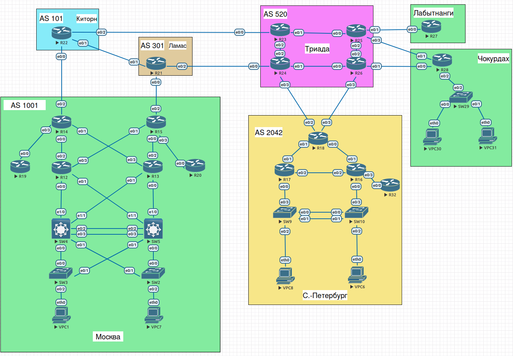
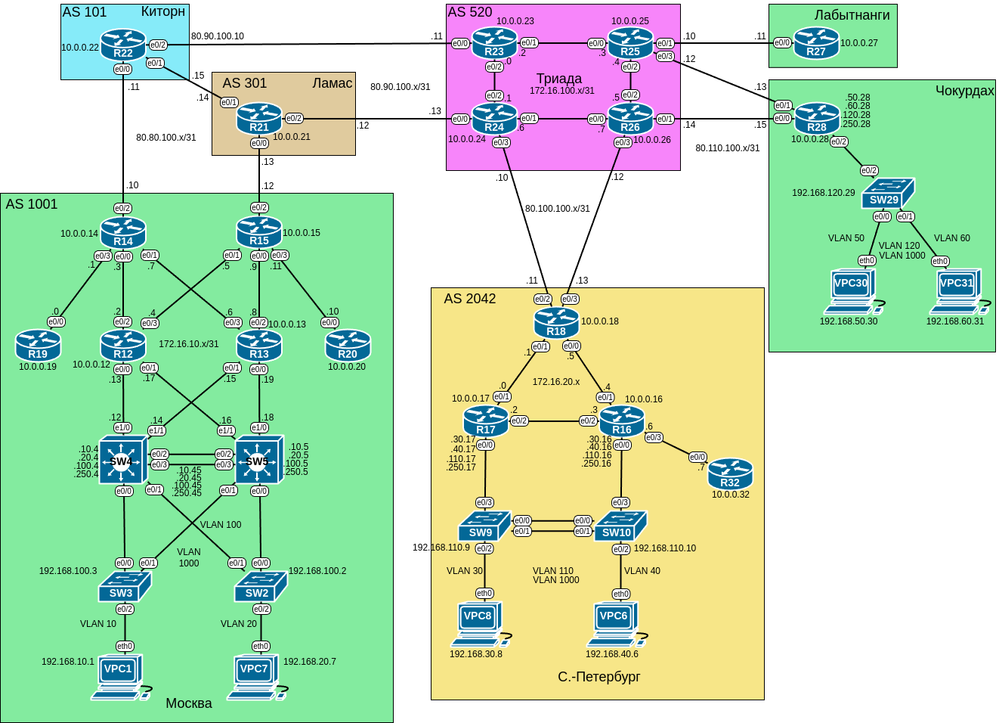

# Домашнее задание №4 «Проектирование сети»

## Цель работы

В данной самостоятельной работе необходимо распланировать адресное пространство.
Настроить IP на всех активных портах для дальнейшей работы над проектом.
Адресное пространство должно быть задокументировано.

## Задачи

1. [Разработать и задокументировать адресное пространство для лабораторного стенда.](#1-проектирование-адресного-пространства)
2. [Настроить IP адреса на каждом активном порту.](#2-назначение-ip-адресов)
3. [Настроить каждый VPC в каждом офисе в своем VLAN.](#3-настройка-vlan)
4. [Настроить VLAN/Loopback interface управления для сетевых устройств](#4-настройка-интерфейсов-управления)
5. [Настроить сети офисов так, чтобы не возникало broadcast штормов.](#5-профилактика-широковещательных-штормов)
6. [Использовать IPv4, IPv6 по желанию.](#6-настройка-ipv6)

## Топология

Топология лабораторного стенда собрана в среде EVE-NG.



## 1. Проектирование адресного пространства

Наша топология довольно небольших размеров и в принципе можно было бы обойтись
одной сетью класса C или B, разбитой на необходимое подмножество. Однако мы будем
исходить из того, что топология имитирует реальную сеть и постараемся спроектировать
соответствующую схему адресации.

Всё адресное пространство топологии можно разделить на две основные группы:

* уровень доступа и конечные устройства ("офисы");
* уровни дистрибуции, ядра и передачи между сетями (маршрутизаторы, "провайдер"
  и связи между ними).

В первой группе могу быть настроены вланы и присутствовать соединения "один ко многим".
В то время как во второй маршрутизаторы соединены каналами "точка-точка"; также
присутствуют соединения, имитирующие связь с провайдером. Исходя
из этого будем применять разные тактики выделения сетей и адресов.

### a. Уровень доступа

На уровне доступа находятся L2-коммутаторы, оконечные устройства (хосты) и подинтерфейсы
маршрутизаторов, необходимые для межвлановой маршрутизации. В нашей топологии
можно выделить три офиса ("Москва", "Санкт-Петербург" и "Чокурдах"). Для каждого
офиса будем использовать сети класса С, различающиеся третьим октетом. Адреса
хостов и интерфейсов управления постараемся выбрать так, чтобы последний
октет совпадал с номером устройства. В каждом офисе будет 4 VLAN (отдельный для
хостов, управление и native), соответственно и 4 сети. Третий октет в адресе будем
выбирать совпадающим с номером VLAN, за исключением native, для которой зададим
октет 250.

Получим следующие таблицы адресации (во всех сетях маска 255.255.255.0):

#### "Москва"

| Устройство | Интерфейс | IP-адрес      | Шлюз по умолчанию |
| ---------- | --------- | ------------- | ----------------- |
| VPC1       | eth0      | 192.168.10.1  | 192.168.10.45     |
| VPC7       | eth0      | 192.168.20.7  | 192.168.20.45     |
| SW3        | SVI       | 192.168.100.3 | 192.168.100.45    |
| SW2        | SVI       | 192.168.100.2 | 192.168.100.45    |
| SW4        | VLAN 10   | 192.168.10.4  |                   |
|            | VLAN 20   | 192.168.20.4  |                   |
|            | VLAN 100  | 192.168.100.4 |                   |
|            | VLAN 1000 | 192.168.250.4 |                   |
| SW5        | VLAN 10   | 192.168.10.5  |                   |
|            | VLAN 20   | 192.168.20.5  |                   |
|            | VLAN 100  | 192.168.100.5 |                   |
|            | VLAN 1000 | 192.168.250.5 |                   |

В офисе "Москва" коммутаторы третьего уровня будут объединены в standby с последним
октетом адреса "45" (комбинация коммутаторов SW4 и SW5), соответственно заданы и
шлюзы по умолчанию

#### "Санкт-Петербург"

| Устройство | Интерфейс | IP-адрес       | Шлюз по умолчанию |
| ---------- | --------- | -------------- | ----------------- |
| VPC8       | eth0      | 192.168.30.1   | 192.168.30.17     |
| VPC6       | eth0      | 192.168.40.7   | 192.168.40.16     |
| SW9        | SVI       | 192.168.110.9  | 192.168.110.17    |
| SW10       | SVI       | 192.168.110.10 | 192.168.110.17    |
| R17        | e0/0.30   | 192.168.30.17  |                   |
|            | e0/0.40   | 192.168.40.17  |                   |
|            | e0/0.110  | 192.168.110.17 |                   |
|            | e0/0.1000 | 192.168.250.17 |                   |
| R16        | e0/0.30   | 192.168.30.16  |                   |
|            | e0/0.40   | 192.168.40.16  |                   |
|            | e0/0.110  | 192.168.110.16 |                   |
|            | e0/0.1000 | 192.168.250.16 |                   |

В этом офисе межвлановую маршрутизацию выполняют роутеры R17 и R16, шлюзы разделены
между ними пополам для балансировки нагрузки и "наивного" резервирования.

#### "Чокурдах"

| Устройство | Интерфейс | IP-адрес       | Шлюз по умолчанию |
| ---------- | --------- | -------------- | ----------------- |
| VPC30      | eth0      | 192.168.50.30  | 192.168.50.28     |
| VPC31      | eth0      | 192.168.60.31  | 192.168.60.28     |
| SW29       | SVI       | 192.168.120.29 | 192.168.120.28    |
| R28        | e0/2.50   | 192.168.50.28  |                   |
|            | e0/2.60   | 192.168.60.28  |                   |
|            | e0/2.120  | 192.168.120.28 |                   |
|            | e0/2.1000 | 192.168.250.28 |                   |

### b. Уровень дистрибуции и сеть провайдера

Как уже упоминалось, на этих уровнях устройства (маршрутизаторы) соединены каналами
"точка-точка", каждый из которых представляет отдельную подсеть. Для работы такого
канала достаточно двух IP адресов. Если брать адрес сети и широковещательный, то
минимальный размер подсети будет 4 адреса, маска /30. Однако современное оборудование
и протоколы позволяют обойтись подсетью меньших размеров: двумя адресами и маской
/31 (см. RFC 3021).

Также как и в первом случае (уровень доступа), мы могли бы поместить все линки между
маршрутизаторами в одну сеть класса C, разбив её на подсети /31. Однако для большего
правдоподобия будем использовать отдельные сети и подсети диапазонов 172.16.A.B и
80.C.100.D, где A и C меняются в зависимости от офиса и уровня связи между офисами;
B и D - идентифицируют концы линка между маршрутизаторами, выбираются без явного
порядка. Сети с первым октетом 172 будем использовать внутри офисов, а сети с 80,
имитирующие глобальные маршрутизируемые IP адреса - для связи между офисами и
провайдером:

| Область топологии        | Диапазон сетей  |
| ------------------------ | --------------- |
| Москва                   | 172.16.10.x/31  |
| Санкт-Петербург          | 172.16.20.x/31  |
| Триада                   | 172.16.100.x/31 |
| Москва - Киторн          | 80.80.100.x/31  |
| Москва - Ламас           | 80.80.100.x/31  |
| Киторн - Ламас           | 80.80.100.x/31  |
| Киторн - Триада          | 80.90.100.x/31  |
| Ламас - Триада           | 80.90.100.x/31  |
| Санкт-Петербург - Триада | 80.100.100.x/31 |
| Триада - Лабытнанги      | 80.110.100.x/31 |
| Триада - Чокурдах        | 80.110.100.x/31 |

Помимо интерфейсов, на маршрутизаторах будут настроены виртуальные интерфейсы -
 лупбэки. Их адреса выберем из сети 10.0.0.x/32, последний октет назначим совпадающим
 с именем устройства. Запишем адреса:

#### "Москва"

| Устройство | Интерфейс | IP-адрес     |
| ---------- | --------- | ------------ |
| SW4        | e1/0      | 172.16.10.12 |
|            | e1/1      | 172.16.10.14 |
| SW5        | e1/0      | 172.16.10.18 |
|            | e1/1      | 172.16.10.16 |
| R19        | e0/0      | 172.16.10.0  |
|            | lo0       | 10.0.0.19    |
| R12        | e0/0      | 172.16.10.13 |
|            | e0/1      | 172.16.10.17 |
|            | e0/2      | 172.16.10.2  |
|            | e0/3      | 172.16.10.4  |
|            | lo0       | 10.0.0.12    |
| R13        | e0/0      | 172.16.10.19 |
|            | e0/1      | 172.16.10.15 |
|            | e0/2      | 172.16.10.8  |
|            | e0/3      | 172.16.10.6  |
|            | lo0       | 10.0.0.13    |
| R20        | e0/0      | 172.16.10.10 |
|            | lo0       | 10.0.0.20    |
| R14        | e0/0      | 172.16.10.3  |
|            | e0/1      | 172.16.10.7  |
|            | e0/2      | 80.80.100.10 |
|            | e0/3      | 172.16.10.1  |
|            | lo0       | 10.0.0.14    |
| R15        | e0/0      | 172.16.10.9  |
|            | e0/1      | 172.16.10.5  |
|            | e0/2      | 80.80.100.12 |
|            | e0/3      | 172.16.10.11 |
|            | lo0       | 10.0.0.15    |

#### "Санкт-Петербург"

| Устройство | Интерфейс | IP-адрес      |
| ---------- | --------- | ------------- |
| R17        | e0/1      | 172.16.20.0   |
|            | e0/2      | 172.16.20.2   |
|            | lo0       | 10.0.0.17     |
| R16        | e0/1      | 172.16.20.4   |
|            | e0/2      | 172.16.20.3   |
|            | e0/3      | 172.16.20.6   |
|            | lo0       | 10.0.0.16     |
| R32        | e0/0      | 172.16.20.7   |
|            | lo0       | 10.0.0.32     |
| R18        | e0/0      | 172.16.20.5   |
|            | e0/1      | 172.16.20.1   |
|            | e0/2      | 80.100.100.11 |
|            | e0/3      | 80.100.100.13 |
|            | lo0       | 10.0.0.18     |

#### "Чокурдах"

| Устройство | Интерфейс | IP-адрес      |
| ---------- | --------- | ------------- |
| R28        | e0/0      | 80.110.100.15 |
|            | e0/1      | 80.110.100.13 |
|            | lo0       | 10.0.0.28     |

#### "Киторн"

| Устройство | Интерфейс | IP-адрес     |
| ---------- | --------- | ------------ |
| R22        | e0/0      | 80.80.100.11 |
|            | e0/1      | 80.80.100.15 |
|            | e0/2      | 80.90.100.10 |
|            | lo0       | 10.0.0.22    |

#### "Ламас"

| Устройство | Интерфейс | IP-адрес     |
| ---------- | --------- | ------------ |
| R21        | e0/0      | 80.80.100.13 |
|            | e0/1      | 80.80.100.14 |
|            | e0/2      | 80.90.100.12 |
|            | lo0       | 10.0.0.21    |

#### "Триада"

| Устройство | Интерфейс | IP-адрес      |
| ---------- | --------- | ------------- |
| R23        | e0/0      | 80.90.100.11  |
|            | e0/1      | 172.16.100.2  |
|            | e0/2      | 172.16.100.0  |
|            | lo0       | 10.0.0.23     |
| R24        | e0/0      | 80.90.100.13  |
|            | e0/1      | 172.16.100.6  |
|            | e0/2      | 172.16.100.1  |
|            | e0/3      | 80.100.100.10 |
|            | lo0       | 10.0.0.24     |
| R25        | e0/0      | 172.16.100.3  |
|            | e0/1      | 80.110.100.10 |
|            | e0/2      | 172.16.100.4  |
|            | e0/3      | 80.110.100.12 |
|            | lo0       | 10.0.0.25     |
| R26        | e0/0      | 172.16.100.7  |
|            | e0/1      | 80.110.100.14 |
|            | e0/2      | 172.16.100.5  |
|            | e0/3      | 80.100.100.12 |
|            | lo0       | 10.0.0.26     |

#### "Лабытнанги"

| Устройство | Интерфейс | IP-адрес      |
| ---------- | --------- | ------------- |
| R27        | e0/0      | 80.110.100.11 |
|            | lo0       | 10.0.0.27     |

#### Схема топологии с IPv4 адресами



## 2. Назначение IP адресов

Для назначения IP адресов использовалась команда
**ip address ADDRESS 255.255.255.254**, где ADDRESS - IPv4 адрес. Маршрут
по умолчанию на коммутаторах задавался командой **ip route 0.0.0.0 0.0.0.0 GW_ADDRESS**,
где GW_ADDRESS - IPv4 адрес соответствующего шлюза.

Вывод команд **show ip** и **show ip interface brief** для различных офисов.

<details>
<summary><strong>"Москва"</strong></summary>

<details>
<summary>VPC1</summary>

```text
VPC1> show ip

NAME        : VPC1[1]
IP/MASK     : 192.168.10.1/24
GATEWAY     : 192.168.10.45
DNS         : 
MAC         : 00:50:79:66:68:01
LPORT       : 20000
RHOST:PORT  : 127.0.0.1:30000
MTU         : 1500
```

</details>

<details>
<summary>VPC7</summary>

```text
VPC7> sh ip

NAME        : VPC7[1]
IP/MASK     : 192.168.20.7/24
GATEWAY     : 192.168.20.45
DNS         : 
MAC         : 00:50:79:66:68:07
LPORT       : 20000
RHOST:PORT  : 127.0.0.1:30000
MTU         : 1500
```

</details>

<details>
<summary>SW3</summary>

```text
SW3>sh ip int br
Interface              IP-Address      OK? Method Status                Protocol
Ethernet0/0            unassigned      YES unset  up                    up      
Ethernet0/1            unassigned      YES unset  up                    up      
Ethernet0/2            unassigned      YES unset  up                    up      
Ethernet0/3            unassigned      YES unset  administratively down down    
Ethernet1/0            unassigned      YES unset  administratively down down    
Ethernet1/1            unassigned      YES unset  administratively down down    
Ethernet1/2            unassigned      YES unset  administratively down down    
Ethernet1/3            unassigned      YES unset  administratively down down    
Vlan100                192.168.100.3   YES NVRAM  up                    up
```

</details>

<details>
<summary>SW2</summary>

```text
SW2>sh ip int br
Interface              IP-Address      OK? Method Status                Protocol
Ethernet0/0            unassigned      YES unset  up                    up      
Ethernet0/1            unassigned      YES unset  up                    up      
Ethernet0/2            unassigned      YES unset  up                    up      
Ethernet0/3            unassigned      YES unset  administratively down down    
Ethernet1/0            unassigned      YES unset  administratively down down    
Ethernet1/1            unassigned      YES unset  administratively down down    
Ethernet1/2            unassigned      YES unset  administratively down down    
Ethernet1/3            unassigned      YES unset  administratively down down    
Vlan100                192.168.100.2   YES NVRAM  up                    up
```

</details>

<details>
<summary>SW4</summary>

```text
SW4>sh ip int br
Interface              IP-Address      OK? Method Status                Protocol
Ethernet0/0            unassigned      YES unset  up                    up      
Ethernet0/1            unassigned      YES unset  up                    up      
Ethernet0/2            unassigned      YES unset  up                    up      
Ethernet0/3            unassigned      YES unset  up                    up      
Ethernet1/0            172.16.10.12    YES NVRAM  up                    up      
Ethernet1/1            172.16.10.14    YES NVRAM  up                    up      
Ethernet1/2            unassigned      YES unset  administratively down down    
Ethernet1/3            unassigned      YES unset  administratively down down    
Port-channel1          unassigned      YES unset  up                    up      
Vlan10                 192.168.10.4    YES NVRAM  up                    up      
Vlan20                 192.168.20.4    YES NVRAM  up                    up      
Vlan100                192.168.100.4   YES NVRAM  up                    up      
Vlan1000               192.168.250.4   YES NVRAM  up                    up
```

</details>

<details>
<summary>SW5</summary>

```text
SW5>sh ip int br
Interface              IP-Address      OK? Method Status                Protocol
Ethernet0/0            unassigned      YES unset  up                    up      
Ethernet0/1            unassigned      YES unset  up                    up      
Ethernet0/2            unassigned      YES unset  up                    up      
Ethernet0/3            unassigned      YES unset  up                    up      
Ethernet1/0            172.16.10.18    YES NVRAM  up                    up      
Ethernet1/1            172.16.10.16    YES NVRAM  up                    up      
Ethernet1/2            unassigned      YES unset  administratively down down    
Ethernet1/3            unassigned      YES unset  administratively down down    
Port-channel1          unassigned      YES unset  up                    up      
Vlan10                 192.168.10.5    YES NVRAM  up                    up      
Vlan20                 192.168.20.5    YES NVRAM  up                    up      
Vlan100                192.168.100.5   YES NVRAM  up                    up      
Vlan1000               192.168.250.5   YES NVRAM  up                    up
```

</details>

<details>
<summary>R19</summary>

```text
R19>sh ip int br
Interface                  IP-Address      OK? Method Status                Protocol
Ethernet0/0                172.16.10.0     YES NVRAM  up                    up      
Ethernet0/1                unassigned      YES NVRAM  administratively down down    
Ethernet0/2                unassigned      YES NVRAM  administratively down down    
Ethernet0/3                unassigned      YES NVRAM  administratively down down    
Loopback0                  10.0.0.19       YES NVRAM  up                    up
```

</details>

<details>
<summary>R12</summary>

```text
R12>sh ip int br
Interface                  IP-Address      OK? Method Status                Protocol
Ethernet0/0                172.16.10.13    YES NVRAM  up                    up      
Ethernet0/1                172.16.10.17    YES NVRAM  up                    up      
Ethernet0/2                172.16.10.2     YES NVRAM  up                    up      
Ethernet0/3                172.16.10.4     YES NVRAM  up                    up      
Ethernet1/0                unassigned      YES NVRAM  administratively down down    
Ethernet1/1                unassigned      YES NVRAM  administratively down down    
Ethernet1/2                unassigned      YES NVRAM  administratively down down    
Ethernet1/3                unassigned      YES NVRAM  administratively down down    
Loopback0                  10.0.0.12       YES NVRAM  up                    up
```

</details>

<details>
<summary>R13</summary>

```text
R13>sh ip int br
Interface                  IP-Address      OK? Method Status                Protocol
Ethernet0/0                172.16.10.19    YES NVRAM  up                    up      
Ethernet0/1                172.16.10.15    YES NVRAM  up                    up      
Ethernet0/2                172.16.10.8     YES NVRAM  up                    up      
Ethernet0/3                172.16.10.6     YES NVRAM  up                    up      
Ethernet1/0                unassigned      YES NVRAM  administratively down down    
Ethernet1/1                unassigned      YES NVRAM  administratively down down    
Ethernet1/2                unassigned      YES NVRAM  administratively down down    
Ethernet1/3                unassigned      YES NVRAM  administratively down down    
Loopback0                  10.0.0.13       YES NVRAM  up                    up
```

</details>

<details>
<summary>R20</summary>

```text
R20>sh ip int br
Interface                  IP-Address      OK? Method Status                Protocol
Ethernet0/0                172.16.10.10    YES NVRAM  up                    up      
Ethernet0/1                unassigned      YES NVRAM  administratively down down    
Ethernet0/2                unassigned      YES NVRAM  administratively down down    
Ethernet0/3                unassigned      YES NVRAM  administratively down down    
Loopback0                  10.0.0.20       YES NVRAM  up                    up
```

</details>

<details>
<summary>R14</summary>

```text
R14>sh ip int br
Interface                  IP-Address      OK? Method Status                Protocol
Ethernet0/0                172.16.10.3     YES NVRAM  up                    up      
Ethernet0/1                172.16.10.7     YES NVRAM  up                    up      
Ethernet0/2                80.80.100.10    YES NVRAM  up                    up      
Ethernet0/3                172.16.10.1     YES NVRAM  up                    up      
Loopback0                  10.0.0.14       YES NVRAM  up                    up
```

</details>

<details>
<summary>R15</strong></summary>

```text
R15>sh ip int br
Interface                  IP-Address      OK? Method Status                Protocol
Ethernet0/0                172.16.10.9     YES NVRAM  up                    up      
Ethernet0/1                172.16.10.5     YES NVRAM  up                    up      
Ethernet0/2                80.80.100.12    YES NVRAM  up                    up      
Ethernet0/3                172.16.10.11    YES NVRAM  up                    up      
Loopback0                  10.0.0.15       YES NVRAM  up                    up
```

</details>

</details>

<details>
<summary><strong>"Санкт-Петербург"</strong></summary>

<details>
<summary>VPC8</summary>

```text
VPC8> sh ip

NAME        : VPC8[1]
IP/MASK     : 192.168.30.8/24
GATEWAY     : 192.168.30.17
DNS         : 
MAC         : 00:50:79:66:68:08
LPORT       : 20000
RHOST:PORT  : 127.0.0.1:30000
MTU         : 1500
```

</details>

<details>
<summary>VPC6</summary>

```text
VPC6> sh ip

NAME        : VPC6[1]
IP/MASK     : 192.168.40.6/24
GATEWAY     : 192.168.40.16
DNS         : 
MAC         : 00:50:79:66:68:0b
LPORT       : 20000
RHOST:PORT  : 127.0.0.1:30000
MTU         : 1500
```

</details>

<details>
<summary>SW9</summary>

```text
SW9>sh ip int br
Interface              IP-Address      OK? Method Status                Protocol
Ethernet0/0            unassigned      YES unset  up                    up      
Ethernet0/1            unassigned      YES unset  up                    up      
Ethernet0/2            unassigned      YES unset  up                    up      
Ethernet0/3            unassigned      YES unset  up                    up      
Ethernet1/0            unassigned      YES unset  administratively down down    
Ethernet1/1            unassigned      YES unset  administratively down down    
Ethernet1/2            unassigned      YES unset  administratively down down    
Ethernet1/3            unassigned      YES unset  administratively down down    
Port-channel1          unassigned      YES unset  up                    up      
Vlan110                192.168.110.9   YES NVRAM  up                    up
```

</details>

<details>
<summary>SW10</summary>

```text
SW10>sh ip int br
Interface              IP-Address      OK? Method Status                Protocol
Ethernet0/0            unassigned      YES unset  up                    up      
Ethernet0/1            unassigned      YES unset  up                    up      
Ethernet0/2            unassigned      YES unset  up                    up      
Ethernet0/3            unassigned      YES unset  up                    up      
Ethernet1/0            unassigned      YES unset  administratively down down    
Ethernet1/1            unassigned      YES unset  administratively down down    
Ethernet1/2            unassigned      YES unset  administratively down down    
Ethernet1/3            unassigned      YES unset  administratively down down    
Port-channel1          unassigned      YES unset  up                    up      
Vlan110                192.168.110.10  YES NVRAM  up                    up
```

</details>

<details>
<summary>R17</summary>

```text
R17>sh ip int br
Interface                  IP-Address      OK? Method Status                Protocol
Ethernet0/0                unassigned      YES NVRAM  up                    up      
Ethernet0/0.30             192.168.30.17   YES NVRAM  up                    up      
Ethernet0/0.40             192.168.40.17   YES NVRAM  up                    up      
Ethernet0/0.110            192.168.110.17  YES NVRAM  up                    up      
Ethernet0/0.1000           192.168.250.17  YES NVRAM  up                    up      
Ethernet0/1                172.16.20.0     YES NVRAM  up                    up      
Ethernet0/2                172.16.20.2     YES NVRAM  up                    up      
Ethernet0/3                unassigned      YES NVRAM  administratively down down    
Loopback0                  10.0.0.17       YES NVRAM  up                    up
```

</details>

<details>
<summary>R16</summary>

```text
R16>sh ip int br
Interface                  IP-Address      OK? Method Status                Protocol
Ethernet0/0                unassigned      YES NVRAM  up                    up      
Ethernet0/0.30             192.168.30.16   YES NVRAM  up                    up      
Ethernet0/0.40             192.168.40.16   YES NVRAM  up                    up      
Ethernet0/0.110            192.168.110.16  YES NVRAM  up                    up      
Ethernet0/0.1000           192.168.250.16  YES NVRAM  up                    up      
Ethernet0/1                172.16.20.4     YES NVRAM  up                    up      
Ethernet0/2                172.16.20.3     YES NVRAM  up                    up      
Ethernet0/3                172.16.20.6     YES NVRAM  up                    up      
Loopback0                  10.0.0.16       YES NVRAM  up                    up
```

</details>

<details>
<summary>R32</summary>

```text
R32>sh ip int br
Interface                  IP-Address      OK? Method Status                Protocol
Ethernet0/0                172.16.20.7     YES NVRAM  up                    up      
Ethernet0/1                unassigned      YES NVRAM  administratively down down    
Ethernet0/2                unassigned      YES NVRAM  administratively down down    
Ethernet0/3                unassigned      YES NVRAM  administratively down down    
Loopback0                  10.0.0.32       YES NVRAM  up                    up
```

</details>

<details>
<summary>R18</summary>

```text
R18>sh ip int br
Interface                  IP-Address      OK? Method Status                Protocol
Ethernet0/0                172.16.20.5     YES NVRAM  up                    up      
Ethernet0/1                172.16.20.1     YES NVRAM  up                    up      
Ethernet0/2                80.100.100.11   YES NVRAM  up                    up      
Ethernet0/3                80.100.100.13   YES NVRAM  up                    up      
Loopback0                  10.0.0.18       YES NVRAM  up                    up
```

</details>

</details>

<details>
<summary><strong>"Чокурдах"</strong></summary>

<details>
<summary>VPC30</summary>

```text
VPC30> sh ip

NAME        : VPC30[1]
IP/MASK     : 192.168.50.30/24
GATEWAY     : 192.168.50.28
DNS         : 
MAC         : 00:50:79:66:68:1e
LPORT       : 20000
RHOST:PORT  : 127.0.0.1:30000
MTU         : 1500
```

</details>

<details>
<summary>VPC31</summary>

```text
VPC31> sh ip

NAME        : VPC31[1]
IP/MASK     : 192.168.60.31/24
GATEWAY     : 192.168.60.28
DNS         : 
MAC         : 00:50:79:66:68:1f
LPORT       : 20000
RHOST:PORT  : 127.0.0.1:30000
MTU         : 1500
```

</details>

<details>
<summary>SW29</summary>

```text
SW29>sh ip int br
Interface              IP-Address      OK? Method Status                Protocol
Ethernet0/0            unassigned      YES unset  up                    up      
Ethernet0/1            unassigned      YES unset  up                    up      
Ethernet0/2            unassigned      YES unset  up                    up      
Ethernet0/3            unassigned      YES unset  administratively down down    
Vlan120                192.168.120.29  YES NVRAM  up                    up
```

</details>

<details>
<summary>R28</summary>

```text
R28>sh ip int br
Interface                  IP-Address      OK? Method Status                Protocol
Ethernet0/0                80.110.100.15   YES NVRAM  up                    up      
Ethernet0/1                80.110.100.13   YES NVRAM  up                    up      
Ethernet0/2                unassigned      YES NVRAM  up                    up      
Ethernet0/2.50             192.168.50.28   YES NVRAM  up                    up      
Ethernet0/2.60             192.168.60.28   YES NVRAM  up                    up      
Ethernet0/2.120            192.168.120.28  YES NVRAM  up                    up      
Ethernet0/2.1000           192.168.250.28  YES NVRAM  up                    up      
Ethernet0/3                unassigned      YES NVRAM  administratively down down    
Ethernet1/0                unassigned      YES NVRAM  administratively down down    
Ethernet1/1                unassigned      YES NVRAM  administratively down down    
Ethernet1/2                unassigned      YES NVRAM  administratively down down    
Ethernet1/3                unassigned      YES NVRAM  administratively down down    
Loopback0                  10.0.0.28       YES NVRAM  up                    up
```

</details>

</details>

<details>
<summary><strong>"Киторн"</strong></summary>

R22

```text
R22>sh ip int br
Interface                  IP-Address      OK? Method Status                Protocol
Ethernet0/0                80.80.100.11    YES NVRAM  up                    up      
Ethernet0/1                80.80.100.15    YES NVRAM  up                    up      
Ethernet0/2                80.90.100.10    YES NVRAM  up                    up      
Ethernet0/3                unassigned      YES NVRAM  administratively down down    
Ethernet1/0                unassigned      YES NVRAM  administratively down down    
Ethernet1/1                unassigned      YES NVRAM  administratively down down    
Ethernet1/2                unassigned      YES NVRAM  administratively down down    
Ethernet1/3                unassigned      YES NVRAM  administratively down down    
Loopback0                  10.0.0.22       YES NVRAM  up                    up
```

</details>

<details>
<summary><strong>"Ламас"</strong></summary>

R21

```text
R21>sh ip int br
Interface                  IP-Address      OK? Method Status                Protocol
Ethernet0/0                80.80.100.13    YES NVRAM  up                    up      
Ethernet0/1                80.80.100.14    YES NVRAM  up                    up      
Ethernet0/2                80.90.100.12    YES NVRAM  up                    up      
Ethernet0/3                unassigned      YES NVRAM  administratively down down    
Ethernet1/0                unassigned      YES NVRAM  administratively down down    
Ethernet1/1                unassigned      YES NVRAM  administratively down down    
Ethernet1/2                unassigned      YES NVRAM  administratively down down    
Ethernet1/3                unassigned      YES NVRAM  administratively down down    
Loopback0                  10.0.0.21       YES NVRAM  up                    up
```

</details>

<details>
<summary><strong>"Триада"</strong></summary>

<details>
<summary>R23</summary>

```text
R23>sh ip int br
Interface                  IP-Address      OK? Method Status                Protocol
Ethernet0/0                80.90.100.11    YES NVRAM  up                    up      
Ethernet0/1                172.16.100.2    YES NVRAM  up                    up      
Ethernet0/2                172.16.100.0    YES NVRAM  up                    up      
Ethernet0/3                unassigned      YES NVRAM  administratively down down    
Ethernet1/0                unassigned      YES NVRAM  administratively down down    
Ethernet1/1                unassigned      YES NVRAM  administratively down down    
Ethernet1/2                unassigned      YES NVRAM  administratively down down    
Ethernet1/3                unassigned      YES NVRAM  administratively down down    
Loopback0                  10.0.0.23       YES NVRAM  up                    up
```

</details>

<details>
<summary>R24</summary>

```text
R24>sh ip int br
Interface                  IP-Address      OK? Method Status                Protocol
Ethernet0/0                80.90.100.13    YES NVRAM  up                    up      
Ethernet0/1                172.16.100.6    YES NVRAM  up                    up      
Ethernet0/2                172.16.100.1    YES NVRAM  up                    up      
Ethernet0/3                80.100.100.10   YES NVRAM  up                    up      
Ethernet1/0                unassigned      YES NVRAM  administratively down down    
Ethernet1/1                unassigned      YES NVRAM  administratively down down    
Ethernet1/2                unassigned      YES NVRAM  administratively down down    
Ethernet1/3                unassigned      YES NVRAM  administratively down down    
Loopback0                  10.0.0.24       YES NVRAM  up                    up
```

</details>

<details>
<summary>R25</summary>

```text
R24>sh ip int br
Interface                  IP-Address      OK? Method Status                Protocol
Ethernet0/0                80.90.100.13    YES NVRAM  up                    up      
Ethernet0/1                172.16.100.6    YES NVRAM  up                    up      
Ethernet0/2                172.16.100.1    YES NVRAM  up                    up      
Ethernet0/3                80.100.100.10   YES NVRAM  up                    up      
Ethernet1/0                unassigned      YES NVRAM  administratively down down    
Ethernet1/1                unassigned      YES NVRAM  administratively down down    
Ethernet1/2                unassigned      YES NVRAM  administratively down down    
Ethernet1/3                unassigned      YES NVRAM  administratively down down    
Loopback0                  10.0.0.25       YES NVRAM  up                    up
```

</details>

<details>
<summary>R26</summary>

```text
R26>sh ip int br
Interface                  IP-Address      OK? Method Status                Protocol
Ethernet0/0                172.16.100.7    YES NVRAM  up                    up      
Ethernet0/1                80.110.100.14   YES NVRAM  up                    up      
Ethernet0/2                172.16.100.5    YES NVRAM  up                    up      
Ethernet0/3                80.100.100.12   YES NVRAM  up                    up      
Ethernet1/0                unassigned      YES NVRAM  administratively down down    
Ethernet1/1                unassigned      YES NVRAM  administratively down down    
Ethernet1/2                unassigned      YES NVRAM  administratively down down    
Ethernet1/3                unassigned      YES NVRAM  administratively down down    
Loopback0                  10.0.0.26       YES NVRAM  up                    up
```

</details>

</details>

<details>
<summary><strong>"Лабытнанги"</strong></summary>

R27

```text
R27>sh ip int br
Interface                  IP-Address      OK? Method Status                Protocol
Ethernet0/0                80.110.100.11   YES NVRAM  up                    up      
Ethernet0/1                unassigned      YES NVRAM  administratively down down    
Ethernet0/2                unassigned      YES NVRAM  administratively down down    
Ethernet0/3                unassigned      YES NVRAM  administratively down down    
Ethernet1/0                unassigned      YES NVRAM  administratively down down    
Ethernet1/1                unassigned      YES NVRAM  administratively down down    
Ethernet1/2                unassigned      YES NVRAM  administratively down down    
Ethernet1/3                unassigned      YES NVRAM  administratively down down    
Loopback0                  10.0.0.27       YES NVRAM  up                    up
```

</details>

## 3. Настройка VLAN

В L2 сетях офисов для каждого хоста создан свой VLAN, также отдельно настроены
вланы управления, native и "parking" для неиспользуемых портов. Для межвлановой
маршрутизации в офисах "Чокурдах" и "Санкт-Петербург" используется "роутер-на-палочке",
причём во втором случае вланы поделены пополам между маршрутизаторами R17 и R16.
В офисе "Москва" передачу трафика между вланами обеспечивают коммутаторы третьего
уровня SW4 и SW5, объединённые в standby группу. Все неиспользуемые порты переведены
в отдельный влан и выключены.

Таблицы VLAN по офисам приведены ниже.

#### "Москва"

| VLAN | Имя        | Назначенный интерфейс                                                |
| ---- | ---------- | -------------------------------------------------------------------- |
| 10   | VLAN10     | VPC1: eth0<br>SW3: e0/2<br>SW4: VLAN 10<br>SW5: VLAN 10              |
| 20   | VLAN20     | VPC7: eth0<br>SW2: e0/2 <br>SW4: VLAN 20<br>SW5: VLAN 20             |
| 100  | MANAGEMENT | SW3: VLAN 100<br>SW2: VLAN 100<br>SW4: VLAN 100<br>SW5: VLAN 100     |
| 999  | PARKING    | SW3: e0/3, e1/0-3<br>SW2: e0/3, e1/0-3<br>SW4: e1/2-3<br>SW5: e1/2-3 |
| 1000 | NATIVE     | SW4: VLAN 1000<br>SW5: VLAN 1000                                     |

#### "Санкт-Петербург"

| VLAN | Имя        | Назначенный интерфейс           |
| ---- | ---------- | ------------------------------- |
| 30   | VLAN30     | VPC8: eth0<br>SW9: e0/2         |
| 40   | VLAN40     | VPC6: eth0<br>SW10: e0/2        |
| 110  | MANAGEMENT | SW9: VLAN 110<br>SW10: VLAN 110 |
| 999  | PARKING    | SW9: e1/0-3<br>SW10: e1/0-3     |
| 1000 | NATIVE     | —                               |

#### "Чокурдах"

| VLAN | Имя        | Назначенный интерфейс     |
| ---- | ---------- | ------------------------- |
| 50   | VLAN50     | VPC30: eth0<br>SW29: e0/0 |
| 60   | VLAN60     | VPC31: eth0<br>SW29: e0/1 |
| 120  | MANAGEMENT | SW29: VLAN 120            |
| 999  | PARKING    | SW29: e0/3                |
| 1000 | NATIVE     | —                         |

## 4. Настройка интерфейсов управления

На коммутаторах второго и третьего уровней настроим интерфейсы управления. Они
будут размещаться в отдельных управляющих вланах с номерами 100, 110 и 120 (офисы
"Москва", "Санкт-Петербург" и "Чокурдах" соответственно). Для создания виртуального
интерфейса и присвоения ему IP адреса воспользуемся командами **interface vlan**
и **ip address**.

Таблица управляющих интерфейсов с адресами:

| Устройство | VLAN | IP адрес       |
| ---------- | ---- | -------------- |
| SW3        | 100  | 192.168.100.3  |
| SW2        | 100  | 192.168.100.2  |
| SW4        | 100  | 192.168.100.4  |
| SW5        | 100  | 192.168.100.5  |
| SW9        | 110  | 192.168.110.9  |
| SW10       | 110  | 192.168.110.10 |
| SW29       | 120  | 192.168.120.29 |

На маршрутизаторах также создадим виртуальные интерфейсы (команда
**interface loopback 0**) и присвоим им адреса согласно ранее спроектированной
схеме (10.0.0.x/32).

| Устройство | IP адрес  |
| ---------- | --------- |
| R19        | 10.0.0.19 |
| R12        | 10.0.0.12 |
| R13        | 10.0.0.13 |
| R20        | 10.0.0.20 |
| R14        | 10.0.0.14 |
| R15        | 10.0.0.15 |
| R17        | 10.0.0.17 |
| R16        | 10.0.0.16 |
| R1         | 10.0.0.1  |
| R18        | 10.0.0.18 |
| R28        | 10.0.0.28 |
| R22        | 10.0.0.22 |
| R21        | 10.0.0.21 |
| R23        | 10.0.0.23 |
| R24        | 10.0.0.24 |
| R25        | 10.0.0.25 |
| R26        | 10.0.0.26 |
| R27        | 10.0.0.27 |

## 5. Профилактика широковещательных штормов

Для предотвращения широковещательных штормов и возникновения петель настроен STP:

* режим работы переключён на Rapid PVST;
* явно задан root для каждого VLAN (разнесён пополам между шлюзами);
* в сторону хостов включены portfast и bpduguard;
* в сторону других коммутаторов и маршрутизаторов установлен тип линка
  point-to-point.

Также дублирующиеся линки между коммутаторами SW4, SW5 и SW9, SW10 были объединены
в группу etherchannel (протокол LACP).

## 6. Настройка IPv6

Пока не реализовано.

## Файлы настроек

Файлы настроек устройств (конфиги) экспортированы в каталог [configs](./configs/).

Готовая лабораторная (экспорт из EVE-NG) - [11_addresses.zip](./11_addresses.zip).
