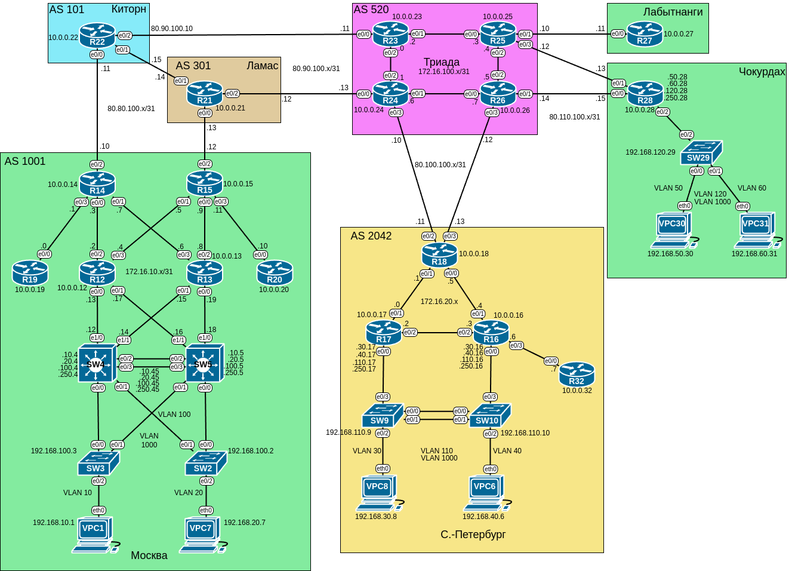

# Домашнее задание №5 «Маршрутизация на основе политик»

## Цель работы

В данной самостоятельной работе необходимо настроить политику маршрутизации в
офисе "Чокурдах" и распределить трафик между 2 линками.

## Задачи

- [Домашнее задание №5 «Маршрутизация на основе политик»](#домашнее-задание-5-маршрутизация-на-основе-политик)
  - [Цель работы](#цель-работы)
  - [Задачи](#задачи)
  - [Топология](#топология)
  - [1. Настройка политики маршрутизации](#1-настройка-политики-маршрутизации)
  - [2. Настройка распределения трафика](#2-настройка-распределения-трафика)
  - [3. Отслеживание линка (IP SLA)](#3-отслеживание-линка-ip-sla)
  - [4. Настройка маршрута по умолчанию](#4-настройка-маршрута-по-умолчанию)
  - [Файлы настроек](#файлы-настроек)

## Топология

Топология лабораторного стенда собрана в среде EVE-NG.



## 1. Настройка политики маршрутизации

В предыдущей работы мы настроили IPv4 адреса на устройствах нашей топологии. Таблица
адресации для офисов "Чокурдах", "Лабытнанги" и прилегающих к ним маршрутизаторов
провайдера "Триада":

| Устройство | Интерфейс | IP-адрес       | Шлюз по умолчанию |
| ---------- | --------- | -------------- | ----------------- |
| VPC30      | eth0      | 192.168.50.30  | 192.168.50.28     |
| VPC31      | eth0      | 192.168.60.31  | 192.168.60.28     |
| SW29       | SVI       | 192.168.120.29 | 192.168.120.28    |
| R28        | e0/0      | 80.110.100.15  |                   |
|            | e0/1      | 80.110.100.13  |                   |
|            | e0/2.50   | 192.168.50.28  |                   |
|            | e0/2.60   | 192.168.60.28  |                   |
|            | e0/2.120  | 192.168.120.28 |                   |
|            | e0/2.250  | 192.168.250.28 |                   |
| R27        | e0/0      | 80.110.100.11  |                   |
| R25        | e0/1      | 80.110.100.10  |                   |
|            | e0/3      | 80.110.100.12  |                   |
| R26        | e0/1      | 80.110.100.14  |                   |

В качестве шлюза по умолчанию для соответствующих вланов выступает маршрутизатор
R28. Для работы пинга настроим статические обратные маршруты в локальную сеть офиса
"Чокурдах" на граничных роутерах провайдера.

```text
R25(config)#ip route 192.168.50.0 255.255.255.0 80.110.100.13
R25(config)#ip route 192.168.60.0 255.255.255.0 80.110.100.13
R25(config)#ip route 192.168.120.0 255.255.255.0 80.110.100.13
```

```text
R26(config)#ip route 192.168.50.0 255.255.255.0 80.110.100.15
R26(config)#ip route 192.168.60.0 255.255.255.0 80.110.100.15
R26(config)#ip route 192.168.120.0 255.255.255.0 80.110.100.15
```
Теперь маршрутизаторы провайдера пингуются с VPC30 и VPC31

<details>
<summary>Вывод ping</summary>

```text
VPC30> ping 80.110.100.14

84 bytes from 80.110.100.14 icmp_seq=1 ttl=254 time=1.665 ms
84 bytes from 80.110.100.14 icmp_seq=2 ttl=254 time=1.693 ms
^C
VPC30> ping 80.110.100.12

84 bytes from 80.110.100.12 icmp_seq=1 ttl=254 time=0.797 ms
84 bytes from 80.110.100.12 icmp_seq=2 ttl=254 time=1.390 ms
^C
```

```text
VPC31> ping 80.110.100.12

84 bytes from 80.110.100.12 icmp_seq=1 ttl=254 time=0.912 ms
84 bytes from 80.110.100.12 icmp_seq=2 ttl=254 time=1.085 ms
^C
VPC31> ping 80.110.100.14

84 bytes from 80.110.100.14 icmp_seq=1 ttl=254 time=1.713 ms
84 bytes from 80.110.100.14 icmp_seq=2 ttl=254 time=1.208 ms
^C
VPC31>
```

</details>

Дальнейшая маршрутизация остаётся на совести провайдера.

## 2. Настройка распределения трафика

Распределим трафик между двумя линками с провайдером так, чтобы трафик VLAN50 шёл
по верхнему линку к R25, а трафик VLAN 60 - по нижнему, к R26.

Зададим ACL для соответствующих подсетей:

```text
R28(config)#ip access-list standard ACL_VLAN50
R28(config-std-nacl)#permit 192.168.50.0 0.0.0.255
R28(config-std-nacl)#exit
R28(config)#ip access-list standard ACL_VLAN60
R28(config-std-nacl)#permit 192.168.60.0 0.0.0.255     
R28(config-std-nacl)#exit
```

Настроим route-map:

```text
R28(config)#route-map BALANCE permit 10
R28(config-route-map)#match ip address ACL_VLAN50
R28(config-route-map)#set ip next-hop 80.110.100.12
R28(config-route-map)#exit
R28(config)#route-map BALANCE permit 20  
R28(config-route-map)#match ip address ACL_VLAN60  
R28(config-route-map)#set ip next-hop 80.110.100.14
R28(config-route-map)#exit
R28(config)#
```

Назначим route-map на соответствующие входные интерфейсы:

```text
R28(config)#int e0/2.50
R28(config-subif)#ip policy route-map BALANCE
R28(config-subif)#exit
R28(config)#int e0/2.60                
R28(config-subif)#ip policy route-map BALANCE
R28(config-subif)#end
R28#
```

Теперь траффик от VPC30 (50-й влан) проходит только по верхнему линку, а от
VPC31 - по нижнему. При этом для SW29, по-прежнему доступны оба линка:

<details>
<summary>Вывод ping</summary>

```text
VPC30> ping 80.110.100.12

84 bytes from 80.110.100.12 icmp_seq=1 ttl=254 time=1.204 ms
84 bytes from 80.110.100.12 icmp_seq=2 ttl=254 time=1.282 ms
^C
VPC30> ping 80.110.100.14

*80.110.100.12 icmp_seq=1 ttl=254 time=1.300 ms (ICMP type:3, code:1, Destination host unreachable)
*80.110.100.12 icmp_seq=2 ttl=254 time=1.323 ms (ICMP type:3, code:1, Destination host unreachable)
^C
VPC30>
```

```text
VPC31> ping 80.110.100.12

*80.110.100.14 icmp_seq=1 ttl=254 time=0.820 ms (ICMP type:3, code:1, Destination host unreachable)
*80.110.100.14 icmp_seq=2 ttl=254 time=2.059 ms (ICMP type:3, code:1, Destination host unreachable)
^C
VPC31> ping 80.110.100.14

84 bytes from 80.110.100.14 icmp_seq=1 ttl=254 time=1.570 ms
84 bytes from 80.110.100.14 icmp_seq=3 ttl=254 time=1.297 ms
^C
VPC31>
```

```text
SW29>ping 80.110.100.12
Type escape sequence to abort.
Sending 5, 100-byte ICMP Echos to 80.110.100.12, timeout is 2 seconds:
!!!!!
Success rate is 100 percent (5/5), round-trip min/avg/max = 1/1/1 ms
SW29>ping 80.110.100.14
Type escape sequence to abort.
Sending 5, 100-byte ICMP Echos to 80.110.100.14, timeout is 2 seconds:
!!!!!
Success rate is 100 percent (5/5), round-trip min/avg/max = 1/1/2 ms
SW29>
```

</details>

Для просмотра настроек и статистики срабатывания воспользуемся командами
**show access-lists**, **show route-map** и **show ip policy**:

Списки доступа:

```text
R28#show access-lists 
Standard IP access list ACL_VLAN50
    10 permit 192.168.50.0, wildcard bits 0.0.0.255 (4 matches)
Standard IP access list ACL_VLAN60
    10 permit 192.168.60.0, wildcard bits 0.0.0.255 (5 matches)
```

Назначение route-map интерфейсам:

```text
R28#show ip policy
Interface      Route map
Ethernet0/2.50 BALANCE
Ethernet0/2.60 BALANCE
```

Число "срабатываний" route-map:

```text
R28#show route-map 
route-map BALANCE, permit, sequence 10
  Match clauses:
    ip address (access-lists): ACL_VLAN50 
  Set clauses:
    ip next-hop 80.110.100.12
  Policy routing matches: 4 packets, 408 bytes
route-map BALANCE, permit, sequence 20
  Match clauses:
    ip address (access-lists): ACL_VLAN60 
  Set clauses:
    ip next-hop 80.110.100.14
  Policy routing matches: 5 packets, 510 bytes
```

## 3. Отслеживание линка (IP SLA)

Дополнительно к route-map настроим отслеживание линка через технологию IP SLA.
Для проверки доступности используем ping:

```text
R28(config)#ip sla 1
R28(config-ip-sla)#icmp-echo 80.110.100.12 source-ip 80.110.100.13
R28(config-ip-sla-echo)#frequency 10
R28(config-ip-sla-echo)#exit
R28(config)#ip sla schedule 1 life forever start-time now
R28(config)#ip sla 2                                       
R28(config-ip-sla)#icmp-echo 80.110.100.14 source-ip 80.110.100.15
R28(config-ip-sla-echo)#frequency 10
R28(config-ip-sla-echo)#exit
R28(config)#ip sla schedule 2 life forever start-time now    
R28(config)#
```

Привяжем sla к треку:

```text
R28(config)#track 1 ip sla 1 reachability
R28(config-track)#delay down 90 up 90
R28(config-track)#exit
R28(config)#track 2 ip sla 2 reachability
R28(config-track)#delay down 90 up 90          
R28(config-track)#exit
R28(config)#
```

Модифицируем route-map: будем менять некстхоп если он доступен.

```text
R28(config)#route-map BALANCE permit 10  
R28(config-route-map)#no set ip next-hop 80.110.100.12
R28(config-route-map)#set ip next-hop verify-availability 80.110.100.12 10 track 1
R28(config-route-map)#set ip next-hop verify-availability 80.110.100.14 20 track 2
R28(config-route-map)#exit
R28(config)#route-map BALANCE permit 20 
R28(config-route-map)#no set ip next-hop 80.110.100.14
R28(config-route-map)#set ip next-hop verify-availability 80.110.100.14 10 track 2
R28(config-route-map)#set ip next-hop verify-availability 80.110.100.12 20 track 1
R28(config-route-map)#exit
```

Проверим работу на примере VPC30. В исходной конфигурации трафик от него направлялся
на R25, R26 был недоступен:

```text
VPC30> ping 80.110.100.12

84 bytes from 80.110.100.12 icmp_seq=1 ttl=254 time=0.846 ms
^C
VPC30> ping 80.110.100.14

*80.110.100.12 icmp_seq=1 ttl=254 time=1.784 ms (ICMP type:3, code:1, Destination host unreachable)
^C
VPC30>
```

Выключим маршрутизатор R25. Теперь оба маршрутизатора недоступны:

```text
VPC30> ping 80.110.100.12

80.110.100.12 icmp_seq=1 timeout
^C
VPC30> 
VPC30> ping 80.110.100.14

80.110.100.14 icmp_seq=1 timeout
80.110.100.14 icmp_seq=2 timeout
^C
VPC30>
```

Для того, чтобы маршрут переключился на R26, подождём delay секунд (мы указали 90),
по прошествии которых R26 станет доступен, а R25 нет:

```text
PC30> ping 80.110.100.14

84 bytes from 80.110.100.14 icmp_seq=1 ttl=254 time=1.178 ms
84 bytes from 80.110.100.14 icmp_seq=2 ttl=254 time=0.668 ms
^C
VPC30> ping 80.110.100.12

*80.110.100.14 icmp_seq=1 ttl=254 time=1.084 ms (ICMP type:3, code:1, Destination host unreachable)
*80.110.100.14 icmp_seq=2 ttl=254 time=1.290 ms (ICMP type:3, code:1, Destination host unreachable)
^C
VPC30>
```

На шлюзе R28 также появились изменения:

```text
R28#
*May 29 06:21:25.568: %TRACK-6-STATE: 1 ip sla 1 reachability Up -> Down
R28#show route-map 
route-map BALANCE, permit, sequence 10
  Match clauses:
    ip address (access-lists): ACL_VLAN50 
  Set clauses:
    ip next-hop verify-availability 80.110.100.12 10 track 1  [down]
    ip next-hop verify-availability 80.110.100.14 20 track 2  [up]
  Policy routing matches: 15 packets, 1530 bytes
route-map BALANCE, permit, sequence 20
  Match clauses:
    ip address (access-lists): ACL_VLAN60 
  Set clauses:
    ip next-hop verify-availability 80.110.100.14 10 track 2  [up]
    ip next-hop verify-availability 80.110.100.12 20 track 1  [down]
  Policy routing matches: 5 packets, 510 bytes
R28#  
```

Также можно вывести сводку настроек IP SLA и статистику проверок.

<details>
<summary>Вывод команд show</summary>

```text
R28#show ip sla summary
IPSLAs Latest Operation Summary
Codes: * active, ^ inactive, ~ pending

ID           Type        Destination       Stats       Return      Last
                                           (ms)        Code        Run 
-----------------------------------------------------------------------
*1           icmp-echo   80.110.100.12     -           Timeout     14 seconds ag
                                                                   o            
                                                                                
                                                                                
                                                                                
*2           icmp-echo   80.110.100.14     RTT=1       OK          7 seconds ago
                                                                                
                                                                                
                                                                                
                                                                                

R28#show ip sla statistics
IPSLAs Latest Operation Statistics

IPSLA operation id: 1
	Latest RTT: NoConnection/Busy/Timeout
Latest operation start time: 06:29:48 UTC Thu May 29 2025
Latest operation return code: Timeout
Number of successes: 210
Number of failures: 61
Operation time to live: Forever


IPSLA operation id: 2
	Latest RTT: 1 milliseconds
Latest operation start time: 06:29:55 UTC Thu May 29 2025
Latest operation return code: OK
Number of successes: 269
Number of failures: 0
Operation time to live: Forever

R28#
```

</details>

## 4. Настройка маршрута по умолчанию

Для офиса Лабытнанги настроим маршрут по-умолчанию.

```text
R27(config)#ip route 0.0.0.0 0.0.0.0 80.110.100.10
R27(config)#
```

В выводе **show ip route** появился "Gateway of last resort":

```text
R27#sh ip route
Codes: L - local, C - connected, S - static, R - RIP, M - mobile, B - BGP
       D - EIGRP, EX - EIGRP external, O - OSPF, IA - OSPF inter area 
       N1 - OSPF NSSA external type 1, N2 - OSPF NSSA external type 2
       E1 - OSPF external type 1, E2 - OSPF external type 2
       i - IS-IS, su - IS-IS summary, L1 - IS-IS level-1, L2 - IS-IS level-2
       ia - IS-IS inter area, * - candidate default, U - per-user static route
       o - ODR, P - periodic downloaded static route, H - NHRP, l - LISP
       a - application route
       + - replicated route, % - next hop override

Gateway of last resort is 80.110.100.10 to network 0.0.0.0

S*    0.0.0.0/0 [1/0] via 80.110.100.10
      10.0.0.0/32 is subnetted, 1 subnets
C        10.0.0.27 is directly connected, Loopback0
      80.0.0.0/8 is variably subnetted, 2 subnets, 2 masks
C        80.110.100.10/31 is directly connected, Ethernet0/0
L        80.110.100.11/32 is directly connected, Ethernet0/0
R27#
```

## Файлы настроек

<details>
<summary>R25</summary>

```text
R25#sh run
Building configuration...

Current configuration : 1416 bytes
!
version 15.4
service timestamps debug datetime msec
service timestamps log datetime msec
no service password-encryption
!
hostname R25
!
boot-start-marker
boot-end-marker
!
!
!
no aaa new-model
mmi polling-interval 60
no mmi auto-configure
no mmi pvc
mmi snmp-timeout 180
!
!
!
!         
!
!
!
!


!
!
!
!
no ip domain lookup
ip cef
no ipv6 cef
!
multilink bundle-name authenticated
!
!
!
!
!
!
!
!         
!
redundancy
!
!
! 
!
!
!
!
!
!
!
!
!
!
!
!
interface Loopback0
 ip address 10.0.0.25 255.255.255.255
!
interface Ethernet0/0
 description Link to R23
 ip address 172.16.100.3 255.255.255.254
!
interface Ethernet0/1
 description Downlink to R27
 ip address 80.110.100.10 255.255.255.254
!
interface Ethernet0/2
 description Link to R26
 ip address 172.16.100.4 255.255.255.254
!
interface Ethernet0/3
 description Downlink to R28
 ip address 80.110.100.12 255.255.255.254
!
interface Ethernet1/0
 no ip address
 shutdown
!
interface Ethernet1/1
 no ip address
 shutdown
!
interface Ethernet1/2
 no ip address
 shutdown
!
interface Ethernet1/3
 no ip address
 shutdown
!
ip forward-protocol nd
!
!
no ip http server
no ip http secure-server
ip route 192.168.50.0 255.255.255.0 80.110.100.13
ip route 192.168.60.0 255.255.255.0 80.110.100.13
ip route 192.168.120.0 255.255.255.0 80.110.100.13
!
!
!
!
control-plane
!
!
!
!         
!
!
!
!
line con 0
 logging synchronous
line aux 0
line vty 0 4
 login
 transport input none
!
!
end

R25#
```

</details>

<details>
<summary>R26</summary>

```text
R26#sh run
Building configuration...

Current configuration : 1416 bytes
!
version 15.4
service timestamps debug datetime msec
service timestamps log datetime msec
no service password-encryption
!
hostname R26
!
boot-start-marker
boot-end-marker
!
!
!
no aaa new-model
mmi polling-interval 60
no mmi auto-configure
no mmi pvc
mmi snmp-timeout 180
!
!
!
!         
!
!
!
!


!
!
!
!
no ip domain lookup
ip cef
no ipv6 cef
!
multilink bundle-name authenticated
!
!
!
!
!
!
!
!         
!
redundancy
!
!
! 
!
!
!
!
!
!
!
!
!
!
!
!
interface Loopback0
 ip address 10.0.0.26 255.255.255.255
!
interface Ethernet0/0
 description Link to R24
 ip address 172.16.100.7 255.255.255.254
!
interface Ethernet0/1
 description Downlink to R28
 ip address 80.110.100.14 255.255.255.254
!
interface Ethernet0/2
 description Link to R25
 ip address 172.16.100.5 255.255.255.254
!
interface Ethernet0/3
 description Downlink to R18
 ip address 80.100.100.12 255.255.255.254
!
interface Ethernet1/0
 no ip address
 shutdown
!
interface Ethernet1/1
 no ip address
 shutdown
!
interface Ethernet1/2
 no ip address
 shutdown
!
interface Ethernet1/3
 no ip address
 shutdown
!
ip forward-protocol nd
!
!
no ip http server
no ip http secure-server
ip route 192.168.50.0 255.255.255.0 80.110.100.15
ip route 192.168.60.0 255.255.255.0 80.110.100.15
ip route 192.168.120.0 255.255.255.0 80.110.100.15
!
!
!
!
control-plane
!
!
!
!         
!
!
!
!
line con 0
 logging synchronous
line aux 0
line vty 0 4
 login
 transport input none
!
!
end

R26#
```

</details>

<details>
<summary>R27</summary>

```text
R27#sh run
Building configuration...

Current configuration : 1236 bytes
!
! Last configuration change at 06:38:15 UTC Thu May 29 2025
!
version 15.4
service timestamps debug datetime msec
service timestamps log datetime msec
no service password-encryption
!
hostname R27
!
boot-start-marker
boot-end-marker
!
!
!
no aaa new-model
mmi polling-interval 60
no mmi auto-configure
no mmi pvc
mmi snmp-timeout 180
!
!         
!
!
!
!
!
!


!
!
!
!
no ip domain lookup
ip cef
no ipv6 cef
!
multilink bundle-name authenticated
!
!
!
!
!
!         
!
!
!
redundancy
!
!
! 
!
!
!
!
!
!
!
!
!
!
!
!
interface Loopback0
 ip address 10.0.0.27 255.255.255.255
!
interface Ethernet0/0
 description Uplink to R25
 ip address 80.110.100.11 255.255.255.254
!
interface Ethernet0/1
 no ip address
 shutdown
!
interface Ethernet0/2
 no ip address
 shutdown
!
interface Ethernet0/3
 no ip address
 shutdown
!
interface Ethernet1/0
 no ip address
 shutdown
!
interface Ethernet1/1
 no ip address
 shutdown
!         
interface Ethernet1/2
 no ip address
 shutdown
!
interface Ethernet1/3
 no ip address
 shutdown
!
ip forward-protocol nd
!
!
no ip http server
no ip http secure-server
ip route 0.0.0.0 0.0.0.0 80.110.100.10
!
!
!
!
control-plane
!
!
!
!         
!
!
!
!
line con 0
 logging synchronous
line aux 0
line vty 0 4
 login
 transport input none
!
!
end

R27#
```

</details>

<details>
<summary>R28</summary>

```text
R28#sh run
Building configuration...

Current configuration : 2691 bytes
!
! Last configuration change at 06:20:00 UTC Thu May 29 2025
!
version 15.4
service timestamps debug datetime msec
service timestamps log datetime msec
no service password-encryption
!
hostname R28
!
boot-start-marker
boot-end-marker
!
!
!
no aaa new-model
mmi polling-interval 60
no mmi auto-configure
no mmi pvc
mmi snmp-timeout 180
!
!         
!
!
!
!
!
!


!
!
!
!
no ip domain lookup
ip cef
no ipv6 cef
!
multilink bundle-name authenticated
!
!
!
!
!
!         
!
!
!
redundancy
!
!
track 1 ip sla 1 reachability
 delay down 90 up 90
!
track 2 ip sla 2 reachability
 delay down 90 up 90
!
! 
!
!
!
!
!
!
!
!
!
!         
!
!
interface Loopback0
 ip address 10.0.0.28 255.255.255.255
!
interface Ethernet0/0
 description Uplink to R26
 ip address 80.110.100.15 255.255.255.254
!
interface Ethernet0/1
 description Uplink to R25
 ip address 80.110.100.13 255.255.255.254
!
interface Ethernet0/2
 description Trunk to SW29
 no ip address
!
interface Ethernet0/2.50
 description Default GW for VLAN 50
 encapsulation dot1Q 50
 ip address 192.168.50.28 255.255.255.0
 ip policy route-map BALANCE
!         
interface Ethernet0/2.60
 description Default GW for VLAN 60
 encapsulation dot1Q 60
 ip address 192.168.60.28 255.255.255.0
 ip policy route-map BALANCE
!
interface Ethernet0/2.120
 description Default GW for VLAN 120
 encapsulation dot1Q 120
 ip address 192.168.120.28 255.255.255.0
!
interface Ethernet0/2.1000
 description Default GW for native VLAN 1000
 encapsulation dot1Q 1000 native
 ip address 192.168.250.28 255.255.255.0
!
interface Ethernet0/3
 no ip address
 shutdown
!
interface Ethernet1/0
 no ip address
 shutdown 
!
interface Ethernet1/1
 no ip address
 shutdown
!
interface Ethernet1/2
 no ip address
 shutdown
!
interface Ethernet1/3
 no ip address
 shutdown
!
ip forward-protocol nd
!
!
no ip http server
no ip http secure-server
!
ip access-list standard ACL_VLAN50
 permit 192.168.50.0 0.0.0.255
ip access-list standard ACL_VLAN60
 permit 192.168.60.0 0.0.0.255
!
ip sla 1
 icmp-echo 80.110.100.12 source-ip 80.110.100.13
 frequency 10
ip sla schedule 1 life forever start-time now
ip sla 2
 icmp-echo 80.110.100.14 source-ip 80.110.100.15
 frequency 10
ip sla schedule 2 life forever start-time now
!
route-map BALANCE permit 10
 match ip address ACL_VLAN50
 set ip next-hop verify-availability 80.110.100.12 10 track 1
 set ip next-hop verify-availability 80.110.100.14 20 track 2
!
route-map BALANCE permit 20
 match ip address ACL_VLAN60
 set ip next-hop verify-availability 80.110.100.14 10 track 2
 set ip next-hop verify-availability 80.110.100.12 20 track 1
!
!
!
control-plane
!
!
!
!
!
!
!
!
line con 0
 logging synchronous
line aux 0
line vty 0 4
 login
 transport input none
!
!
end

R28#
```

</details>

Готовая лабораторная (экспорт из EVE-NG) - [12_pbr.zip](./12_pbr.zip).
