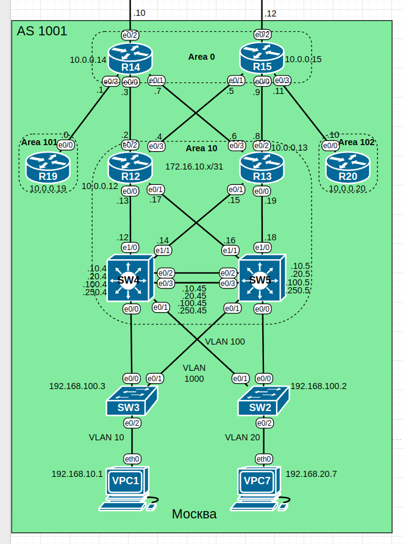

# Домашнее задание №6 «OSPF»

## Цель работы

В данной самостоятельной работе необходимо настроить OSPF и фильтрацию в офисе
"Москва" согласно техническим требованиям.

## Технические требования

Настройки OSPF на маршрутизаторах должны отвечать следующим требованиям:

* **R14** и **R15** находятся в зоне **0** - backbone;
* **R12** и **R13** находятся в зоне **10**. Дополнительно к маршрутам они
  должны получать маршрут по умолчанию;
* **R19** находится в зоне **101** и получает только маршрут по умолчанию;
* **R20** находится в зоне **102** и получает все маршруты, кроме маршрутов до
  сетей зоны **101**.

## Задачи

<!-- no toc -->
1. [Разделение сети на зоны.](#1-разделение-сети-на-зоны)
2. [Настройка OSPF.](#2-настройка-ospf)
3. [Настройка фильтрации.](#3-настройка-фильтрации)

## Топология

Топология лабораторного стенда собрана в среде EVE-NG.



## 1. Разделение сети на зоны

Разделение маршрутизаторов по зонам и требования к получаемым маршрутам описаны
в пункте [Технические требования](#технические-требования). Так как в офисе "Москва"
коммутаторы **SW4** и **SW5** работают в режиме L3, то мы их также включим в OSPF,
в одну зоны с **R12** и **R13**.

| Зона     | Устройства         | Какие маршруты получают               |
| -------- | ------------------ | ------------------------------------- |
| Area 0   | R14, R15           | Все                                   |
| Area 10  | R12, R13, SW4, SW5 | Все маршрут по умолчанию              |
| Area 101 | R19                | Только маршрут по умолчанию           |
| Area 102 | R20                | Все, кроме маршрута до сетей зоны 101 |

## 2. Настройка OSPF

### Включение OSPF и выбор router-id

Включим OSPFv2 на всех маршрутизаторах офиса "Москва", а также на коммутаторах
**SW4** и **SW5**. Номер процесса везде будет одинаков и равен единице. Явно
зададим **router-id** совпадающим с адресом лупбека (для коммутаторов выберем по
аналогичному принципу):

```text
R14(config)#router ospf 1
R14(config-router)#router-id 10.0.0.14    
R14(config-router)#exit
R14(config)#
```

Таблица router-id:

| Зона     | Устройство | router-id |
| -------- | ---------- | --------- |
| Area 0   | R14        | 10.0.0.14 |
|          | R15        | 10.0.0.15 |
| Area 10  | R12        | 10.0.0.12 |
|          | R13        | 10.0.0.13 |
|          | SW4        | 10.0.0.4  |
|          | SW5        | 10.0.0.5  |
| Area 101 | R19        | 10.0.0.19 |
| Area 102 | R20        | 10.0.0.20 |

### Добавление интерфейсов в зоны

Роутер может состоять в нескольких зонах. Таблица принадлежности
интерфейсов зонам:

| Устройство | Интерфейс | Зона     |
| ---------- | --------- | -------- |
| R14        | e0/0      | Area 10  |
| R14        | e0/1      | Area 10  |
| R14        | e0/2      | Area 0   |
| R14        | e0/3      | Area 101 |
| R15        | e0/0      | Area 10  |
| R15        | e0/1      | Area 10  |
| R15        | e0/2      | Area 0   |
| R15        | e0/3      | Area 102 |
| R12        | e0/0      | Area 10  |
| R12        | e0/1      | Area 10  |
| R12        | e0/2      | Area 10  |
| R12        | e0/3      | Area 10  |
| R13        | e0/0      | Area 10  |
| R13        | e0/1      | Area 10  |
| R13        | e0/2      | Area 10  |
| R13        | e0/3      | Area 10  |
| SW4        | e1/0      | Area 10  |
| SW4        | e1/1      | Area 10  |
| SW4        | Vlan10    | Area 10  |
| SW4        | Vlan20    | Area 10  |
| SW4        | Vlan100   | Area 10  |
| SW4        | Vlan1000  | Area 10  |
| SW5        | e1/0      | Area 10  |
| SW5        | e1/1      | Area 10  |
| SW5        | Vlan10    | Area 10  |
| SW5        | Vlan20    | Area 10  |
| SW5        | Vlan100   | Area 10  |
| SW5        | Vlan1000  | Area 10  |
| R19        | e0/0      | Area 101 |
| R20        | e0/0      | Area 102 |

Добавим интерфейсы в OSPF командой **ip ospf 1 area X** на соответствующем
интерфейсе, где X - номер зоны.

Пример на **R14**:

```text
R14(config)#int e0/0
R14(config-if)#ip ospf 1 area 10
R14(config-if)#exit
R14(config)#
```

### Настройка линков "точка-точка"

Для ускорения работы протокола OSPF явно зададим тип сети "точка-точка" на
всех интерфейсах между маршрутизаторами.

```text
R19(config)#int e0/0
R19(config-if)#ip ospf network point-to-point
R19(config-if)#end
R19#
```

### Ограничение анонсов OSPF в клиентские сети

Дополнительно ограничим рассылку OSPF сообщений на интерфейсах
коммутаторов **SW4** и **SW5** которые подключены к другим коммутаторам.

```text
SW4(config)#router ospf 1            
SW4(config-router)#passive-interface vlan10
SW4(config-router)#passive-interface vlan20
SW4(config-router)#passive-interface vlan100
SW4(config-router)#passive-interface vlan1000
SW4(config-router)#end
SW4#
```

### Настройка маршрутов по умолчанию

Включим распространение маршрута по умолчанию на граничных маршрутизаторах
**R14** и **R15**. Для этого добавим на них маршруты по умолчанию с интерфейсом
в сторону провайдера, а затем воспользуемся командой **default-information originate**.

```text
R14(config)#ip route 0.0.0.0 0.0.0.0 e0/2    
%Default route without gateway, if not a point-to-point interface, may impact performance
R14(config)#router ospf 1
R14(config-router)#default-information originate
R14(config-router)#exit
R14(config)#
```

Получить такой же результат можно было бы объявив зону 10 как **stub**.

### Добавление virtual-link

В нашей топологии между маршрутизаторами **R14** и **R15** нет прямой связи. Как
следствие зона 0 получается разрывной и отношение соседства между ними не устанавливается:

```text
R14#sh ip ospf neighbor 

Neighbor ID     Pri   State           Dead Time   Address         Interface
10.0.0.13         0   FULL/  -        00:00:37    172.16.10.6     Ethernet0/1
10.0.0.12         0   FULL/  -        00:00:35    172.16.10.2     Ethernet0/0
10.0.0.19         0   FULL/  -        00:00:37    172.16.10.0     Ethernet0/3
R14#
```

Это может привести к нежелательному поведению протокола OSPF, например к разным
копиям дерева кратчайшего пути, возможным петлям или блекхолам. В нашем случае было
замечено, что маршрутизаторы **R19** и **R20** получали разные наборы маршрутов.

Для решения этой проблемы обычно предлагается напрямую соединить маршрутизаторы.
В нашем случае связность между ними присутствует, даже избыточная: через роутеры
**R12** и **R13**. Поэтому воспользуемся альтернативным вариантом и поднимем
virtual-link.

Virtual-link позволяет связать разрывную зону через общую. В нашем случае зона 0
будет связана через зону 10. Настройки выполняются на ABR`ах, соединяющих зоны; у
нас это будут **R14** и **R15**.

```text
R14(config)#router ospf 1
R14(config-router)#area 10 virtual-link 10.0.0.15
R14(config-router)#end
R14#
```

После аналогичной настройки на **R15** виртуальный канал будет поднят:

```text
R14#sh ip ospf virtual-links 
Virtual Link OSPF_VL0 to router 10.0.0.15 is up
  Run as demand circuit
  DoNotAge LSA allowed.
  Transit area 10, via interface Ethernet0/0
 Topology-MTID    Cost    Disabled     Shutdown      Topology Name
        0           20        no          no            Base
  Transmit Delay is 1 sec, State POINT_TO_POINT,
  Timer intervals configured, Hello 10, Dead 40, Wait 40, Retransmit 5
    Hello due in 00:00:03
    Adjacency State FULL (Hello suppressed)
    Index 1/4, retransmission queue length 0, number of retransmission 0
    First 0x0(0)/0x0(0) Next 0x0(0)/0x0(0)
    Last retransmission scan length is 0, maximum is 0
    Last retransmission scan time is 0 msec, maximum is 0 msec
R14#
```

Теперь соседство установлено.

```text
R15(config-router)#en
*Jun 12 09:31:19.157: %OSPF-5-ADJCHG: Process 1, Nbr 10.0.0.14 on OSPF_VL0 from LOADING to FULL, Loading Done
R15(config-router)#end
R15#
*Jun 12 09:31:20.741: %SYS-5-CONFIG_I: Configured from console by console
R15#sh ip ospf neighbor 

Neighbor ID     Pri   State           Dead Time   Address         Interface
10.0.0.14         0   FULL/  -        00:00:29    172.16.10.7     OSPF_VL0
10.0.0.12         0   FULL/  -        00:00:37    172.16.10.4     Ethernet0/1
10.0.0.13         0   FULL/  -        00:00:39    172.16.10.8     Ethernet0/0
10.0.0.20         0   FULL/  -        00:00:37    172.16.10.10    Ethernet0/3
R15#
```

## 3. Настройка фильтрации

У нас задано три требования:

* маршрутизаторы **R12** и **R13** должны получать все маршруты и маршрут по умолчанию;
* **R19** должен получать только маршрут по умолчанию;
* **R20** должен получать все маршруты, кроме маршрута по умолчанию.

Первое требование стало выполняться после того, как мы настроили распространение
маршрутов по умолчанию на граничных маршрутизаторах **R14** и **R15**. Дополнительно
ничего настраивать не требуется.

<details>
<summary>R12>show ip route</summary>

```text
R12>show ip route     
Codes: L - local, C - connected, S - static, R - RIP, M - mobile, B - BGP
       D - EIGRP, EX - EIGRP external, O - OSPF, IA - OSPF inter area 
       N1 - OSPF NSSA external type 1, N2 - OSPF NSSA external type 2
       E1 - OSPF external type 1, E2 - OSPF external type 2
       i - IS-IS, su - IS-IS summary, L1 - IS-IS level-1, L2 - IS-IS level-2
       ia - IS-IS inter area, * - candidate default, U - per-user static route
       o - ODR, P - periodic downloaded static route, H - NHRP, l - LISP
       a - application route
       + - replicated route, % - next hop override

Gateway of last resort is 172.16.10.5 to network 0.0.0.0

O*E2  0.0.0.0/0 [110/1] via 172.16.10.5, 00:52:38, Ethernet0/3
                [110/1] via 172.16.10.3, 00:52:48, Ethernet0/2
      10.0.0.0/32 is subnetted, 1 subnets
C        10.0.0.12 is directly connected, Loopback0
      80.0.0.0/31 is subnetted, 2 subnets
O IA     80.80.100.10 [110/20] via 172.16.10.3, 00:52:48, Ethernet0/2
O IA     80.80.100.12 [110/20] via 172.16.10.5, 00:52:32, Ethernet0/3
      172.16.0.0/16 is variably subnetted, 14 subnets, 2 masks
O IA     172.16.10.0/31 [110/20] via 172.16.10.3, 00:52:48, Ethernet0/2
C        172.16.10.2/31 is directly connected, Ethernet0/2
L        172.16.10.2/32 is directly connected, Ethernet0/2
C        172.16.10.4/31 is directly connected, Ethernet0/3
L        172.16.10.4/32 is directly connected, Ethernet0/3
O        172.16.10.6/31 [110/20] via 172.16.10.3, 00:52:48, Ethernet0/2
O        172.16.10.8/31 [110/20] via 172.16.10.5, 00:52:48, Ethernet0/3
O IA     172.16.10.10/31 [110/20] via 172.16.10.5, 00:52:32, Ethernet0/3
C        172.16.10.12/31 is directly connected, Ethernet0/0
L        172.16.10.13/32 is directly connected, Ethernet0/0
O        172.16.10.14/31 [110/20] via 172.16.10.12, 00:52:48, Ethernet0/0
C        172.16.10.16/31 is directly connected, Ethernet0/1
L        172.16.10.17/32 is directly connected, Ethernet0/1
O        172.16.10.18/31 [110/20] via 172.16.10.16, 00:52:48, Ethernet0/1
O     192.168.10.0/24 [110/11] via 172.16.10.16, 00:52:48, Ethernet0/1
                      [110/11] via 172.16.10.12, 00:52:48, Ethernet0/0
O     192.168.20.0/24 [110/11] via 172.16.10.16, 00:52:48, Ethernet0/1
                      [110/11] via 172.16.10.12, 00:52:48, Ethernet0/0
O     192.168.100.0/24 [110/11] via 172.16.10.16, 00:52:48, Ethernet0/1
                       [110/11] via 172.16.10.12, 00:52:48, Ethernet0/0
O     192.168.250.0/24 [110/11] via 172.16.10.16, 00:52:48, Ethernet0/1
                       [110/11] via 172.16.10.12, 00:52:48, Ethernet0/0
R12>
```

</details>

<details>
<summary>R13>show ip route</summary>

```text
R13>show ip route
Codes: L - local, C - connected, S - static, R - RIP, M - mobile, B - BGP
       D - EIGRP, EX - EIGRP external, O - OSPF, IA - OSPF inter area 
       N1 - OSPF NSSA external type 1, N2 - OSPF NSSA external type 2
       E1 - OSPF external type 1, E2 - OSPF external type 2
       i - IS-IS, su - IS-IS summary, L1 - IS-IS level-1, L2 - IS-IS level-2
       ia - IS-IS inter area, * - candidate default, U - per-user static route
       o - ODR, P - periodic downloaded static route, H - NHRP, l - LISP
       a - application route
       + - replicated route, % - next hop override

Gateway of last resort is 172.16.10.9 to network 0.0.0.0

O*E2  0.0.0.0/0 [110/1] via 172.16.10.9, 00:53:59, Ethernet0/2
                [110/1] via 172.16.10.7, 00:58:17, Ethernet0/3
      10.0.0.0/32 is subnetted, 1 subnets
C        10.0.0.13 is directly connected, Loopback0
      80.0.0.0/31 is subnetted, 2 subnets
O IA     80.80.100.10 [110/20] via 172.16.10.7, 01:38:22, Ethernet0/3
O IA     80.80.100.12 [110/20] via 172.16.10.9, 00:53:54, Ethernet0/2
      172.16.0.0/16 is variably subnetted, 14 subnets, 2 masks
O IA     172.16.10.0/31 [110/20] via 172.16.10.7, 01:38:22, Ethernet0/3
O        172.16.10.2/31 [110/20] via 172.16.10.7, 01:38:22, Ethernet0/3
O        172.16.10.4/31 [110/20] via 172.16.10.9, 01:38:22, Ethernet0/2
C        172.16.10.6/31 is directly connected, Ethernet0/3
L        172.16.10.6/32 is directly connected, Ethernet0/3
C        172.16.10.8/31 is directly connected, Ethernet0/2
L        172.16.10.8/32 is directly connected, Ethernet0/2
O IA     172.16.10.10/31 [110/20] via 172.16.10.9, 00:53:54, Ethernet0/2
O        172.16.10.12/31 [110/20] via 172.16.10.14, 01:37:32, Ethernet0/1
C        172.16.10.14/31 is directly connected, Ethernet0/1
L        172.16.10.15/32 is directly connected, Ethernet0/1
O        172.16.10.16/31 [110/20] via 172.16.10.18, 01:37:16, Ethernet0/0
C        172.16.10.18/31 is directly connected, Ethernet0/0
L        172.16.10.19/32 is directly connected, Ethernet0/0
O     192.168.10.0/24 [110/11] via 172.16.10.18, 01:24:15, Ethernet0/0
                      [110/11] via 172.16.10.14, 01:32:15, Ethernet0/1
O     192.168.20.0/24 [110/11] via 172.16.10.18, 01:32:35, Ethernet0/0
                      [110/11] via 172.16.10.14, 01:24:43, Ethernet0/1
O     192.168.100.0/24 [110/11] via 172.16.10.18, 01:24:05, Ethernet0/0
                       [110/11] via 172.16.10.14, 01:32:45, Ethernet0/1
O     192.168.250.0/24 [110/11] via 172.16.10.18, 01:32:35, Ethernet0/0
                       [110/11] via 172.16.10.14, 01:22:31, Ethernet0/1
R13> 
```

</details>

### Настройка ограничений для зоны 101

Второе требование можно реализовать, изменив тип зоны 101 на **totally stub**.
Тогда эта зона будет получать только маршрут по умолчанию, маршруты из других
не будут рассылаться в неё.

Изменим тип зоны на всех маршрутизаторах, входящих в неё (**R14** и **R19**):

```text
R14(config)#router ospf 1
R14(config-router)#area 101 stub no-summary 
R14(config-router)#end
```

Теперь на R19 видны присутствуют только внутренние маршруты и маршрут по умолчанию:

```text
R19>sh ip rou
Gateway of last resort is 172.16.10.1 to network 0.0.0.0

O*IA  0.0.0.0/0 [110/11] via 172.16.10.1, 00:10:54, Ethernet0/0
      10.0.0.0/32 is subnetted, 1 subnets
C        10.0.0.19 is directly connected, Loopback0
      172.16.0.0/16 is variably subnetted, 2 subnets, 2 masks
C        172.16.10.0/31 is directly connected, Ethernet0/0
L        172.16.10.0/32 is directly connected, Ethernet0/0
R19>
```

### Настройка ограничений для зоны 102

Сейчас **R20** получает маршрут в 102-ю зону (сеть 172.16.10.0/31):

```text
R20>sh ip route
...
Gateway of last resort is 172.16.10.11 to network 0.0.0.0

O*E2  0.0.0.0/0 [110/1] via 172.16.10.11, 01:22:56, Ethernet0/0
      10.0.0.0/32 is subnetted, 1 subnets
C        10.0.0.20 is directly connected, Loopback0
      80.0.0.0/31 is subnetted, 2 subnets
O IA     80.80.100.10 [110/40] via 172.16.10.11, 00:01:06, Ethernet0/0
O IA     80.80.100.12 [110/20] via 172.16.10.11, 01:22:56, Ethernet0/0
      172.16.0.0/16 is variably subnetted, 11 subnets, 2 masks
O IA     172.16.10.0/31 [110/40] via 172.16.10.11, 00:01:06, Ethernet0/0
O IA     172.16.10.2/31 [110/30] via 172.16.10.11, 01:22:56, Ethernet0/0
...
```

Чтобы реализовать третье требование, настроим фильтрацию LSA3 в зону 102,
используя префикс-лист. Выполним следующие команды на ABR этой зоны:

```text
R15(config)#ip prefix-list AREA101_LSA_FILTER seq 5 deny 172.16.10.0/31
R15(config)#ip prefix-list AREA101_LSA_FILTER seq 10 permit 0.0.0.0/0 le 32
R15(config)#router ospf 1                                    
R15(config-router)#area 102 filter-list prefix AREA101_LSA_FILTER in
R15(config-router)#end
R15#
```

Теперь **R20** получает все маршруты, кроме **"O IA     172.16.10.0/31"**. Тем
не менее пинг к **R19** сохраняется, т.к. у нас есть маршрут по умолчанию через
**R15**.

## Файлы настроек

Файлы настроек устройств (конфиги) экспортированы в каталог [configs](./configs/).

Готовая лабораторная (экспорт из EVE-NG) - [15_ospf.zip](./15_ospf.zip).
