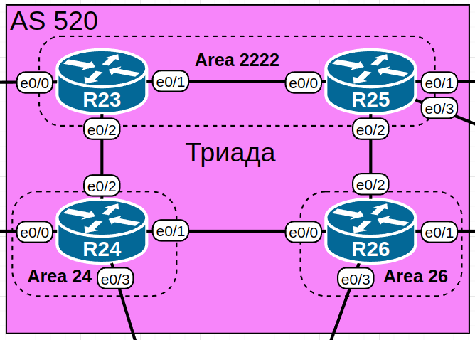

# Домашнее задание №7 «IS-IS»

## Цель работы

В данной самостоятельной работе необходимо настроить IS-IS в офисе
"Триада".

## Технические требования

Настройки IS-IS на маршрутизаторах должны отвечать следующим требованиям:

* **R23** и **R25** находятся в зоне **2222**;
* **R24** находится в зоне **24**;
* **R19** находится в зоне **26**.

## Топология

Топология лабораторного стенда собрана в среде EVE-NG.



## Настройка IS-IS

### Конфигурация маршрутизаторов

Включим процесс IS-IS на всех маршрутизаторах офиса "Триада":

```text
R23(config)#router isis
R23(config-router)#
```

Определим идентификаторы маршрутизаторов. Идентификатор (NET|NSAP) будет состоять
из следующих компонентов:

* 49
* номер зоны (area id)
* адрес (на основе IP адреса лупбека)
* 00

Таблица с идентификаторами (NET|NSAP адресами):

| Устройство | NET адрес                | Зона |
| ---------- | ------------------------- | ---- |
| R23        | 49.2222.0100.0000.0023.00 | 2222 |
| R24        | 49.0024.0100.0000.0024.00 | 24   |
| R25        | 49.2222.0100.0000.0025.00 | 2222 |
| R26        | 49.0026.0100.0000.0026.00 | 26   |

Зададим NET-адреса на маршрутизаторах:

```text
R23(config-router)#net 49.2222.0100.0000.0023.00 
R23(config-router)#exit
R23(config)#
```

Теперь включим IS-IS на интерфейсах:

```text
R23(config)#int r e0/1-2
R23(config-if-range)#ip router isis
R23(config-if-range)#end
R23#
```

### Просмотр сведений

На примере **R23** можно посмотреть, как отображается информация о соседях
по L1 и L2, топология и маршруты.

Соседи:

```text
R23#show isis neighbors 

System Id      Type Interface   IP Address      State Holdtime Circuit Id
R24            L2   Et0/2       172.16.100.1    UP    9        R24.02             
R25            L1   Et0/1       172.16.100.3    UP    8        R25.01             
R25            L2   Et0/1       172.16.100.3    UP    8        R25.01             
R23#
```

R25 присутствует дважды, так как с ним установлено и L1 и L2 соседство (в Cisco
по умолчанию при включении IS-IS маршрутизатор работает как L1-L2).

База данных IS-IS:

```text
R23#show isis database

IS-IS Level-1 Link State Database:
LSPID                 LSP Seq Num  LSP Checksum  LSP Holdtime      ATT/P/OL
R23.00-00           * 0x00000007   0xE55E        1147              1/0/0
R25.00-00             0x00000007   0xF443        1032              1/0/0
R25.01-00             0x00000002   0xB430        756               0/0/0
IS-IS Level-2 Link State Database:
LSPID                 LSP Seq Num  LSP Checksum  LSP Holdtime      ATT/P/OL
R23.00-00           * 0x00000008   0x2A9D        1106              0/0/0
R24.00-00             0x00000004   0x2485        1069              0/0/0
R24.02-00             0x00000002   0x3737        1004              0/0/0
R25.00-00             0x00000008   0xF5C7        1042              0/0/0
R25.01-00             0x00000002   0x4429        924               0/0/0
R26.00-00             0x00000003   0xBBDE        1129              0/0/0
R26.01-00             0x00000002   0x6307        977               0/0/0
R26.02-00             0x00000002   0x75F2        1055              0/0/0
R23#
```

Соответствие адресов IS-IS именам хостов:

```text
R23#show isis hostname
Level  System ID      Dynamic Hostname  (notag)
     * 0100.0000.0023 R23
 2     0100.0000.0025 R25
 2     0100.0000.0024 R24
 2     0100.0000.0026 R26
R23#
```

Топология:

```text
R23#show isis topology

IS-IS TID 0 paths to level-1 routers
System Id            Metric     Next-Hop             Interface   SNPA
R23                  --
R25                  10         R25                  Et0/1       aabb.cc01.9000 

IS-IS TID 0 paths to level-2 routers
System Id            Metric     Next-Hop             Interface   SNPA
R23                  --
R24                  10         R24                  Et0/2       aabb.cc01.8020 
R25                  10         R25                  Et0/1       aabb.cc01.9000 
R26                  20         R24                  Et0/2       aabb.cc01.8020 
                                R25                  Et0/1       aabb.cc01.9000 
R23#
```

Можно посмотреть, какие маршруты приходят по IS-IS:

```text
R23#show isis rib


IPv4 local RIB for IS-IS process 

IPV4 unicast topology base (TID 0, TOPOID 0x0) =================

172.16.100.0/31
  [115/L2/20] via 172.16.100.1(Ethernet0/2), from 172.16.100.1, tag 0, LSP[8/3] 
  [115/L2/30] via 172.16.100.3(Ethernet0/1), from 172.16.100.4, tag 0, LSP[6/5] 

172.16.100.2/31
  [115/L1/20] via 172.16.100.3(Ethernet0/1), from 172.16.100.4, tag 0, LSP[3/3] 
  [115/L2/20] via 172.16.100.3(Ethernet0/1), from 172.16.100.4, tag 0, LSP[6/5] 

172.16.100.4/31
  [115/L1/20] via 172.16.100.3(Ethernet0/1), from 172.16.100.4, tag 0, LSP[3/3] 
              (installed)
  [115/L2/20] via 172.16.100.3(Ethernet0/1), from 172.16.100.4, tag 0, LSP[6/5] 
  [115/L2/30] via 172.16.100.1(Ethernet0/2), from 172.16.100.5, tag 0, LSP[11/2] 
  [115/L2/30] via 172.16.100.3(Ethernet0/1), from 172.16.100.5, tag 0, LSP[11/2] 

172.16.100.6/31
  [115/L2/20] via 172.16.100.1(Ethernet0/2), from 172.16.100.1, tag 0, LSP[8/3] 
              (installed)
  [115/L2/30] via 172.16.100.1(Ethernet0/2), from 172.16.100.5, tag 0, LSP[11/2] 
  [115/L2/30] via 172.16.100.3(Ethernet0/1), from 172.16.100.5, tag 0, LSP[11/2] 
R23#
```

И итоговую таблицу маршрутизации на роутере:

```text
R23#show ip route
Codes: L - local, C - connected, S - static, R - RIP, M - mobile, B - BGP
       D - EIGRP, EX - EIGRP external, O - OSPF, IA - OSPF inter area 
       N1 - OSPF NSSA external type 1, N2 - OSPF NSSA external type 2
       E1 - OSPF external type 1, E2 - OSPF external type 2
       i - IS-IS, su - IS-IS summary, L1 - IS-IS level-1, L2 - IS-IS level-2
       ia - IS-IS inter area, * - candidate default, U - per-user static route
       o - ODR, P - periodic downloaded static route, H - NHRP, l - LISP
       a - application route
       + - replicated route, % - next hop override

Gateway of last resort is not set

      10.0.0.0/32 is subnetted, 1 subnets
C        10.0.0.23 is directly connected, Loopback0
      80.0.0.0/8 is variably subnetted, 2 subnets, 2 masks
C        80.90.100.10/31 is directly connected, Ethernet0/0
L        80.90.100.11/32 is directly connected, Ethernet0/0
      172.16.0.0/16 is variably subnetted, 6 subnets, 2 masks
C        172.16.100.0/31 is directly connected, Ethernet0/2
L        172.16.100.0/32 is directly connected, Ethernet0/2
C        172.16.100.2/31 is directly connected, Ethernet0/1
L        172.16.100.2/32 is directly connected, Ethernet0/1
i L1     172.16.100.4/31 [115/20] via 172.16.100.3, 00:23:52, Ethernet0/1
i L2     172.16.100.6/31 [115/20] via 172.16.100.1, 00:20:29, Ethernet0/2
R23#
```

Видим, что появились маршруты, полученные по IS-IS - с кодами L1 и L2, получаемые
от маршрутизаторов разного уровня соседства.

## Файлы настроек

<details>
<summary>R23</summary>

```text
R23#sh run
Building configuration...

Current configuration : 1359 bytes
!
! Last configuration change at 06:19:25 UTC Sat Jun 14 2025
!
version 15.4
service timestamps debug datetime msec
service timestamps log datetime msec
no service password-encryption
!
hostname R23
!
boot-start-marker
boot-end-marker
!
!
!
no aaa new-model
mmi polling-interval 60
no mmi auto-configure
no mmi pvc
mmi snmp-timeout 180
!
!         
!
!
!
!
!
!


!
!
!
!
no ip domain lookup
ip cef
no ipv6 cef
!
multilink bundle-name authenticated
!
!
!
!
!
!         
!
!
!
redundancy
!
!
! 
!
!
!
!
!
!
!
!
!
!
!
!
interface Loopback0
 ip address 10.0.0.23 255.255.255.255
!
interface Ethernet0/0
 description Downlink to R22
 ip address 80.90.100.11 255.255.255.254
!
interface Ethernet0/1
 description Link to R25
 ip address 172.16.100.2 255.255.255.254
 ip router isis 
!
interface Ethernet0/2
 description Link to R24
 ip address 172.16.100.0 255.255.255.254
 ip router isis 
!
interface Ethernet0/3
 no ip address
 shutdown
!
interface Ethernet1/0
 no ip address
 shutdown
!
interface Ethernet1/1
 no ip address
 shutdown
!
interface Ethernet1/2
 no ip address
 shutdown
!
interface Ethernet1/3
 no ip address
 shutdown
!
router isis
 net 49.2222.0100.0000.0023.00
!
ip forward-protocol nd
!
!
no ip http server
no ip http secure-server
!
!
!
!
control-plane
!
!
!
!
!
!
!
!
line con 0
 logging synchronous
line aux 0
line vty 0 4
 login
 transport input none
!
!
end

R23#
```

</details>

<details>
<summary>R24</summary>

```text
R24#sh run
Building configuration...

Current configuration : 1405 bytes
!
! Last configuration change at 06:24:07 UTC Sat Jun 14 2025
!
version 15.4
service timestamps debug datetime msec
service timestamps log datetime msec
no service password-encryption
!
hostname R24
!
boot-start-marker
boot-end-marker
!
!
!
no aaa new-model
mmi polling-interval 60
no mmi auto-configure
no mmi pvc
mmi snmp-timeout 180
!
!         
!
!
!
!
!
!


!
!
!
!
no ip domain lookup
ip cef
no ipv6 cef
!
multilink bundle-name authenticated
!
!
!
!
!
!         
!
!
!
redundancy
!
!
! 
!
!
!
!
!
!
!
!
!
!
!
!
interface Loopback0
 ip address 10.0.0.24 255.255.255.255
!
interface Ethernet0/0
 description Downlink to R21
 ip address 80.90.100.13 255.255.255.254
!
interface Ethernet0/1
 description Link to R26
 ip address 172.16.100.6 255.255.255.254
 ip router isis 
!
interface Ethernet0/2
 description Link to R23
 ip address 172.16.100.1 255.255.255.254
 ip router isis 
!
interface Ethernet0/3
 description Downlink to R18
 ip address 80.100.100.10 255.255.255.254
!
interface Ethernet1/0
 no ip address
 shutdown
!
interface Ethernet1/1
 no ip address
 shutdown
!
interface Ethernet1/2
 no ip address
 shutdown
!
interface Ethernet1/3
 no ip address
 shutdown
!
router isis
 net 49.0024.0100.0000.0024.00
!
ip forward-protocol nd
!
!
no ip http server
no ip http secure-server
!
!
!
!
control-plane
!
!
!
!
!
!
!
!
line con 0
 logging synchronous
line aux 0
line vty 0 4
 login
 transport input none
!
!
end

R24#
```

</details>

<details>
<summary>R25</summary>

```text
R25#sh run
Building configuration...

Current configuration : 1557 bytes
!
! Last configuration change at 06:20:49 UTC Sat Jun 14 2025
!
version 15.4
service timestamps debug datetime msec
service timestamps log datetime msec
no service password-encryption
!
hostname R25
!
boot-start-marker
boot-end-marker
!
!
!
no aaa new-model
mmi polling-interval 60
no mmi auto-configure
no mmi pvc
mmi snmp-timeout 180
!
!         
!
!
!
!
!
!


!
!
!
!
no ip domain lookup
ip cef
no ipv6 cef
!
multilink bundle-name authenticated
!
!
!
!
!
!         
!
!
!
redundancy
!
!
! 
!
!
!
!
!
!
!
!
!
!
!
!
interface Loopback0
 ip address 10.0.0.25 255.255.255.255
!
interface Ethernet0/0
 description Link to R23
 ip address 172.16.100.3 255.255.255.254
 ip router isis 
!
interface Ethernet0/1
 description Downlink to R27
 ip address 80.110.100.10 255.255.255.254
!
interface Ethernet0/2
 description Link to R26
 ip address 172.16.100.4 255.255.255.254
 ip router isis 
!
interface Ethernet0/3
 description Downlink to R28
 ip address 80.110.100.12 255.255.255.254
!
interface Ethernet1/0
 no ip address
 shutdown
!
interface Ethernet1/1
 no ip address
 shutdown
!
interface Ethernet1/2
 no ip address
 shutdown
!
interface Ethernet1/3
 no ip address
 shutdown
!
router isis
 net 49.2222.0100.0000.0025.00
!
ip forward-protocol nd
!
!
no ip http server
no ip http secure-server
ip route 192.168.50.0 255.255.255.0 80.110.100.13
ip route 192.168.60.0 255.255.255.0 80.110.100.13
ip route 192.168.120.0 255.255.255.0 80.110.100.13
!
!         
!
!
control-plane
!
!
!
!
!
!
!
!
line con 0
 logging synchronous
line aux 0
line vty 0 4
 login
 transport input none
!
!
end

R25#
```

</details>

<details>
<summary>R26</summary>

```text
R26#sh run
Building configuration...

Current configuration : 1557 bytes
!
! Last configuration change at 06:24:24 UTC Sat Jun 14 2025
!
version 15.4
service timestamps debug datetime msec
service timestamps log datetime msec
no service password-encryption
!
hostname R26
!
boot-start-marker
boot-end-marker
!
!
!
no aaa new-model
mmi polling-interval 60
no mmi auto-configure
no mmi pvc
mmi snmp-timeout 180
!
!         
!
!
!
!
!
!


!
!
!
!
no ip domain lookup
ip cef
no ipv6 cef
!
multilink bundle-name authenticated
!
!
!
!
!
!         
!
!
!
redundancy
!
!
! 
!
!
!
!
!
!
!
!
!
!
!
!
interface Loopback0
 ip address 10.0.0.26 255.255.255.255
!
interface Ethernet0/0
 description Link to R24
 ip address 172.16.100.7 255.255.255.254
 ip router isis 
!
interface Ethernet0/1
 description Downlink to R28
 ip address 80.110.100.14 255.255.255.254
!
interface Ethernet0/2
 description Link to R25
 ip address 172.16.100.5 255.255.255.254
 ip router isis 
!
interface Ethernet0/3
 description Downlink to R18
 ip address 80.100.100.12 255.255.255.254
!
interface Ethernet1/0
 no ip address
 shutdown
!
interface Ethernet1/1
 no ip address
 shutdown
!
interface Ethernet1/2
 no ip address
 shutdown
!
interface Ethernet1/3
 no ip address
 shutdown
!
router isis
 net 49.0026.0100.0000.0026.00
!
ip forward-protocol nd
!
!
no ip http server
no ip http secure-server
ip route 192.168.50.0 255.255.255.0 80.110.100.15
ip route 192.168.60.0 255.255.255.0 80.110.100.15
ip route 192.168.120.0 255.255.255.0 80.110.100.15
!
!         
!
!
control-plane
!
!
!
!
!
!
!
!
line con 0
 logging synchronous
line aux 0
line vty 0 4
 login
 transport input none
!
!
end

R26#
```

</details>

Готовая лабораторная (экспорт из EVE-NG) - [19_is-is.zip](./19_is-is.zip).
