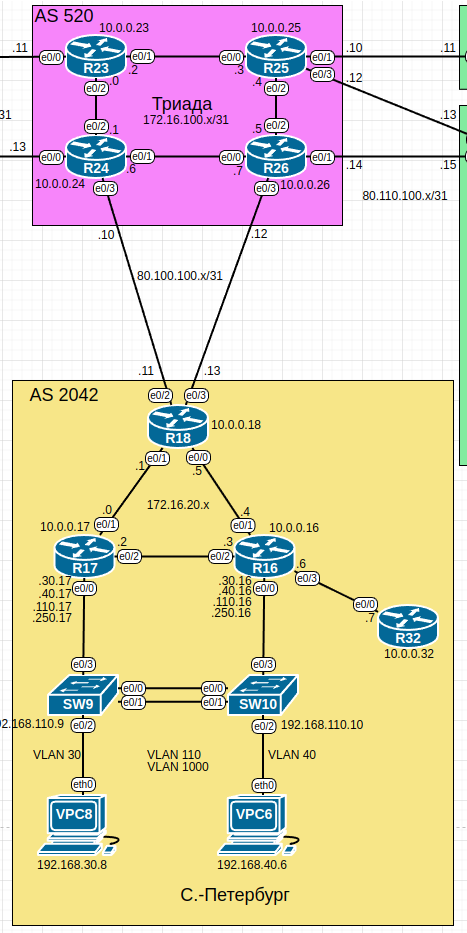

# Домашнее задание №8 «EIGRP»

## Цель работы

В данной самостоятельной работе необходимо настроить EIGRP в офисе
"Санкт-Петербург".

## Технические требования

Настройки EIGRP на маршрутизаторах должны отвечать следующим требованиям:

* **R32** получает только маршрут по умолчанию;
* **R16**, **R17** анонсируют только суммарные префиксы;
* использовать EIGRP named-mode для настройки сети.

## Топология

Топология лабораторного стенда собрана в среде EVE-NG.



## Настройка EIGRP

### Включение EIGRP

Включим EIGRP на всех маршрутизаторах офиса "Санкт-Петербург". Будем использовать
named EIGRP, т.е. вместо номера процесса укажем его имя "SPB":

```text
R18(config)#router eigrp SPB    
R18(config-router)#
```

Также в EIGRP named mode необходимо указать используемое адресное семейство и
номер автономной системы:

```text
R18(config-router)#address-family ipv4 unicast autonomous-system 1
R18(config-router-af)#
```

Явно зададим eigrp router-id, используя в качестве идентификатора адрес
лупбэка (10.0.0.X, где X - номер роутера):

```text
R18(config-router-af)#eigrp router-id 10.0.0.18
R18(config-router-af)#
```

Чтобы на интерфейсах поднялся EIGRP, используем команду network:

```text
R18(config-router-af)#network 172.16.20.0 0.0.0.255 
R18(config-router-af)#end
R18#
```

### Настройка пассивных интерфейсов

На маршрутизаторах **R16** и **R17** мы добавили в EIGRP клиентские сети 192.168.x.x.
Однако помимо рассылки анонсов другим маршрутизаторам, это привело к тому, что
сообщения EIGRP пересылаются и ниже, на уровень доступа, что может быть нежелательным.

Переведём эти интерфейсы в пассивный режим:

```text
R17(config-router-af)#af-interface e0/0.30
R17(config-router-af-interface)#passive-interface   
R17(config-router-af-interface)#exit
```

### Распространение лупбэков

Чтобы информация о лупбэках появилась в EIGRP, включим редистрибьюцию подключённых
маршрутов:

```text
R17(config-router-af)# topology base
R17(config-router-af-topology)#redistribute connected    
R17(config-router-af-topology)#
```

### Распространение маршрута по умолчанию

На граничном маршрутизаторе **R18** маршрут по умолчанию (к провайдеру) прописан
статически. Чтобы он был доступен даунлинкам, включим дополнительно распространение
статики:

```text
R18(config-router-af-topology)#redistribute static    
R18(config-router-af-topology)#end
R18#
```

### Просмотр сведений

Посмотрим, как выглядит информация об EIGRP на примере **R18**.

Соседи:

```text
R18#show ip eigrp neighbors 
EIGRP-IPv4 VR(SPB) Address-Family Neighbors for AS(1)
H   Address                 Interface              Hold Uptime   SRTT   RTO  Q  Seq
                                                   (sec)         (ms)       Cnt Num
1   172.16.20.4             Et0/0                    11 00:01:10 1598  5000  0  8
0   172.16.20.0             Et0/1                    11 01:15:43    5   100  0  67
R18# 
```

Топология:

```text
R18#sh ip eigrp topology 
EIGRP-IPv4 VR(SPB) Topology Table for AS(1)/ID(10.0.0.18)
Codes: P - Passive, A - Active, U - Update, Q - Query, R - Reply,
       r - reply Status, s - sia Status 

P 172.16.20.0/31, 1 successors, FD is 131072000
        via Connected, Ethernet0/1
P 172.16.20.6/31, 1 successors, FD is 196608000
        via 172.16.20.4 (196608000/131072000), Ethernet0/0
P 192.168.110.0/24, 2 successors, FD is 196608000
        via 172.16.20.0 (196608000/131072000), Ethernet0/1
        via 172.16.20.4 (196608000/131072000), Ethernet0/0
P 192.168.30.0/24, 2 successors, FD is 196608000
        via 172.16.20.0 (196608000/131072000), Ethernet0/1
        via 172.16.20.4 (196608000/131072000), Ethernet0/0
P 192.168.40.0/24, 2 successors, FD is 196608000
        via 172.16.20.0 (196608000/131072000), Ethernet0/1
        via 172.16.20.4 (196608000/131072000), Ethernet0/0
P 192.168.250.0/24, 2 successors, FD is 196608000
        via 172.16.20.0 (196608000/131072000), Ethernet0/1
        via 172.16.20.4 (196608000/131072000), Ethernet0/0
P 80.100.100.10/31, 1 successors, FD is 131072000
        via Rconnected (131072000/0)
P 0.0.0.0/0, 1 successors, FD is 131072000
        via Rstatic (131072000/0)
P 10.0.0.17/32, 1 successors, FD is 131153920
        via 172.16.20.0 (131153920/163840), Ethernet0/1
P 10.0.0.18/32, 1 successors, FD is 163840
        via Rconnected (163840/0)
P 172.16.20.2/31, 2 successors, FD is 196608000
        via 172.16.20.0 (196608000/131072000), Ethernet0/1
        via 172.16.20.4 (196608000/131072000), Ethernet0/0
P 172.16.20.4/31, 1 successors, FD is 131072000
        via Connected, Ethernet0/0
P 10.0.0.16/32, 1 successors, FD is 131153920
        via 172.16.20.4 (131153920/163840), Ethernet0/0
P 80.100.100.12/31, 1 successors, FD is 131072000
        via Rconnected (131072000/0)

R18#
```

Можно посмотреть, какие маршруты приходят по EIGRP:

```text
R18#show ip route eigrp    
Codes: L - local, C - connected, S - static, R - RIP, M - mobile, B - BGP
       D - EIGRP, EX - EIGRP external, O - OSPF, IA - OSPF inter area 
       N1 - OSPF NSSA external type 1, N2 - OSPF NSSA external type 2
       E1 - OSPF external type 1, E2 - OSPF external type 2
       i - IS-IS, su - IS-IS summary, L1 - IS-IS level-1, L2 - IS-IS level-2
       ia - IS-IS inter area, * - candidate default, U - per-user static route
       o - ODR, P - periodic downloaded static route, H - NHRP, l - LISP
       a - application route
       + - replicated route, % - next hop override

Gateway of last resort is 80.100.100.12 to network 0.0.0.0

      10.0.0.0/32 is subnetted, 3 subnets
D EX     10.0.0.16 [170/1024640] via 172.16.20.4, 00:08:46, Ethernet0/0
D EX     10.0.0.17 [170/1024640] via 172.16.20.0, 00:03:11, Ethernet0/1
      172.16.0.0/16 is variably subnetted, 6 subnets, 2 masks
D        172.16.20.2/31 [90/1536000] via 172.16.20.4, 00:08:46, Ethernet0/0
                        [90/1536000] via 172.16.20.0, 00:08:46, Ethernet0/1
D        172.16.20.6/31 [90/1536000] via 172.16.20.4, 00:08:46, Ethernet0/0
D     192.168.30.0/24 [90/1536000] via 172.16.20.4, 00:08:46, Ethernet0/0
                      [90/1536000] via 172.16.20.0, 00:08:46, Ethernet0/1
D     192.168.40.0/24 [90/1536000] via 172.16.20.4, 00:08:46, Ethernet0/0
                      [90/1536000] via 172.16.20.0, 00:08:46, Ethernet0/1
D     192.168.110.0/24 [90/1536000] via 172.16.20.4, 00:08:46, Ethernet0/0
                       [90/1536000] via 172.16.20.0, 00:08:46, Ethernet0/1
D     192.168.250.0/24 [90/1536000] via 172.16.20.4, 00:08:46, Ethernet0/0
                       [90/1536000] via 172.16.20.0, 00:08:46, Ethernet0/1
R18#
```

Видим, что появились маршруты в сети 172.16.20.2/31 (линк между **R16** и **R17**)
и 172.16.20.6/31 (сеть к **R32**), маршруты к лупбэкам роутеров и маршруты к
нижележащим клиентским сетям (192.168.x.0/24).

## Суммаризация маршрутов

Согласно требованиям задания **R16**, **R17** должны анонсировать только суммарные
префиксы. Включим на этих роутерах суммаризацию маршрутов.

```text
R17(config)#router eigrp SPB
R17(config-router)#address-family ipv4 unicast autonomous-system 1
R17(config-router-af)#af-interface e0/1
R17(config-router-af-interface)#summary-address 192.168.0.0 255.255.0.0
R17(config-router-af-interface)#
*Jun 28 06:15:59.765: %DUAL-5-NBRCHANGE: EIGRP-IPv4 1: Neighbor 172.16.20.1 (Ethernet0/1) is resync: summary configured
R17(config-router-af-interface)#end
R17#
```

В таблице маршрутизации на **R18** видим суммарный маршрут для клиентских сетей
192.168.x.x:

```text
R18#sh ip route eigrp     
...
      10.0.0.0/32 is subnetted, 3 subnets
D EX     10.0.0.16 [170/1024640] via 172.16.20.4, 00:02:11, Ethernet0/0
D EX     10.0.0.17 [170/1024640] via 172.16.20.0, 00:02:11, Ethernet0/1
      172.16.0.0/16 is variably subnetted, 6 subnets, 2 masks
D        172.16.20.2/31 [90/1536000] via 172.16.20.4, 00:02:11, Ethernet0/0
                        [90/1536000] via 172.16.20.0, 00:02:11, Ethernet0/1
D        172.16.20.6/31 [90/1536000] via 172.16.20.4, 00:02:11, Ethernet0/0
D     192.168.0.0/16 [90/1536000] via 172.16.20.4, 00:01:26, Ethernet0/0
                     [90/1536000] via 172.16.20.0, 00:01:26, Ethernet0/1
```

## Фильтрация маршрутов

По заданию роутер **R32** должен получать только маршрут по умолчанию. Настроим
фильтрацию входящих маршрутов. Создадим префикс лист, разрешающий маршрут по
умолчанию и запрещающий все остальные:

```text
R32(config)#ip prefix-list DEFAULT-ROUTE seq 10 permit 0.0.0.0/0
R32(config)#ip prefix-list DEFAULT-ROUTE seq 20 deny 0.0.0.0/0 le 32
```

Включим фильтрацию входящих EIGRP маршрутов по этому префикс-листу:

```text
R32(config)#router eigrp SPB
R32(config-router)#address-family ipv4 unicast autonomous-system 1
R32(config-router-af)#topology base
R32(config-router-af-topology)#distribute-list prefix DEFAULT-ROUTE in
R32(config-router-af-topology)#end 
R32#
```

Теперь в по EIGRP приходит только маршрут по умолчанию:

```text
R32#sh ip route      
Codes: L - local, C - connected, S - static, R - RIP, M - mobile, B - BGP
       D - EIGRP, EX - EIGRP external, O - OSPF, IA - OSPF inter area 
       N1 - OSPF NSSA external type 1, N2 - OSPF NSSA external type 2
       E1 - OSPF external type 1, E2 - OSPF external type 2
       i - IS-IS, su - IS-IS summary, L1 - IS-IS level-1, L2 - IS-IS level-2
       ia - IS-IS inter area, * - candidate default, U - per-user static route
       o - ODR, P - periodic downloaded static route, H - NHRP, l - LISP
       a - application route
       + - replicated route, % - next hop override

Gateway of last resort is 172.16.20.6 to network 0.0.0.0

D*EX  0.0.0.0/0 [170/2048000] via 172.16.20.6, 00:39:30, Ethernet0/0
      10.0.0.0/32 is subnetted, 1 subnets
C        10.0.0.32 is directly connected, Loopback0
      172.16.0.0/16 is variably subnetted, 2 subnets, 2 masks
C        172.16.20.6/31 is directly connected, Ethernet0/0
L        172.16.20.7/32 is directly connected, Ethernet0/0
R32#
```

## Файлы настроек

<details>
<summary>R16</summary>

```text
R16#sh run
Building configuration...

Current configuration : 2031 bytes
!
! Last configuration change at 06:52:03 UTC Sat Jun 28 2025
!
version 15.4
service timestamps debug datetime msec
service timestamps log datetime msec
no service password-encryption
!
hostname R16
!
boot-start-marker
boot-end-marker
!
!
!
no aaa new-model
mmi polling-interval 60
no mmi auto-configure
no mmi pvc
mmi snmp-timeout 180
!
!         
!
!
!
!
!
!


!
!
!
!
no ip domain lookup
ip cef
no ipv6 cef
!
multilink bundle-name authenticated
!
!
!
!
!
!         
!
!
!
redundancy
!
!
! 
!
!
!
!
!
!
!
!
!
!
!
!
interface Loopback0
 ip address 10.0.0.16 255.255.255.255
!
interface Ethernet0/0
 description Trunk to SW10
 no ip address
!
interface Ethernet0/0.30
 description VLAN 30 subinterface
 encapsulation dot1Q 30
 ip address 192.168.30.16 255.255.255.0
!
interface Ethernet0/0.40
 description Default GW for VLAN 40
 encapsulation dot1Q 40
 ip address 192.168.40.16 255.255.255.0
!
interface Ethernet0/0.110
 description VLAN 110 subinterface
 encapsulation dot1Q 110
 ip address 192.168.110.16 255.255.255.0
!
interface Ethernet0/0.1000
 description Default GW for native VLAN 1000
 encapsulation dot1Q 1000 native
 ip address 192.168.250.16 255.255.255.0
!         
interface Ethernet0/1
 description Uplink to R18
 ip address 172.16.20.4 255.255.255.254
!
interface Ethernet0/2
 description Link to R17
 ip address 172.16.20.3 255.255.255.254
!
interface Ethernet0/3
 description Link to R1
 ip address 172.16.20.6 255.255.255.254
!
!
router eigrp SPB
 !
 address-family ipv4 unicast autonomous-system 1
  !
  af-interface Ethernet0/1
   summary-address 192.168.0.0 255.255.0.0
  exit-af-interface
  !
  topology base
   redistribute connected
  exit-af-topology
  network 172.16.20.0 0.0.0.255
  network 192.168.30.0
  network 192.168.40.0
  network 192.168.110.0
  network 192.168.250.0
  eigrp router-id 10.0.0.16
 exit-address-family
!
ip forward-protocol nd
!
!
no ip http server
no ip http secure-server
!
!
!
!
control-plane
!
!
!
!         
!
!
!
!
line con 0
 logging synchronous
line aux 0
line vty 0 4
 login
 transport input none
!
!
end

R16#
```

</details>

<details>
<summary>R17</summary>

```text
R17#sh run
Building configuration...

Current configuration : 2289 bytes
!
! Last configuration change at 06:17:18 UTC Sat Jun 28 2025
!
version 15.4
service timestamps debug datetime msec
service timestamps log datetime msec
no service password-encryption
!
hostname R17
!
boot-start-marker
boot-end-marker
!
!
!
no aaa new-model
mmi polling-interval 60
no mmi auto-configure
no mmi pvc
mmi snmp-timeout 180
!
!         
!
!
!
!
!
!


!
!
!
!
no ip domain lookup
ip cef
no ipv6 cef
!
multilink bundle-name authenticated
!
!
!
!
!
!         
!
!
!
redundancy
!
!
! 
!
!
!
!
!
!
!
!
!
!
!
!
interface Loopback0
 ip address 10.0.0.17 255.255.255.255
!
interface Ethernet0/0
 description Trunk to SW9
 no ip address
!
interface Ethernet0/0.30
 description Default GW for VLAN 30
 encapsulation dot1Q 30
 ip address 192.168.30.17 255.255.255.0
!
interface Ethernet0/0.40
 description VLAN 40 subinterface
 encapsulation dot1Q 40
 ip address 192.168.40.17 255.255.255.0
!
interface Ethernet0/0.110
 description Default GW for VLAN 110
 encapsulation dot1Q 110
 ip address 192.168.110.17 255.255.255.0
!
interface Ethernet0/0.1000
 description Native VLAN subinterface
 encapsulation dot1Q 1000 native
 ip address 192.168.250.17 255.255.255.0
!         
interface Ethernet0/1
 description Uplink to R18
 ip address 172.16.20.0 255.255.255.254
!
interface Ethernet0/2
 description Link to R16
 ip address 172.16.20.2 255.255.255.254
!
interface Ethernet0/3
 no ip address
 shutdown
!
!
router eigrp SPB
 !
 address-family ipv4 unicast autonomous-system 1
  !
  af-interface Ethernet0/0.30
   passive-interface
  exit-af-interface
  !
  af-interface Ethernet0/0.40
   passive-interface
  exit-af-interface
  !
  af-interface Ethernet0/0.110
   passive-interface
  exit-af-interface
  !
  af-interface Ethernet0/0.1000
   passive-interface
  exit-af-interface
  !
  af-interface Ethernet0/1
   summary-address 192.168.0.0 255.255.0.0
  exit-af-interface
  !
  topology base
   redistribute connected
  exit-af-topology
  network 172.16.20.0 0.0.0.255
  network 192.168.30.0
  network 192.168.40.0
  network 192.168.110.0
  network 192.168.250.0
  eigrp router-id 10.0.0.17
 exit-address-family
!
ip forward-protocol nd
!
!
no ip http server
no ip http secure-server
!
!
!
!
control-plane
!
!
!
!
!
!
!
!
line con 0
 logging synchronous
line aux 0
line vty 0 4
 login
 transport input none
!
!
end

R17#
```

</details>

<details>
<summary>R18</summary>

```text
R18#sh run
Building configuration...

Current configuration : 1391 bytes
!
version 15.4
service timestamps debug datetime msec
service timestamps log datetime msec
no service password-encryption
!
hostname R18
!
boot-start-marker
boot-end-marker
!
!
!
no aaa new-model
mmi polling-interval 60
no mmi auto-configure
no mmi pvc
mmi snmp-timeout 180
!
!
!
!         
!
!
!
!


!
!
!
!
no ip domain lookup
ip cef
no ipv6 cef
!
multilink bundle-name authenticated
!
!
!
!
!
!
!
!         
!
redundancy
!
!
! 
!
!
!
!
!
!
!
!
!
!
!
!
interface Loopback0
 ip address 10.0.0.18 255.255.255.255
!
interface Ethernet0/0
 description Downlink to R16
 ip address 172.16.20.5 255.255.255.254
!
interface Ethernet0/1
 description Downlink to R17
 ip address 172.16.20.1 255.255.255.254
!
interface Ethernet0/2
 description Uplink to R24
 ip address 80.100.100.11 255.255.255.254
!
interface Ethernet0/3
 description Uplink to R26
 ip address 80.100.100.13 255.255.255.254
!
!
router eigrp SPB
 !
 address-family ipv4 unicast autonomous-system 1
  !
  topology base
   redistribute static
   redistribute connected
  exit-af-topology
  network 172.16.20.0 0.0.0.255
  eigrp router-id 10.0.0.18
 exit-address-family
!
ip forward-protocol nd
!
!
no ip http server
no ip http secure-server
ip route 0.0.0.0 0.0.0.0 80.100.100.10
ip route 0.0.0.0 0.0.0.0 80.100.100.12
!
!
!
!
control-plane
!
!
!
!
!
!
!
!         
line con 0
 logging synchronous
line aux 0
line vty 0 4
 login
 transport input none
!
!
end

R18#
```

</details>

<details>
<summary>R32</summary>

```text
R32#sh run
Building configuration...

Current configuration : 1346 bytes
!
! Last configuration change at 06:54:52 UTC Sat Jun 28 2025
!
version 15.4
service timestamps debug datetime msec
service timestamps log datetime msec
no service password-encryption
!
hostname R32
!
boot-start-marker
boot-end-marker
!
!
!
no aaa new-model
mmi polling-interval 60
no mmi auto-configure
no mmi pvc
mmi snmp-timeout 180
!
!         
!
!
!
!
!
!


!
!
!
!
no ip domain lookup
ip cef
no ipv6 cef
!
multilink bundle-name authenticated
!
!
!
!
!
!         
!
!
!
redundancy
!
!
! 
!
!
!
!
!
!
!
!
!
!
!
!
interface Loopback0
 ip address 10.0.0.32 255.255.255.255
!
interface Ethernet0/0
 description Link to R16
 ip address 172.16.20.7 255.255.255.254
!
interface Ethernet0/1
 no ip address
 shutdown
!
interface Ethernet0/2
 no ip address
 shutdown
!
interface Ethernet0/3
 no ip address
 shutdown
!
!
router eigrp SPB
 !
 address-family ipv4 unicast autonomous-system 1
  !
  topology base
   distribute-list prefix DEFAULT-ROUTE in 
  exit-af-topology
  network 172.16.20.0 0.0.0.255
  eigrp router-id 10.0.0.32
 exit-address-family
!
ip forward-protocol nd
!
!
no ip http server
no ip http secure-server
!
!
ip prefix-list DEFAULT-ROUTE seq 10 permit 0.0.0.0/0
ip prefix-list DEFAULT-ROUTE seq 20 deny 0.0.0.0/0 le 32
!
!
!
control-plane
!
!
!
!
!
!         
!
!
line con 0
 logging synchronous
line aux 0
line vty 0 4
 login
 transport input none
!
!
end

R32#
```

</details>

Готовая лабораторная (экспорт из EVE-NG) - [21_eigrp.zip](./21_eigrp.zip).
