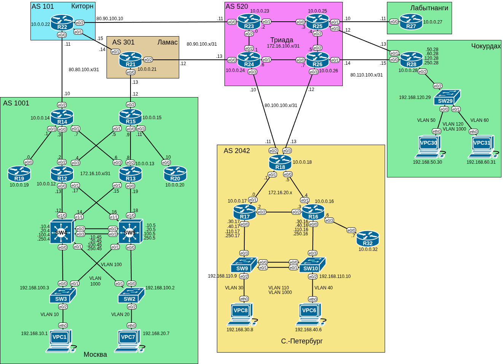

# Домашнее задание №9 «BGP. Основы»

## Цель работы

В данной самостоятельной работе необходимо настроить BGP между автономными системами
и организовать IP связность между офисами «Москва» и «Санкт-Петербург»

## Задачи

1. [Настроить eBGP между офисом Москва и двумя провайдерами - Киторн и Ламас.](#настройка-ebgp-между-офисом-москва-и-провайдерами-киторн-и-ламас)
2. [Настроить eBGP между провайдерами Киторн и Ламас.](#настройка-ebgp-между-провайдерами-киторн-и-ламас)
3. [Настроить eBGP между Ламас и Триада.](#настройка-ebgp-между-ламас-и-триада)
4. [Настроить eBGP между офисом С.-Петербург и провайдером Триада.](#настройка-ebgp-между-офисом-с-петербург-и-провайдером-триада)
5. [Организовать IP доступность между пограничными роутерами офисов Москва и С.-Петербург.](#настройка-ip-доступности-между-пограничными-роутерами-офисов-москва-и-с-петербург)

## Топология

Топология лабораторного стенда собрана в среде EVE-NG.



## Настройка eBGP между офисом Москва и провайдерами Киторн и Ламас

### Активация BGP процесса

Включим процесс BGP на граничных маршрутизаторах офиса «Москва»:

```text
R14(config)#router bgp 1001
R14(config-router)#
```

В отличие от других протоколов маршрутизации номер процесса имеет смысл - это
номер автономной системы, он используется в работе самого BGP поэтому выбираем его
согласно топологии.

| Устройство        | Номер AS<br>(BGP процесса) | Организация            |
| ----------------- | -------------------------- | ---------------------- |
| R14<br>R15        | 1001                       | Офис «Москва»          |
| R18               | 2042                       | Офис «Санкт-Петербург» |
| R22               | 101                        | Провайдер «Киторн»     |
| R21               | 301                        | Провайдер «Ламас»      |
| R23<br>R24<br>R26 | 520                        | Провайдер «Триада»     |

### Установка router-id

Зададим явно router-id, используя в качестве идентификатора адрес лупбэка:

```text
R14(config-router)#bgp router-id 10.0.0.14
R14(config-router)#
```

### Настройка соседства

Командой **neighbor** укажем соседей для каждого:

```text
R14(config-router)#neighbor 80.80.100.11 remote-as 101 
R14(config-router)#neighbor 80.80.100.11 description KITORN  
R14(config-router)#end 
```

### Проверка настроек

Просмотрим состояние процесса BGP:

```text
R14#show ip bgp summary 
BGP router identifier 10.0.0.14, local AS number 1001
BGP table version is 1, main routing table version 1

Neighbor        V           AS MsgRcvd MsgSent   TblVer  InQ OutQ Up/Down  State/PfxRcd
80.80.100.11    4          101      10      10        1    0    0 00:05:39        0
R14#
```

И подробно соседей:

<details>
<summary>show ip bgp neighbors</summary>

```text
R14#show ip bgp neighbors
BGP neighbor is 80.80.100.11,  remote AS 101, external link
 Description: KITORN
  BGP version 4, remote router ID 10.0.0.22
  BGP state = Established, up for 00:08:03
  Last read 00:00:39, last write 00:00:41, hold time is 180, keepalive interval is 60 seconds
  Neighbor sessions:
    1 active, is not multisession capable (disabled)
  Neighbor capabilities:
    Route refresh: advertised and received(new)
    Four-octets ASN Capability: advertised and received
    Address family IPv4 Unicast: advertised and received
    Enhanced Refresh Capability: advertised and received
    Multisession Capability: 
    Stateful switchover support enabled: NO for session 1
  Message statistics:
    InQ depth is 0
    OutQ depth is 0
    
                         Sent       Rcvd
    Opens:                  1          1
    Notifications:          0          0
    Updates:                1          1
    Keepalives:            10         10
    Route Refresh:          0          0
    Total:                 12         12
  Default minimum time between advertisement runs is 30 seconds

 For address family: IPv4 Unicast
  Session: 80.80.100.11
  BGP table version 1, neighbor version 1/0
  Output queue size : 0
  Index 1, Advertise bit 0
  1 update-group member
  Slow-peer detection is disabled
  Slow-peer split-update-group dynamic is disabled
  Interface associated: Ethernet0/2
                                 Sent       Rcvd
  Prefix activity:               ----       ----
    Prefixes Current:               0          0
    Prefixes Total:                 0          0
    Implicit Withdraw:              0          0
    Explicit Withdraw:              0          0
    Used as bestpath:             n/a          0
    Used as multipath:            n/a          0

                                   Outbound    Inbound
  Local Policy Denied Prefixes:    --------    -------
    Total:                                0          0
  Number of NLRIs in the update sent: max 0, min 0
  Last detected as dynamic slow peer: never
  Dynamic slow peer recovered: never
  Refresh Epoch: 1
  Last Sent Refresh Start-of-rib: never
  Last Sent Refresh End-of-rib: never
  Last Received Refresh Start-of-rib: never
  Last Received Refresh End-of-rib: never
				       Sent	  Rcvd
	Refresh activity:	       ----	  ----
	  Refresh Start-of-RIB          0          0
	  Refresh End-of-RIB            0          0

  Address tracking is enabled, the RIB does have a route to 80.80.100.11
  Connections established 1; dropped 0
  Last reset never
  Transport(tcp) path-mtu-discovery is enabled
  Graceful-Restart is disabled
Connection state is ESTAB, I/O status: 1, unread input bytes: 0            
Connection is ECN Disabled, Mininum incoming TTL 0, Outgoing TTL 1
Local host: 80.80.100.10, Local port: 23143
Foreign host: 80.80.100.11, Foreign port: 179
Connection tableid (VRF): 0
Maximum output segment queue size: 50

Enqueued packets for retransmit: 0, input: 0  mis-ordered: 0 (0 bytes)

Event Timers (current time is 0x16B685):
Timer          Starts    Wakeups            Next
Retrans            12          0             0x0
TimeWait            0          0             0x0
AckHold            11          8             0x0
SendWnd             0          0             0x0
KeepAlive           0          0             0x0
GiveUp              0          0             0x0
PmtuAger            1          0        0x187F46
DeadWait            0          0             0x0
Linger              0          0             0x0
ProcessQ            0          0             0x0

iss:  840651218  snduna:  840651489  sndnxt:  840651489
irs: 2376624315  rcvnxt: 2376624586

sndwnd:  16114  scale:      0  maxrcvwnd:  16384
rcvwnd:  16114  scale:      0  delrcvwnd:    270

SRTT: 798 ms, RTTO: 2221 ms, RTV: 1423 ms, KRTT: 0 ms
minRTT: 0 ms, maxRTT: 1000 ms, ACK hold: 200 ms
uptime: 483072 ms, Sent idletime: 38984 ms, Receive idletime: 39189 ms 
Status Flags: active open
Option Flags: nagle, path mtu capable
IP Precedence value : 6

Datagrams (max data segment is 1460 bytes):
Rcvd: 23 (out of order: 0), with data: 12, total data bytes: 270
Sent: 24 (retransmit: 0, fastretransmit: 0, partialack: 0, Second Congestion: 0), with data: 12, total data bytes: 270

 Packets received in fast path: 0, fast processed: 0, slow path: 0
 fast lock acquisition failures: 0, slow path: 0
TCP Semaphore      0xC464866C  FREE 

R14#
```

</details>

## Настройка eBGP между провайдерами Киторн и Ламас

Аналогично настроим соседство между маршрутизаторами Киторн и Ламас.

```text
R21(config)#router bgp 301                          
R21(config-router)#neighbor 80.80.100.15 remote-as 101     
R21(config-router)#neighbor 80.80.100.15 description KITOR
*Jul 17 11:42:28.370: %BGP-5-ADJCHANGE: neighbor 80.80.100.15 Up 
R21(config-router)#neighbor 80.80.100.15 description KITORN
R21(config-router)#end
R21#sh ip bgp summary 
BGP router identifier 10.0.0.21, local AS number 301
BGP table version is 1, main routing table version 1

Neighbor        V           AS MsgRcvd MsgSent   TblVer  InQ OutQ Up/Down  State/PfxRcd
80.80.100.12    4         1001       4       4        1    0    0 00:00:43        0
80.80.100.15    4          101       2       2        1    0    0 00:00:06        0
R21#
```

## Настройка eBGP между Ламас и Триада

У провайдера Ламас добавляем соседа, в Триаде включаем и настраиваем BGP:

```text
R24(config)#router bgp 520
R24(config-router)#bgp router-id 10.0.0.24
R24(config-router)#neighbor 80.90.100.12 remote-as 301
R24(config-router)#neighbor 80.90.100.12 description LAMAS
R24(config-router)#
*Jul 17 11:57:25.278: %BGP-5-ADJCHANGE: neighbor 80.90.100.12 Up 
R24(config-router)#end
R24#
*Jul 17 11:57:29.953: %SYS-5-CONFIG_I: Configured from console by console
R24#sh ip bgp summary
BGP router identifier 10.0.0.24, local AS number 520
BGP table version is 1, main routing table version 1

Neighbor        V           AS MsgRcvd MsgSent   TblVer  InQ OutQ Up/Down  State/PfxRcd
80.90.100.12    4          301       2       4        1    0    0 00:00:10        0
R24#
```

На маршрутизаторе **R21** провайдера Ламас теперь видим всех трёх соседей:

```text
R21#sh bgp summary
BGP router identifier 10.0.0.21, local AS number 301
BGP table version is 1, main routing table version 1

Neighbor        V           AS MsgRcvd MsgSent   TblVer  InQ OutQ Up/Down  State/PfxRcd
80.80.100.12    4         1001      24      23        1    0    0 00:17:56        0
80.80.100.15    4          101      21      21        1    0    0 00:17:20        0
80.90.100.13    4          520       6       4        1    0    0 00:02:23        0
R21#
```

## Настройка eBGP между офисом С.-Петербург и провайдером Триада

Повторим аналогичные настройки для офиса «Санкт-Петербург» и провайдера «Триада»:

```text
R18(config)#router bgp 2042
R18(config-router)#bgp router-id 10.0.0.18
R18(config-router)#neighbor 80.100.100.10 remote-as 520
R18(config-router)#neighbor 80.100.100.10 description TRIADA
*Jul 17 12:16:51.231: %BGP-5-ADJCHANGE: neighbor 80.100.100.10 Up 
R18(config-router)#neighbor 80.100.100.10 description TRIADA1
R18(config-router)#neighbor 80.100.100.12 remote-as 520      
R18(config-router)#neighbor 80.100.100.10 description TRIADA2
R18(config-router)#
*Jul 17 12:17:01.889: %BGP-5-ADJCHANGE: neighbor 80.100.100.12 Up 
R18(config-router)#end
R18#sh bgp summa 
BGP router identifier 10.0.0.18, local AS number 2042
BGP table version is 1, main routing table version 1

Neighbor        V           AS MsgRcvd MsgSent   TblVer  InQ OutQ Up/Down  State/PfxRcd
80.100.100.10   4          520       2       4        1    0    0 00:00:24        0
80.100.100.12   4          520       4       2        1    0    0 00:00:13        0
R18#
```

## Настройка IP доступности между пограничными роутерами офисов Москва и С.-Петербург

Чтобы обеспечить IP-связность между пограничными роутерами офисов «Москва» и
«Санкт-Петербург» необходимо, чтобы все роутеры между ними имели маршруты к ним.
Для этого экспортируем информацию о маршрутах по eBGP.

Также стоит отметить, что для удобства вместо фактических внутренних IP адресов
граничных роутеров (которые строго говоря внутреннее дело сетей офисов и могут
меняться) будем использовать их лупбэки.

### Анонсирование лупбэков

Чтобы BGP распространял информацию о маршрутах к пограничным роутерам, включим
явно анонс их лупбэков:

```text
R15(config-router)#network 10.0.0.15 mask 255.255.255.255
R15(config-router)#end
```

Теперь маршруты к ним появились на роутерах провайдеров:

```text
R24#sh ip route bgp | inc 10.0.0
      10.0.0.0/32 is subnetted, 5 subnets
B        10.0.0.14 [20/0] via 80.90.100.12, 00:09:36
B        10.0.0.15 [20/0] via 80.90.100.12, 00:00:56
B        10.0.0.18 [20/0] via 80.100.100.11, 00:05:14
R24#
```

### Добавление межпровайдерных маршрутов

В текущей конфигурации с маршрутизатора **R21** «Ламас» пингуются все три
граничных роутера. Однако с **R22** «Киторн» **R18** недоступен. Также и в
обратную сторону. Так происходит из-за того, что маршруты пролегают по разным
сетям (80.80.100.xx и 80.100.100.xx) для которых отсутствуют записи в таблицах
маршрутизации провайдеров «Киторн» и «Ламас». Можно было бы добавить их на
соседние роутеры через BGP, включив **distribute connected**, но это может
привести к редистрибуции лишних маршрутов (внутренние маршруты Триады,
маршрут между Киторн и Триадой). В данной топологии ограничимся
явным анонсом маршрутов в BGP.

```text
R22(config)#router bgp 101
R22(config-router)#network 80.80.100.10 mask 255.255.255.254
R22(config-router)#network 80.80.100.14 mask 255.255.255.254
```

```text
R21(config)#router bgp 301
R21(config-router)#network 80.80.100.14 mask 255.255.255.254
R21(config-router)#network 80.80.100.12 mask 255.255.255.254
R21(config-router)#network 80.90.100.12 mask 255.255.255.254
```

```text
R24(config)#router bgp 520
R24(config-router)#network 80.90.100.12 mask 255.255.255.254
R24(config-router)#network 80.100.100.10 mask 255.255.255.254
```

```text
R26(config)#router bgp 520
R26(config-router)#network 80.100.100.12 mask 255.255.255.254
```

То же самое можно было бы сделать через префикс лист.

### Проверка связности

Проверим пинг:

```text
R14#ping 10.0.0.15
Type escape sequence to abort.
Sending 5, 100-byte ICMP Echos to 10.0.0.15, timeout is 2 seconds:
!!!!!
Success rate is 100 percent (5/5), round-trip min/avg/max = 1/1/2 ms
R14#ping 10.0.0.18
Type escape sequence to abort.
Sending 5, 100-byte ICMP Echos to 10.0.0.18, timeout is 2 seconds:
!!!!!
Success rate is 100 percent (5/5), round-trip min/avg/max = 1/1/2 ms
R14#
```

```text
R15>ping 10.0.0.14
Type escape sequence to abort.
Sending 5, 100-byte ICMP Echos to 10.0.0.14, timeout is 2 seconds:
!!!!!
Success rate is 100 percent (5/5), round-trip min/avg/max = 1/1/2 ms
R15>ping 10.0.0.18
Type escape sequence to abort.
Sending 5, 100-byte ICMP Echos to 10.0.0.18, timeout is 2 seconds:
!!!!!
Success rate is 100 percent (5/5), round-trip min/avg/max = 1/1/3 ms
R15>
```

```text
R18>ping 10.0.0.14
Type escape sequence to abort.
Sending 5, 100-byte ICMP Echos to 10.0.0.14, timeout is 2 seconds:
!!!!!
Success rate is 100 percent (5/5), round-trip min/avg/max = 1/1/4 ms
R18>ping 10.0.0.15
Type escape sequence to abort.
Sending 5, 100-byte ICMP Echos to 10.0.0.15, timeout is 2 seconds:
!!!!!
Success rate is 100 percent (5/5), round-trip min/avg/max = 1/2/5 ms
R18>
```

### Настройка связности внутри офиса «Москва»

В офисе «Москва» в качестве внутреннего протокола маршрутизации используется
OSPF. Однако лупбэки в нём не анонсируются. Как результат, пинг между **R14** и
**R15** идёт через сеть провайдера:

```text
R14#trace 10.0.0.15
Type escape sequence to abort.
Tracing the route to 10.0.0.15
VRF info: (vrf in name/id, vrf out name/id)
  1 80.80.100.11 [AS 101] 0 msec 1 msec 1 msec
  2 80.80.100.14 [AS 101] 1 msec 1 msec 1 msec
  3 80.80.100.12 [AS 301] 1 msec *  1 msec
R14#
```

Очевидно, что такой результат нежелателен. Исправим это, добавив лупбэки
роутеров **R14** и **R15** в OSPF.

```text
R15(config)#int lo 0
R15(config-if)#ip ospf 1 area 0
R15(config-if)#end
```

Теперь трейс остаётся внутри сети офиса:

```text
R14#trace 10.0.0.15
Type escape sequence to abort.
Tracing the route to 10.0.0.15
VRF info: (vrf in name/id, vrf out name/id)
  1 172.16.10.2 0 msec
    172.16.10.6 0 msec
    172.16.10.2 0 msec
  2 172.16.10.9 1 msec
    172.16.10.5 1 msec * 
R14#   
```

## Файлы настроек

<details>
<summary>R14</summary>

```text
R14#sh run
Building configuration...

Current configuration : 1693 bytes
!
! Last configuration change at 15:16:19 UTC Thu Jul 17 2025
!
version 15.4
service timestamps debug datetime msec
service timestamps log datetime msec
no service password-encryption
!
hostname R14
!
boot-start-marker
boot-end-marker
!
!
!
no aaa new-model
mmi polling-interval 60
no mmi auto-configure
no mmi pvc
mmi snmp-timeout 180
!
!         
!
!
!
!
!
!


!
!
!
!
no ip domain lookup
ip cef
no ipv6 cef
!
multilink bundle-name authenticated
!
!
!
!
!
!         
!
!
!
redundancy
!
!
! 
!
!
!
!
!
!
!
!
!
!
!
!
interface Loopback0
 ip address 10.0.0.14 255.255.255.255
 ip ospf 1 area 0
!         
interface Ethernet0/0
 description Link to R12
 ip address 172.16.10.3 255.255.255.254
 ip ospf network point-to-point
 ip ospf 1 area 10
!
interface Ethernet0/1
 description Link to R13
 ip address 172.16.10.7 255.255.255.254
 ip ospf network point-to-point
 ip ospf 1 area 10
!
interface Ethernet0/2
 description Uplink to R22
 ip address 80.80.100.10 255.255.255.254
 ip ospf network point-to-point
 ip ospf 1 area 0
!
interface Ethernet0/3
 description Link to R19
 ip address 172.16.10.1 255.255.255.254
 ip ospf network point-to-point
 ip ospf 1 area 101
!
router ospf 1
 router-id 10.0.0.14
 area 10 virtual-link 10.0.0.15
 area 101 stub no-summary
 default-information originate
!
router bgp 1001
 bgp router-id 10.0.0.14
 bgp log-neighbor-changes
 network 10.0.0.14 mask 255.255.255.255
 neighbor 80.80.100.11 remote-as 101
 neighbor 80.80.100.11 description KITORN
!
ip forward-protocol nd
!
!
no ip http server
no ip http secure-server
ip route 0.0.0.0 0.0.0.0 Ethernet0/2
!
!
!         
!
control-plane
!
!
!
!
!
!
!
!
line con 0
 logging synchronous
line aux 0
line vty 0 4
 login
 transport input none
!
!
end

R14#
```

</details>

<details>
<summary>R15</summary>

```text
R15#sh run
Building configuration...

Current configuration : 1844 bytes
!
! Last configuration change at 15:16:35 UTC Thu Jul 17 2025
!
version 15.4
service timestamps debug datetime msec
service timestamps log datetime msec
no service password-encryption
!
hostname R15
!
boot-start-marker
boot-end-marker
!
!
!
no aaa new-model
mmi polling-interval 60
no mmi auto-configure
no mmi pvc
mmi snmp-timeout 180
!
!         
!
!
!
!
!
!


!
!
!
!
no ip domain lookup
ip cef
no ipv6 cef
!
multilink bundle-name authenticated
!
!
!
!
!
!         
!
!
!
redundancy
!
!
! 
!
!
!
!
!
!
!
!
!
!
!
!
interface Loopback0
 ip address 10.0.0.15 255.255.255.255
 ip ospf 1 area 0
!         
interface Ethernet0/0
 description Link to R13
 ip address 172.16.10.9 255.255.255.254
 ip ospf network point-to-point
 ip ospf 1 area 10
!
interface Ethernet0/1
 description Link to R12
 ip address 172.16.10.5 255.255.255.254
 ip ospf network point-to-point
 ip ospf 1 area 10
!
interface Ethernet0/2
 description Uplink to R21
 ip address 80.80.100.12 255.255.255.254
 ip ospf network point-to-point
 ip ospf 1 area 0
!
interface Ethernet0/3
 description Link to R20
 ip address 172.16.10.11 255.255.255.254
 ip ospf network point-to-point
 ip ospf 1 area 102
!
router ospf 1
 router-id 10.0.0.15
 area 10 virtual-link 10.0.0.14
 area 102 filter-list prefix AREA101_LSA_FILTER in
 default-information originate
!
router bgp 1001
 bgp router-id 10.0.0.15
 bgp log-neighbor-changes
 network 10.0.0.15 mask 255.255.255.255
 neighbor 80.80.100.13 remote-as 301
 neighbor 80.80.100.13 description LAMAS
!
ip forward-protocol nd
!
!
no ip http server
no ip http secure-server
ip route 0.0.0.0 0.0.0.0 Ethernet0/2
!
!
ip prefix-list AREA101_LSA_FILTER seq 5 deny 172.16.10.0/31
ip prefix-list AREA101_LSA_FILTER seq 10 permit 0.0.0.0/0 le 32
!
!
!
control-plane
!
!
!
!
!
!
!
!
line con 0
 logging synchronous
line aux 0
line vty 0 4
 login
 transport input none
!
!
end
          
R15#
```

</details>

<details>
<summary>R22</summary>

```text
R22#sh run
Building configuration...

Current configuration : 1594 bytes
!
! Last configuration change at 14:58:32 UTC Thu Jul 17 2025
!
version 15.4
service timestamps debug datetime msec
service timestamps log datetime msec
no service password-encryption
!
hostname R22
!
boot-start-marker
boot-end-marker
!
!
!
no aaa new-model
mmi polling-interval 60
no mmi auto-configure
no mmi pvc
mmi snmp-timeout 180
!
!         
!
!
!
!
!
!


!
!
!
!
no ip domain lookup
ip cef
no ipv6 cef
!
multilink bundle-name authenticated
!
!
!
!
!
!         
!
!
!
redundancy
!
!
! 
!
!
!
!
!
!
!
!
!
!
!
!
interface Loopback0
 ip address 10.0.0.22 255.255.255.255
!
interface Ethernet0/0
 description Downlink to R14
 ip address 80.80.100.11 255.255.255.254
!
interface Ethernet0/1
 description Link to R21
 ip address 80.80.100.15 255.255.255.254
!
interface Ethernet0/2
 description Uplink to R23
 ip address 80.90.100.10 255.255.255.254
!
interface Ethernet0/3
 no ip address
 shutdown
!
interface Ethernet1/0
 no ip address
 shutdown
!
interface Ethernet1/1
 no ip address
 shutdown
!         
interface Ethernet1/2
 no ip address
 shutdown
!
interface Ethernet1/3
 no ip address
 shutdown
!
router bgp 101
 bgp router-id 10.0.0.22
 bgp log-neighbor-changes
 network 80.80.100.10 mask 255.255.255.254
 network 80.80.100.14 mask 255.255.255.254
 neighbor 80.80.100.10 remote-as 1001
 neighbor 80.80.100.10 description MOSCOW
 neighbor 80.80.100.14 remote-as 301
 neighbor 80.80.100.14 description LAMAS
!
ip forward-protocol nd
!
!
no ip http server
no ip http secure-server
!
!
!
!
control-plane
!
!
!
!
!
!
!
!
line con 0
 logging synchronous
line aux 0
line vty 0 4
 login
 transport input none
!
!
end
          
R22# 
```

</details>

<details>
<summary>R21</summary>

```text
R21#sh run
Building configuration...

Current configuration : 1717 bytes
!
! Last configuration change at 14:53:14 UTC Thu Jul 17 2025
!
version 15.4
service timestamps debug datetime msec
service timestamps log datetime msec
no service password-encryption
!
hostname R21
!
boot-start-marker
boot-end-marker
!
!
!
no aaa new-model
mmi polling-interval 60
no mmi auto-configure
no mmi pvc
mmi snmp-timeout 180
!
!         
!
!
!
!
!
!


!
!
!
!
no ip domain lookup
ip cef
no ipv6 cef
!
multilink bundle-name authenticated
!
!
!
!
!
!         
!
!
!
redundancy
!
!
! 
!
!
!
!
!
!
!
!
!
!
!
!
interface Loopback0
 ip address 10.0.0.21 255.255.255.255
!
interface Ethernet0/0
 description Downlink to R15
 ip address 80.80.100.13 255.255.255.254
!
interface Ethernet0/1
 description Link to R22
 ip address 80.80.100.14 255.255.255.254
!
interface Ethernet0/2
 description Uplink to R24
 ip address 80.90.100.12 255.255.255.254
!
interface Ethernet0/3
 no ip address
 shutdown
!
interface Ethernet1/0
 no ip address
 shutdown
!
interface Ethernet1/1
 no ip address
 shutdown
!         
interface Ethernet1/2
 no ip address
 shutdown
!
interface Ethernet1/3
 no ip address
 shutdown
!
router bgp 301
 bgp router-id 10.0.0.21
 bgp log-neighbor-changes
 network 80.80.100.12 mask 255.255.255.254
 network 80.80.100.14 mask 255.255.255.254
 network 80.90.100.12 mask 255.255.255.254
 neighbor 80.80.100.12 remote-as 1001
 neighbor 80.80.100.12 description MOSCOW
 neighbor 80.80.100.15 remote-as 101
 neighbor 80.80.100.15 description KITORN
 neighbor 80.90.100.13 remote-as 520
 neighbor 80.90.100.13 description TRIADA
!
ip forward-protocol nd
!         
!
no ip http server
no ip http secure-server
!
!
!
!
control-plane
!
!
!
!
!
!
!
!
line con 0
 logging synchronous
line aux 0
line vty 0 4
 login
 transport input none
!         
!
end

R21#
```

</details>

<details>
<summary>R24</summary>

```text
R24#sh run
Building configuration...

Current configuration : 1814 bytes
!
! Last configuration change at 15:07:36 UTC Thu Jul 17 2025
!
version 15.4
service timestamps debug datetime msec
service timestamps log datetime msec
no service password-encryption
!
hostname R24
!
boot-start-marker
boot-end-marker
!
!
!
no aaa new-model
mmi polling-interval 60
no mmi auto-configure
no mmi pvc
mmi snmp-timeout 180
!
!         
!
!
!
!
!
!


!
!
!
!
no ip domain lookup
ip cef
no ipv6 cef
!
multilink bundle-name authenticated
!
!
!
!
!
!         
!
!
!
redundancy
!
!
! 
!
!
!
!
!
!
!
!
!
!
!
!
interface Loopback0
 ip address 10.0.0.24 255.255.255.255
!
interface Ethernet0/0
 description Downlink to R21
 ip address 80.90.100.13 255.255.255.254
!
interface Ethernet0/1
 description Link to R26
 ip address 172.16.100.6 255.255.255.254
 ip router isis 
!
interface Ethernet0/2
 description Link to R23
 ip address 172.16.100.1 255.255.255.254
 ip router isis 
!
interface Ethernet0/3
 description Downlink to R18
 ip address 80.100.100.10 255.255.255.254
!
interface Ethernet1/0
 no ip address
 shutdown
!
interface Ethernet1/1
 no ip address
 shutdown
!
interface Ethernet1/2
 no ip address
 shutdown
!
interface Ethernet1/3
 no ip address
 shutdown
!
router isis
 net 49.0024.0100.0000.0024.00
 redistribute connected
 redistribute static ip
!
router bgp 520
 bgp router-id 10.0.0.24
 bgp log-neighbor-changes
 network 80.90.100.12 mask 255.255.255.254
 network 80.100.100.10 mask 255.255.255.254
 neighbor 80.90.100.12 remote-as 301
 neighbor 80.90.100.12 description LAMAS
 neighbor 80.100.100.11 remote-as 2042
 neighbor 80.100.100.11 description SPB
!
ip forward-protocol nd
!
!
no ip http server
no ip http secure-server
ip route 172.16.20.0 255.255.255.0 80.100.100.11
!
!
!
!
control-plane
!
!
!
!
!
!
!
!
line con 0
 logging synchronous
line aux 0
line vty 0 4
 login
 transport input none
!
!
end

R24#
```

</details>

<details>
<summary>R26</summary>

```text
R26#sh run
Building configuration...

Current configuration : 1845 bytes
!
! Last configuration change at 15:09:44 UTC Thu Jul 17 2025
!
version 15.4
service timestamps debug datetime msec
service timestamps log datetime msec
no service password-encryption
!
hostname R26
!
boot-start-marker
boot-end-marker
!
!
!
no aaa new-model
mmi polling-interval 60
no mmi auto-configure
no mmi pvc
mmi snmp-timeout 180
!
!         
!
!
!
!
!
!


!
!
!
!
no ip domain lookup
ip cef
no ipv6 cef
!
multilink bundle-name authenticated
!
!
!
!
!
!         
!
!
!
redundancy
!
!
! 
!
!
!
!
!
!
!
!
!
!
!
!
interface Loopback0
 ip address 10.0.0.26 255.255.255.255
!
interface Ethernet0/0
 description Link to R24
 ip address 172.16.100.7 255.255.255.254
 ip router isis 
!
interface Ethernet0/1
 description Downlink to R28
 ip address 80.110.100.14 255.255.255.254
!
interface Ethernet0/2
 description Link to R25
 ip address 172.16.100.5 255.255.255.254
 ip router isis 
!
interface Ethernet0/3
 description Downlink to R18
 ip address 80.100.100.12 255.255.255.254
!
interface Ethernet1/0
 no ip address
 shutdown
!
interface Ethernet1/1
 no ip address
 shutdown
!
interface Ethernet1/2
 no ip address
 shutdown
!
interface Ethernet1/3
 no ip address
 shutdown
!
router isis
 net 49.0026.0100.0000.0026.00
 redistribute connected
 redistribute static ip
!
router bgp 520
 bgp router-id 10.0.0.26
 bgp log-neighbor-changes
 network 80.100.100.12 mask 255.255.255.254
 neighbor 80.100.100.13 remote-as 2042
 neighbor 80.100.100.13 description SPB
!
ip forward-protocol nd
!
!
no ip http server
no ip http secure-server
ip route 172.16.20.0 255.255.255.0 80.100.100.13
ip route 192.168.50.0 255.255.255.0 80.110.100.15
ip route 192.168.60.0 255.255.255.0 80.110.100.15
ip route 192.168.120.0 255.255.255.0 80.110.100.15
!
!
!
!
control-plane
!
!
!
!
!
!
!
!
line con 0
 logging synchronous
line aux 0
line vty 0 4
 login
 transport input none
!
!
end

R26#
```

</details>

<details>
<summary>R18</summary>

```text
R18#sh run
Building configuration...

Current configuration : 1682 bytes
!
! Last configuration change at 15:07:19 UTC Thu Jul 17 2025
!
version 15.4
service timestamps debug datetime msec
service timestamps log datetime msec
no service password-encryption
!
hostname R18
!
boot-start-marker
boot-end-marker
!
!
!
no aaa new-model
mmi polling-interval 60
no mmi auto-configure
no mmi pvc
mmi snmp-timeout 180
!
!         
!
!
!
!
!
!


!
!
!
!
no ip domain lookup
ip cef
no ipv6 cef
!
multilink bundle-name authenticated
!
!
!
!
!
!         
!
!
!
redundancy
!
!
! 
!
!
!
!
!
!
!
!
!
!
!
!
interface Loopback0
 ip address 10.0.0.18 255.255.255.255
!
interface Ethernet0/0
 description Downlink to R16
 ip address 172.16.20.5 255.255.255.254
!
interface Ethernet0/1
 description Downlink to R17
 ip address 172.16.20.1 255.255.255.254
!
interface Ethernet0/2
 description Uplink to R24
 ip address 80.100.100.11 255.255.255.254
!
interface Ethernet0/3
 description Uplink to R26
 ip address 80.100.100.13 255.255.255.254
!
!
router eigrp SPB
 !
 address-family ipv4 unicast autonomous-system 1
  !
  topology base
   redistribute static
   redistribute connected
  exit-af-topology
  network 172.16.20.0 0.0.0.255
  eigrp router-id 10.0.0.18
 exit-address-family
!
router bgp 2042
 bgp router-id 10.0.0.18
 bgp log-neighbor-changes
 network 10.0.0.18 mask 255.255.255.255
 neighbor 80.100.100.10 remote-as 520
 neighbor 80.100.100.10 description TRIADA2
 neighbor 80.100.100.12 remote-as 520
!
ip forward-protocol nd
!
!
no ip http server
no ip http secure-server
ip route 0.0.0.0 0.0.0.0 80.100.100.10
ip route 0.0.0.0 0.0.0.0 80.100.100.12
!
!
!         
!
control-plane
!
!
!
!
!
!
!
!
line con 0
 logging synchronous
line aux 0
line vty 0 4
 login
 transport input none
!
!
end

R18#
```

</details>

Готовая лабораторная (экспорт из EVE-NG) - [25_ebgp.zip](./25_ebgp.zip).
