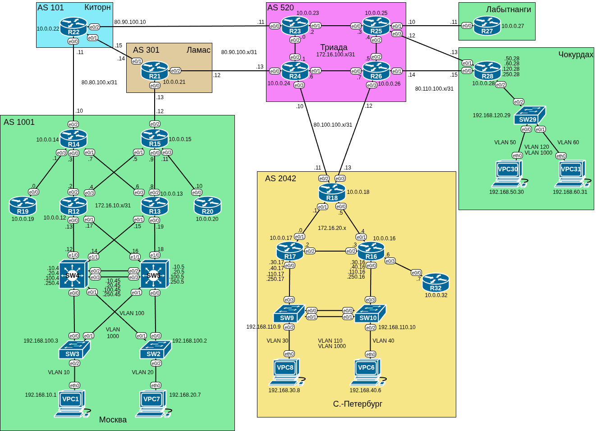

# Домашнее задание №10 «iBGP»

## Цель работы

В данной самостоятельной работе необходимо настроить iBGP в офисе «Москва» и
провайдере «Триада», организовать IP связанность всех сетей.

## Задачи

1. [Настроить iBGP между маршрутизаторами R14 и R15.](#настройка-ibgp-между-маршрутизаторами-r14-и-r15)
2. [Настроить iBGP в провайдере «Триада» с использованием RR.](#настройка-ibgp-в-провайдере-триада)
3. [Сделать провайдера «Ламас» приоритетным для офиса «Москва».](#установка-провайдера-ламас-в-качестве-приоритетного-для-офиса-москва)
4. [Настроить балансировку траффика офиса «Санкт-Петербург» по двум линкам провайдера.](#настройка-балансировки-трафика-в-офисе-санкт-петербург)
5. [Настроить IP связность всех сетей.](#настройка-ip-связности-всех-сетей)

## Топология

Топология лабораторного стенда собрана в среде EVE-NG.



## Настройка iBGP между маршрутизаторами R14 и R15

Выполним настройку iBGP между граничными маршрутизаторами офиса «Москва».

В предыдущей домашней работе мы уже подняли eBGP и настроили связность по лупбэк
адресам **R14** и **R15**. Осталось лишь добавить соседство между ними:

```text
R15(config)#router bgp 1001 
R15(config-router)#neighbor 10.0.0.14 remote-as 1001
R15(config-router)#neighbor 10.0.0.14 description R14
```

При установке соединения BGP отправляет пакеты с ближайшего интерфейса (адреса).
Если мы настраиваем соседство на лупбэках, то это приведёт к несовпадению IP адресов
и отбрасыванию пакетов (сосед описан с одним IP адресом, а присылает пакеты с другого).
Чтобы всё заработало, добавим команду **neighbor update-source**:

```text
R15(config-router)#neighbor 10.0.0.14 update-source
```

Просмотрим состояние процесса BGP:

```text
R15#sh bgp summ
BGP router identifier 10.0.0.15, local AS number 1001
BGP table version is 14, main routing table version 14
8 network entries using 1120 bytes of memory
10 path entries using 800 bytes of memory
7/6 BGP path/bestpath attribute entries using 1008 bytes of memory
5 BGP AS-PATH entries using 120 bytes of memory
0 BGP route-map cache entries using 0 bytes of memory
0 BGP filter-list cache entries using 0 bytes of memory
BGP using 3048 total bytes of memory
BGP activity 8/0 prefixes, 17/7 paths, scan interval 60 secs

Neighbor        V           AS MsgRcvd MsgSent   TblVer  InQ OutQ Up/Down  State/PfxRcd
10.0.0.14       4         1001      22      15       14    0    0 00:05:10        3
80.80.100.13    4          301      52      48       14    0    0 00:38:04        6
R15#
```

И подробно соседей:

<details>
<summary>show ip bgp neighbors</summary>

```text
R15#sh bgp neigh
BGP neighbor is 10.0.0.14,  remote AS 1001, internal link
 Description: R14
  BGP version 4, remote router ID 10.0.0.14
  BGP state = Established, up for 00:05:32
  Last read 00:00:16, last write 00:00:08, hold time is 180, keepalive interval is 60 seconds
  Neighbor sessions:
    1 active, is not multisession capable (disabled)
  Neighbor capabilities:
    Route refresh: advertised and received(new)
    Four-octets ASN Capability: advertised and received
    Address family IPv4 Unicast: advertised and received
    Enhanced Refresh Capability: advertised and received
    Multisession Capability: 
    Stateful switchover support enabled: NO for session 1
  Message statistics:
    InQ depth is 0
    OutQ depth is 0
    
                         Sent       Rcvd
    Opens:                  1          1
    Notifications:          0          0
    Updates:                7         15
    Keepalives:             8          7
    Route Refresh:          0          0
    Total:                 16         23
  Default minimum time between advertisement runs is 0 seconds

 For address family: IPv4 Unicast
  Session: 10.0.0.14
  BGP table version 14, neighbor version 14/0
  Output queue size : 0
  Index 2, Advertise bit 1
  2 update-group member
  Slow-peer detection is disabled
  Slow-peer split-update-group dynamic is disabled
  Interface associated: (none)
                                 Sent       Rcvd
  Prefix activity:               ----       ----
    Prefixes Current:               6          3 (Consumes 240 bytes)
    Prefixes Total:                 7         10
    Implicit Withdraw:              0          0
    Explicit Withdraw:              1          7
    Used as bestpath:             n/a          2
    Used as multipath:            n/a          0

                                   Outbound    Inbound
  Local Policy Denied Prefixes:    --------    -------
    Bestpath from this peer:              5        n/a
    Total:                                5          0
  Number of NLRIs in the update sent: max 3, min 0
  Last detected as dynamic slow peer: never
  Dynamic slow peer recovered: never
  Refresh Epoch: 1
  Last Sent Refresh Start-of-rib: never
  Last Sent Refresh End-of-rib: never
  Last Received Refresh Start-of-rib: never
  Last Received Refresh End-of-rib: never
				       Sent	  Rcvd
	Refresh activity:	       ----	  ----
	  Refresh Start-of-RIB          0          0
	  Refresh End-of-RIB            0          0

  Address tracking is enabled, the RIB does have a route to 10.0.0.14
  Connections established 1; dropped 0
  Last reset never
  Transport(tcp) path-mtu-discovery is enabled
  Graceful-Restart is disabled
Connection state is ESTAB, I/O status: 1, unread input bytes: 0            
Connection is ECN Disabled, Mininum incoming TTL 0, Outgoing TTL 255
Local host: 10.0.0.15, Local port: 179
Foreign host: 10.0.0.14, Foreign port: 45988
Connection tableid (VRF): 0
Maximum output segment queue size: 50

Enqueued packets for retransmit: 0, input: 0  mis-ordered: 0 (0 bytes)

Event Timers (current time is 0x23614D):
Timer          Starts    Wakeups            Next
Retrans            10          0             0x0
TimeWait            0          0             0x0
AckHold            11          8             0x0
SendWnd             0          0             0x0
KeepAlive           0          0             0x0
GiveUp              0          0             0x0
PmtuAger            0          0             0x0
DeadWait            0          0             0x0
Linger              0          0             0x0
ProcessQ            0          0             0x0

iss: 1980492978  snduna: 1980493569  sndnxt: 1980493569
irs:  274054289  rcvnxt:  274055224
          
sndwnd:  15794  scale:      0  maxrcvwnd:  16384
rcvwnd:  15450  scale:      0  delrcvwnd:    934

SRTT: 737 ms, RTTO: 2506 ms, RTV: 1769 ms, KRTT: 0 ms
minRTT: 0 ms, maxRTT: 1000 ms, ACK hold: 200 ms
uptime: 332694 ms, Sent idletime: 8069 ms, Receive idletime: 7861 ms 
Status Flags: passive open, gen tcbs
Option Flags: nagle, path mtu capable
IP Precedence value : 6

Datagrams (max data segment is 1460 bytes):
Rcvd: 23 (out of order: 0), with data: 12, total data bytes: 934
Sent: 22 (retransmit: 0, fastretransmit: 0, partialack: 0, Second Congestion: 0), with data: 11, total data bytes: 590

 Packets received in fast path: 0, fast processed: 0, slow path: 0
 fast lock acquisition failures: 0, slow path: 0
TCP Semaphore      0xC458E4CC  FREE 

BGP neighbor is 80.80.100.13,  remote AS 301, external link
 Description: LAMAS
  BGP version 4, remote router ID 10.0.0.21
  BGP state = Established, up for 00:38:27
  Last read 00:00:15, last write 00:00:13, hold time is 180, keepalive interval is 60 seconds
  Neighbor sessions:
    1 active, is not multisession capable (disabled)
  Neighbor capabilities:
    Route refresh: advertised and received(new)
    Four-octets ASN Capability: advertised and received
    Address family IPv4 Unicast: advertised and received
    Enhanced Refresh Capability: advertised and received
    Multisession Capability: 
    Stateful switchover support enabled: NO for session 1
  Message statistics:
    InQ depth is 0
    OutQ depth is 0
    
                         Sent       Rcvd
    Opens:                  1          1
    Notifications:          0          0
    Updates:                6         10
    Keepalives:            42         42
    Route Refresh:          0          0
    Total:                 49         53
  Default minimum time between advertisement runs is 30 seconds

 For address family: IPv4 Unicast
  Session: 80.80.100.13
  BGP table version 14, neighbor version 14/0
  Output queue size : 0
  Index 1, Advertise bit 0
  1 update-group member
  Slow-peer detection is disabled
  Slow-peer split-update-group dynamic is disabled
  Interface associated: Ethernet0/2
                                 Sent       Rcvd
  Prefix activity:               ----       ----
    Prefixes Current:               3          6 (Consumes 480 bytes)
    Prefixes Total:                 4          6
    Implicit Withdraw:              0          0
    Explicit Withdraw:              1          0
    Used as bestpath:             n/a          5
    Used as multipath:            n/a          0

                                   Outbound    Inbound
  Local Policy Denied Prefixes:    --------    -------
    AS_PATH loop:                       n/a          5
    Bestpath from this peer:              6        n/a
    Total:                                6          5
  Number of NLRIs in the update sent: max 1, min 0
  Last detected as dynamic slow peer: never
  Dynamic slow peer recovered: never
  Refresh Epoch: 1
  Last Sent Refresh Start-of-rib: never
  Last Sent Refresh End-of-rib: never
  Last Received Refresh Start-of-rib: never
  Last Received Refresh End-of-rib: never
				       Sent	  Rcvd
	Refresh activity:	       ----	  ----
	  Refresh Start-of-RIB          0          0
	  Refresh End-of-RIB            0          0

  Address tracking is enabled, the RIB does have a route to 80.80.100.13
  Connections established 1; dropped 0
  Last reset never
  Transport(tcp) path-mtu-discovery is enabled
  Graceful-Restart is disabled
Connection state is ESTAB, I/O status: 1, unread input bytes: 0            
Connection is ECN Disabled, Mininum incoming TTL 0, Outgoing TTL 1
Local host: 80.80.100.12, Local port: 179
Foreign host: 80.80.100.13, Foreign port: 38635
Connection tableid (VRF): 0
Maximum output segment queue size: 50

Enqueued packets for retransmit: 0, input: 0  mis-ordered: 0 (0 bytes)

Event Timers (current time is 0x23614E):
Timer          Starts    Wakeups            Next
Retrans            47          0             0x0
TimeWait            0          0             0x0
AckHold            47         45             0x0
SendWnd             0          0             0x0
KeepAlive           0          0             0x0
GiveUp              0          0             0x0
PmtuAger            0          0             0x0
DeadWait            0          0             0x0
Linger              0          0             0x0
ProcessQ            0          0             0x0

iss: 3020497821  snduna: 3020498931  sndnxt: 3020498931
irs:   39174656  rcvnxt:   39176028

sndwnd:  15275  scale:      0  maxrcvwnd:  16384
rcvwnd:  15013  scale:      0  delrcvwnd:   1371

SRTT: 998 ms, RTTO: 1014 ms, RTV: 16 ms, KRTT: 0 ms
minRTT: 1 ms, maxRTT: 1000 ms, ACK hold: 200 ms
uptime: 2307185 ms, Sent idletime: 13216 ms, Receive idletime: 13015 ms 
Status Flags: passive open, gen tcbs
Option Flags: nagle, path mtu capable
IP Precedence value : 6

Datagrams (max data segment is 1460 bytes):
Rcvd: 92 (out of order: 0), with data: 48, total data bytes: 1371
Sent: 95 (retransmit: 0, fastretransmit: 0, partialack: 0, Second Congestion: 0), with data: 47, total data bytes: 1109

 Packets received in fast path: 0, fast processed: 0, slow path: 0
 fast lock acquisition failures: 0, slow path: 0
TCP Semaphore      0xC458E5AC  FREE 

R15#
```

</details>

## Настройка iBGP в провайдере «Триада»

Выполним настройку iBGP на маршрутизаторах провайдера «Триада», указав один из
них в качестве Route Reflector.

Включим BGP там, где он ещё не запущен и назначим router-id.

```text
R23(config)#router bgp 520
R23(config-router)#bgp router-id 10.0.0.23
```

В качестве route-reflector выберем **R23**. Чтобы не прописывать соседей вручную
воспользуемся peer-group:

```text
R23(config-router)#neighbor LEAF peer-group
R23(config-router)#bgp listen range 172.16.100.0/24 peer-group LEAF
R23(config-router)#neighbor LEAF remote-as 520
R23(config-router)#neighbor LEAF route-reflector-client
```

Теперь на остальных маршрутизаторах Триады достаточно прописать соседство с
route-reflector:

```text
R25(config-router)#neighbor 172.16.100.2 remote-as 520
```

Все 3 соседства поднялись:


```text
R23#sh bgp summ
BGP router identifier 10.0.0.23, local AS number 520
BGP table version is 10, main routing table version 10
9 network entries using 1260 bytes of memory
10 path entries using 800 bytes of memory
5/5 BGP path/bestpath attribute entries using 720 bytes of memory
4 BGP AS-PATH entries using 96 bytes of memory
0 BGP route-map cache entries using 0 bytes of memory
0 BGP filter-list cache entries using 0 bytes of memory
BGP using 2876 total bytes of memory
BGP activity 9/0 prefixes, 12/2 paths, scan interval 60 secs

Neighbor        V           AS MsgRcvd MsgSent   TblVer  InQ OutQ Up/Down  State/PfxRcd
*172.16.100.1   4          520      19      21       10    0    0 00:03:16        8
*172.16.100.3   4          520      14      26       10    0    0 00:08:18        0
*172.16.100.5   4          520      11      22       10    0    0 00:01:54        2
* Dynamically created based on a listen range command
Dynamically created neighbors: 3, Subnet ranges: 1

BGP peergroup LEAF listen range group members: 
  172.16.100.0/24 

Total dynamically created neighbors: 3/(100 max), Subnet ranges: 1

R23#
```

## Установка провайдера «Ламас» в качестве приоритетного для офиса «Москва»

Чтобы весь трафик офиса «Москва» шёл наружу в приоритете через провайдера «Ламас»
установим для его маршрутов local-preference, используя route-map:

```text
R15(config)#route-map AS301_LAMAS permit 10
R15(config-route-map)#set local-preference 200
R15(config-route-map)#exit
R15(config)#router bgp 1001
R15(config-router)#neighbor 80.80.100.13 route-map AS301_LAMAS in
```

На соседнем граничном маршрутизаторе **R14** теперь в качестве лучших выбраны
маршруты через «Ламас», даже в случае более длинного AS_PATH:

```text
R14#sh bgp             
BGP table version is 156, local router ID is 10.0.0.14
Status codes: s suppressed, d damped, h history, * valid, > best, i - internal, 
              r RIB-failure, S Stale, m multipath, b backup-path, f RT-Filter, 
              x best-external, a additional-path, c RIB-compressed, 
Origin codes: i - IGP, e - EGP, ? - incomplete
RPKI validation codes: V valid, I invalid, N Not found

     Network          Next Hop            Metric LocPrf Weight Path
 *>  10.0.0.14/32     0.0.0.0                  0         32768 i
 r>i 10.0.0.15/32     10.0.0.15                0    100      0 i
 *>i 10.0.0.18/32     80.80.100.13             0    200      0 301 520 2042 i
 *                    80.80.100.11                           0 101 301 520 2042 i
 r>i 80.80.100.10/31  80.80.100.13             0    200      0 301 101 i
 r                    80.80.100.11             0             0 101 i
 r>i 80.80.100.12/31  80.80.100.13             0    200      0 301 i
 r                    80.80.100.11                           0 101 301 i
 *>i 80.80.100.14/31  80.80.100.13             0    200      0 301 i
 *                    80.80.100.11             0             0 101 i
 *>i 80.90.100.12/31  80.80.100.13             0    200      0 301 i
 *                    80.80.100.11                           0 101 301 i
 *>i 80.100.100.10/31 80.80.100.13             0    200      0 301 520 i
     Network          Next Hop            Metric LocPrf Weight Path
 *                    80.80.100.11                           0 101 301 520 i
 *>i 80.100.100.12/31 80.80.100.13             0    200      0 301 520 i
 *                    80.80.100.11                           0 101 301 520 i
R14#
```

## Настройка балансировки трафика в офисе «Санкт-Петербург»

Выполним настройку исходящего трафика офиса «Санкт-Петербург» по двум линкам
провайдера «Триада».

На **R18** маршрут по умолчанию был прописан статикой, удалим его:

```text
R18(config)#no ip route 0.0.0.0 0.0.0.0 80.100.100.10
R18(config)#no ip route 0.0.0.0 0.0.0.0 80.100.100.12
```

Включим редистрибьюцию маршрута по умолчанию на маршрутизаторах Триады, подключённых
к **R18** (R24 и R26):

```text
R24(config-router)#neighbor 80.100.100.11 default-originate
```

На **R18** появилось два маршрута к 0.0.0.0, но в таблице маршрутизации пока только
один:

```text
R18#sh bgp 0.0.0.0   
BGP routing table entry for 0.0.0.0/0, version 124
Paths: (2 available, best #2, table default)
  Advertised to update-groups:
     1         
  Refresh Epoch 1
  520
    80.100.100.12 from 80.100.100.12 (10.0.0.26)
      Origin IGP, localpref 100, valid, external
      rx pathid: 0, tx pathid: 0
  Refresh Epoch 1
  520
    80.100.100.10 from 80.100.100.10 (10.0.0.24)
      Origin IGP, localpref 100, valid, external, best
      rx pathid: 0, tx pathid: 0x0
R18#
```

```text
R18#sh ip rou 0.0.0.0
Routing entry for 0.0.0.0/0, supernet
  Known via "bgp 2042", distance 20, metric 0, candidate default path
  Tag 520, type external
  Last update from 80.100.100.10 00:23:01 ago
  Routing Descriptor Blocks:
  * 80.100.100.10, from 80.100.100.10, 00:23:01 ago
      Route metric is 0, traffic share count is 1
      AS Hops 1
      Route tag 520
      MPLS label: none
R18#
```

```text
R18#sh ip rou bgp
Codes: L - local, C - connected, S - static, R - RIP, M - mobile, B - BGP
       D - EIGRP, EX - EIGRP external, O - OSPF, IA - OSPF inter area 
       N1 - OSPF NSSA external type 1, N2 - OSPF NSSA external type 2
       E1 - OSPF external type 1, E2 - OSPF external type 2
       i - IS-IS, su - IS-IS summary, L1 - IS-IS level-1, L2 - IS-IS level-2
       ia - IS-IS inter area, * - candidate default, U - per-user static route
       o - ODR, P - periodic downloaded static route, H - NHRP, l - LISP
       a - application route
       + - replicated route, % - next hop override

Gateway of last resort is 80.100.100.10 to network 0.0.0.0

B*    0.0.0.0/0 [20/0] via 80.100.100.10, 00:23:42
      10.0.0.0/32 is subnetted, 5 subnets
B        10.0.0.14 [20/0] via 80.100.100.10, 11:35:29
B        10.0.0.15 [20/0] via 80.100.100.10, 12:23:35
      80.0.0.0/8 is variably subnetted, 8 subnets, 2 masks
B        80.80.100.10/31 [20/0] via 80.100.100.10, 12:39:02
B        80.80.100.12/31 [20/0] via 80.100.100.10, 14:05:53
B        80.80.100.14/31 [20/0] via 80.100.100.10, 14:05:53
B        80.90.100.12/31 [20/0] via 80.100.100.10, 14:06:23
R18# 
```

Для включения балансировки выполним команду **maximum-paths 2**:

```text
R18(config)#router bgp 2042 
R18(config-router)#maximum-paths 2
```

Теперь в таблице маршрутизации два одинаковых маршрута по умолчанию:

```text
R18#sh ip rou bgp
Codes: L - local, C - connected, S - static, R - RIP, M - mobile, B - BGP
       D - EIGRP, EX - EIGRP external, O - OSPF, IA - OSPF inter area 
       N1 - OSPF NSSA external type 1, N2 - OSPF NSSA external type 2
       E1 - OSPF external type 1, E2 - OSPF external type 2
       i - IS-IS, su - IS-IS summary, L1 - IS-IS level-1, L2 - IS-IS level-2
       ia - IS-IS inter area, * - candidate default, U - per-user static route
       o - ODR, P - periodic downloaded static route, H - NHRP, l - LISP
       a - application route
       + - replicated route, % - next hop override

Gateway of last resort is 80.100.100.12 to network 0.0.0.0

B*    0.0.0.0/0 [20/0] via 80.100.100.12, 00:34:26
                [20/0] via 80.100.100.10, 00:34:26
      10.0.0.0/32 is subnetted, 5 subnets
B        10.0.0.14 [20/0] via 80.100.100.12, 00:34:26
                   [20/0] via 80.100.100.10, 00:34:26
B        10.0.0.15 [20/0] via 80.100.100.12, 00:34:26
                   [20/0] via 80.100.100.10, 00:34:26
      80.0.0.0/8 is variably subnetted, 8 subnets, 2 masks
B        80.80.100.10/31 [20/0] via 80.100.100.12, 00:34:26
                         [20/0] via 80.100.100.10, 00:34:26
B        80.80.100.12/31 [20/0] via 80.100.100.12, 00:34:26
                         [20/0] via 80.100.100.10, 00:34:26
B        80.80.100.14/31 [20/0] via 80.100.100.12, 00:34:26
                         [20/0] via 80.100.100.10, 00:34:26
B        80.90.100.12/31 [20/0] via 80.100.100.12, 00:34:26
                         [20/0] via 80.100.100.10, 00:34:26
R18#
```

```text
R18#sh ip rou 0.0.0.0    
Routing entry for 0.0.0.0/0, supernet
  Known via "bgp 2042", distance 20, metric 0, candidate default path
  Tag 520, type external
  Last update from 80.100.100.10 00:35:00 ago
  Routing Descriptor Blocks:
  * 80.100.100.12, from 80.100.100.12, 00:35:00 ago
      Route metric is 0, traffic share count is 1
      AS Hops 1
      Route tag 520
      MPLS label: none
    80.100.100.10, from 80.100.100.10, 00:35:00 ago
      Route metric is 0, traffic share count is 1
      AS Hops 1
      Route tag 520
      MPLS label: none
R18#
```

```text
R18#sh bgp 0.0.0.0   
BGP routing table entry for 0.0.0.0/0, version 144
Paths: (2 available, best #2, table default)
Multipath: eBGP
  Advertised to update-groups:
     1         
  Refresh Epoch 3
  520
    80.100.100.12 from 80.100.100.12 (10.0.0.26)
      Origin IGP, localpref 100, valid, external, multipath(oldest)
      rx pathid: 0, tx pathid: 0
  Refresh Epoch 3
  520
    80.100.100.10 from 80.100.100.10 (10.0.0.24)
      Origin IGP, localpref 100, valid, external, multipath, best
      rx pathid: 0, tx pathid: 0x0
R18#
```

Оба пути имеют одинаковые атрибуты, в том числе и AS_PATH. Если бы последний
был разным, то мы могли бы использовать команду
**bgp bestpath as-path multipath-relax**, однако в данной конфигурации она не
понадобилась.

После того, как мы удалили статический маршрут по умолчанию с **R18**, остальные
роутеры офиса «Санкт-Петербург» остались без маршрута по умолчанию. Чтобы вернуть
его, настроим редистрибьюцию из BGP в EIGRP.

Сперва создадим префикс-лист и рут-мэп:

```text
R18(config)#ip prefix-list EIGRP_DEF seq 10 permit 0.0.0.0/0
R18(config)#route-map EIGRP_DEF_REDIST permit 10
R18(config)#match ip address prefix-list EIGRP_DEF
```

Добавим редистрибьюцию из BGP:

```text
R18(config)#router eigrp SPB
R18(config-router)#address-family ipv4 unicast autonomous-system 1
R18(config-router-af)#topology base
R18(config-router-af-topology)#redistribute bgp 2042 route-map EIGRP_DEF_REDIST metric 10000 100 255 1 1500
```

Теперь маршрут по умолчанию вернулся в EIGRP:

```text
R32#sh ip rou
Codes: L - local, C - connected, S - static, R - RIP, M - mobile, B - BGP
       D - EIGRP, EX - EIGRP external, O - OSPF, IA - OSPF inter area 
       N1 - OSPF NSSA external type 1, N2 - OSPF NSSA external type 2
       E1 - OSPF external type 1, E2 - OSPF external type 2
       i - IS-IS, su - IS-IS summary, L1 - IS-IS level-1, L2 - IS-IS level-2
       ia - IS-IS inter area, * - candidate default, U - per-user static route
       o - ODR, P - periodic downloaded static route, H - NHRP, l - LISP
       a - application route
       + - replicated route, % - next hop override

Gateway of last resort is 172.16.20.6 to network 0.0.0.0

D*EX  0.0.0.0/0 [170/2048000] via 172.16.20.6, 00:17:14, Ethernet0/0
      10.0.0.0/32 is subnetted, 1 subnets
C        10.0.0.32 is directly connected, Loopback0
      172.16.0.0/16 is variably subnetted, 2 subnets, 2 masks
C        172.16.20.6/31 is directly connected, Ethernet0/0
L        172.16.20.7/32 is directly connected, Ethernet0/0
R32#
```

## Настройка IP связности всех сетей

Чтобы обеспечить IP-связность между различными сетями включим редистрибьюцию
маршрутов между различными протоколами маршрутизации.

```text
R14(config-router)#redistribute ospf 1
```

```text
R15(config-router)#redistribute ospf 1
```

```text
R18(config-router)#redistribute eigrp 1
```

Добавим лупбэки в IGP (OSPF и EIGRP). Также и в BGP:

```text
R22(config)#router bgp 101
R22(config-router)#network 10.0.0.22 mask 255.255.255.255
```

На всех маршрутизаторах, кроме офисов «Санкт-Петербург», «Санкт-Петербург»
и граничных с ними (**R25** - **R28**) удалим статические маршруты. Для получения
маршрута по умолчанию укажем на роутерах провайдеров **default-originate** в
сторону соответствующих соседей:

```text
R21(config-router)#neighbor 80.80.100.12 default-originate
```

IP связность работает:

**VPC1** - **VPC31**

```text
VPC1> ping 192.168.60.31 -c 1

84 bytes from 192.168.60.31 icmp_seq=1 ttl=57 time=2.797 ms
```

**VPC8** - **R27**

```text
VPC8> ping 10.0.0.27 -c 1

84 bytes from 10.0.0.27 icmp_seq=1 ttl=250 time=2.249 ms
```

**R19** - **R32**

```text
R19>ping 10.0.0.32 
Type escape sequence to abort.
Sending 5, 100-byte ICMP Echos to 10.0.0.32, timeout is 2 seconds:
!!!!!
Success rate is 100 percent (5/5), round-trip min/avg/max = 2/3/5 ms
R19>
```

## Файлы настроек

Файлы настроек устройств (конфиги) экспортированы в каталог [configs](./configs/).

Готовая лабораторная (экспорт из EVE-NG) - [11_ibgp.zip](./11_ibgp.zip).
