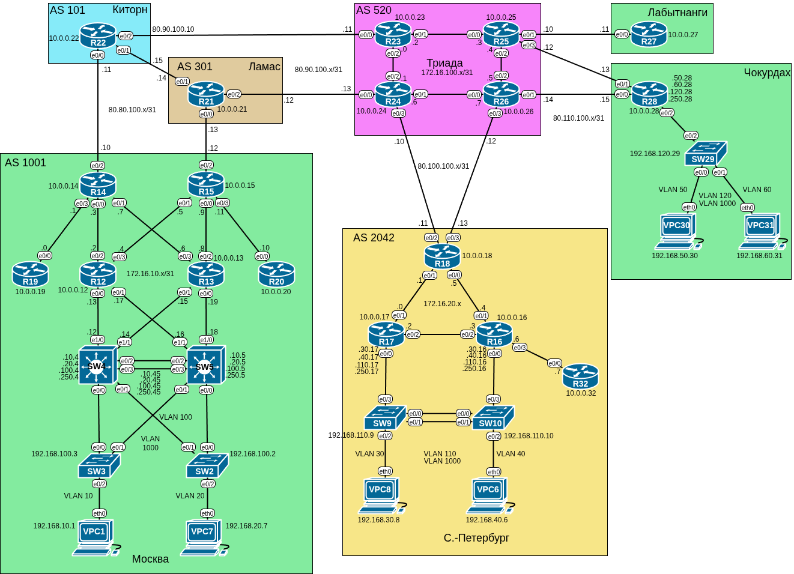

# Домашнее задание №12 «Основные протоколы сети интернет»

## Цель работы

В данной самостоятельной работе необходимо настроить DHCP и синхронизацию времени
в офисе «Москва», настроить NAT в офисах «Москва», «Санкт-Петербург» и «Чокурдах».

## Задачи

1. [Настройка NAT(PAT) на R14 и R15](#настройка-natpat-на-r14-и-r15)
2. [Настройка NAT(PAT) на R18](#настройка-natpat-на-r18)
3. [Настройка статического NAT для R20](#настройка-статического-nat-для-r20)
4. [Настройка NAT(PAT) на R19](#настройка-natpat-на-r19)
5. [Настройка статического NAT для офиса «Чокурдах»](#настройка-статического-nat-для-офиса-чокурдах)
6. [Настройка DHCP IPv4 в офисе «Москва»](#настройка-dhcp-ipv4-в-офисе-москва)
7. [Настройка NTP в офисе «Москва»](#настройка-ntp-в-офисе-москва)
8. [Проверка IP связности](#проверка-ip-связности)

## Топология

Топология лабораторного стенда собрана в среде EVE-NG.



## Настройка NAT(PAT) на R14 и R15

Настроим NAT(PAT) на R14 и R15 так, чтобы трансляция осуществлялась в адреса
автономной системы AS1001.

Создадим access list для внутренних сетей, которые будем транслировать:

```text
R14(config)#access-list 1 permit 192.168.0.0 0.0.255.255
R14(config)#access-list 1 permit 172.16.10.0 0.0.0.255 
```

Настроим преобразование адреса источника в публичный адрес:

```text
R14(config)#ip nat inside source list 1 interface e0/2 overload 
```

Определим внутренние и внешний интерфейсы:

```text
R14(config)#int e0/0
R14(config-if)#ip nat inside
R14(config-if)#exit
R14(config)#int e0/1     
R14(config-if)#ip nat inside
R14(config-if)#exit
R14(config)#int e0/3     
R14(config-if)#ip nat inside
R14(config-if)#exit
R14(config)#int e0/2
R14(config-if)#ip nat outside
R14(config-if)#end
```

Для проверки работы NAT выполним пинг с **R19**:

```text
R19>ping 80.80.100.11
Type escape sequence to abort.
Sending 5, 100-byte ICMP Echos to 80.80.100.11, timeout is 2 seconds:
!!!!!
Success rate is 100 percent (5/5), round-trip min/avg/max = 1/1/2 ms
R19>
```

Теперь посмотрим информацию о NAT на **R14**:

```text
R14#show ip nat statistics 
Total active translations: 1 (0 static, 1 dynamic; 1 extended)
Peak translations: 1, occurred 00:00:04 ago
Outside interfaces:
  Ethernet0/2
Inside interfaces: 
  Ethernet0/0, Ethernet0/1, Ethernet0/3
Hits: 10  Misses: 0
CEF Translated packets: 10, CEF Punted packets: 0
Expired translations: 0
Dynamic mappings:
-- Inside Source
[Id: 1] access-list 1 interface Ethernet0/2 refcount 1

Total doors: 0
Appl doors: 0
Normal doors: 0
Queued Packets: 0
R14#show ip nat translations 
Pro Inside global      Inside local       Outside local      Outside global
icmp 80.80.100.10:0    172.16.10.0:0      80.80.100.11:0     80.80.100.11:0
R14#
```

Аналогичным образом настроим и **R15**.

## Настройка NAT(PAT) на R18

Настроим NAT(PAT) на R18 так, чтобы трансляция осуществлялась в пул из 5 адресов
автономной системы AS2042.

Создадим пул из внешних IP адресов:

```text
R18(config)#ip nat pool NAT_POOL 80.100.100.240 80.100.100.244 netmask 255.255.255.248
```

Создадим access list для внутренних сетей, которые будем транслировать:

```text
R18(config)#access-list 1 permit 192.168.0.0 0.0.255.255
R18(config)#access-list 1 permit 172.16.20.0 0.0.0.255
```

Свяжем access list и пул NAT:

```text
R18(config)#ip nat inside source list 1 pool NAT_POOL overload
```

Определим внутренние и внешний интерфейсы:

```text
R18(config)#int r e0/0-1
R18(config-if-range)#ip nat inside
R18(config-if-range)#exit
R18(config)#int r e0/2-3 
R18(config-if-range)#ip nat outside
R18(config-if-range)#end
R18#
```

Для проверки работы NAT выполним пинг с **R16** и **R17**. Теперь посмотрим
информацию о NAT на **R18**:

```text
R18#sh ip nat statistics 
Total active translations: 2 (0 static, 2 dynamic; 2 extended)
Peak translations: 2, occurred 00:02:02 ago
Outside interfaces:
  Ethernet0/2, Ethernet0/3
Inside interfaces: 
  Ethernet0/0, Ethernet0/1
Hits: 55  Misses: 0
CEF Translated packets: 55, CEF Punted packets: 0
Expired translations: 4
Dynamic mappings:
-- Inside Source
[Id: 1] access-list 1 pool NAT_POOL refcount 2
 pool NAT_POOL: netmask 255.255.255.248
	start 80.100.100.240 end 80.100.100.244
	type generic, total addresses 5, allocated 1 (20%), misses 0

Total doors: 0
Appl doors: 0
Normal doors: 0
Queued Packets: 0
R18#sh ip nat tra        
R18#sh ip nat translations 
Pro Inside global      Inside local       Outside local      Outside global
icmp 80.100.100.241:4  172.16.20.0:4      10.0.0.14:4        10.0.0.14:4
icmp 80.100.100.241:0  172.16.20.4:0      10.0.0.28:0        10.0.0.28:0
R18#
```

## Настройка статического NAT для R20

Настроим на **R15** статический NAT для **R20** с учётом того, что на **R15**
уже настроен динамический NAT (PAT).

Сперва добавим ещё один IP-адрес на исходящий интерфейс, который будет
использовать для статического NAT:

```text
R15(config)#int e0/2
R15(config-if)#ip address 80.80.100.240 255.255.255.254 secondary   
% Warning: use /31 mask on non point-to-point interface cautiously
R15(config-if)#exit
R15(config)#
```

Исключим адрес **R20** из списка адресов для динамической трансляции:

```text
R15(config)#no access-list 1 permit 192.168.0.0 0.0.255.255
R15(config)#no access-list 1 permit 172.16.10.0 0.0.0.255
R15(config)#access-list 1 deny host 172.16.10.10
R15(config)#access-list 1 permit 192.168.0.0 0.0.255.255
R15(config)#access-list 1 permit 172.16.10.0 0.0.0.255
```

Теперь включим статическую трансляцию адреса:

```text
R15(config)#ip nat inside source static 172.16.10.10 80.80.100.240
```

Проверим, что запись о статическом NAT появилась:

```text
R15#show ip nat translation
Pro Inside global      Inside local       Outside local      Outside global
--- 80.80.100.240      172.16.10.10       ---                ---
R15#
```

После пинга с **R20**:

```text
R15#show ip nat translation
Pro Inside global      Inside local       Outside local      Outside global
icmp 80.80.100.240:3   172.16.10.10:3     10.0.0.21:3        10.0.0.21:3
--- 80.80.100.240      172.16.10.10       ---                ---
R15#
```

Динамический NAT для остальных адресов по-прежнему работает:

```text
R15#show ip nat translation
Pro Inside global      Inside local       Outside local      Outside global
icmp 80.80.100.12:0    172.16.10.8:0      10.0.0.21:0        10.0.0.21:0
icmp 80.80.100.240:3   172.16.10.10:3     10.0.0.21:3        10.0.0.21:3
--- 80.80.100.240      172.16.10.10       ---                ---
R15#
```

## Настройка NAT(PAT) на R19

Настроите NAT так, чтобы R19 был доступен с любого узла для удаленного управления.

В рамках настройки NAT на роутерах **R14** и **R15** мы уже настроили трансляцию;
**R19** доступен по своему лупбэку. Продемонстрируем это.

Включим телнет без пароля:

```text
R19>en
R19#conf t
R19(config)#line vty 0 4
R19(config-line)#transport input telnet
R19(config-line)#no login
R19(config-line)#end
R19#
```

Подключимся с **R19**:

```text
R27#telnet 10.0.0.19
Trying 10.0.0.19 ... Open
R19>
```

И c **R32**:

```text
R32>telnet 10.0.0.19
Trying 10.0.0.19 ... Open
R19>
```

## Настройка статического NAT для офиса «Чокурдах»

Настроим статический NAT для клиентов офиса «Чокурдах». В качестве выходных
адресов используем сети провайдера 80.110.150.0/24 и 80.110.160.0/24 (назначение
целой подсети для трансляции может быть актуальным в сценарии миграции сетей):

```text
R28(config)#ip nat inside source static network 192.168.50.0 80.110.150.0 /24
R28(config)#ip nat inside source static network 192.168.60.0 80.110.160.0 /24
```

Включим NAT на интерфейсах:

```textR28(config)#int e0/2
R28(config)#int e0/2.50
R28(config-subif)#ip nat inside
R28(config-subif)#exit
R28(config)#int e0/2.60  
R28(config-subif)#ip nat inside
R28(config)#int r e0/0-1                                             
R28(config-if-range)#ip nat outside
R28(config-subif)#end
R28#
```

Поправим соответствующим образом маршруты на аплинках (ранее там была настроена
статика). Выведем информацию о NAT трансляции и статистику:

```text
R28#sh ip nat translations 
Pro Inside global      Inside local       Outside local      Outside global
icmp 80.110.150.30:17549 192.168.50.30:17549 10.0.0.16:17549 10.0.0.16:17549
icmp 80.110.150.30:17805 192.168.50.30:17805 10.0.0.16:17805 10.0.0.16:17805
icmp 80.110.150.30:18061 192.168.50.30:18061 10.0.0.16:18061 10.0.0.16:18061
icmp 80.110.150.30:18317 192.168.50.30:18317 10.0.0.16:18317 10.0.0.16:18317
icmp 80.110.150.30:18573 192.168.50.30:18573 10.0.0.16:18573 10.0.0.16:18573
--- 80.110.150.30      192.168.50.30      ---                ---
--- 80.110.150.0       192.168.50.0       ---                ---
icmp 80.110.160.31:14733 192.168.60.31:14733 10.0.0.14:14733 10.0.0.14:14733
icmp 80.110.160.31:14989 192.168.60.31:14989 10.0.0.14:14989 10.0.0.14:14989
--- 80.110.160.31      192.168.60.31      ---                ---
--- 80.110.160.0       192.168.60.0       ---                ---
```

```text
R28#sh ip nat statistics 
Total active translations: 11 (2 static, 9 dynamic; 7 extended)
Peak translations: 11, occurred 00:00:06 ago
Outside interfaces:
  Ethernet0/0, Ethernet0/1
Inside interfaces: 
  Ethernet0/2.50, Ethernet0/2.60
Hits: 46  Misses: 0
CEF Translated packets: 46, CEF Punted packets: 0
Expired translations: 18
Dynamic mappings:

Total doors: 0
Appl doors: 0
Normal doors: 0
Queued Packets: 0
```

## Настройка DHCP IPv4 в офисе «Москва»

Настроим IPv4 DHCP сервер на маршрутизаторах **R12** и **R13** так, чтобы **VPC1**
и **VPC7** получали сетевые настройки по DHCP.

Создадим пул IP адресов, исключив адреса L3 коммутаторов **SW4**, **SW5** и их
совместного стендбая:

```text
R12(config)#ip dhcp excluded-address 192.168.10.4 192.168.10.5              
R12(config)#ip dhcp excluded-address 192.168.10.45
R12(config)#ip dhcp pool LAN_POOL_10
R12(dhcp-config)#network 192.168.10.0 255.255.255.0
R12(dhcp-config)#default-router 192.168.10.45
R12(dhcp-config)#exit                    
R12(config)#ip dhcp excluded-address 192.168.20.4 192.168.20.5
R12(config)#ip dhcp excluded-address 192.168.20.45            
R12(config)#ip dhcp pool LAN_POOL_20                          
R12(dhcp-config)#network 192.168.20.0 255.255.255.0
R12(dhcp-config)#default-router 192.168.20.45
R12(dhcp-config)#end
R12#
```

В качестве шлюза по умолчанию указан IP адрес виртуального стендбай коммутатора,
состоящего из **SW4** и **SW5**.

Выполним аналогичные настройки на **R13**.

Чтобы коммутаторы **SW4** и **SW5** передавали запросы к DHCP серверам, включим
на них релей:

```text
SW4(config)#int Vlan10                    
SW4(config-if)#ip helper-address 10.0.0.12   
SW4(config-if)#ip helper-address 10.0.0.13
SW4(config-if)#exit                       
SW4(config)#int Vlan20                 
SW4(config-if)#ip helper-address 10.0.0.12
SW4(config-if)#ip helper-address 10.0.0.13
```

Проверим назначение IP адресов:

```text
VPC1> ip dhcp
DDORA IP 192.168.10.2/24 GW 192.168.10.45

VPC1> show ip

NAME        : VPC1[1]
IP/MASK     : 192.168.10.2/24
GATEWAY     : 192.168.10.45
DNS         : 
DHCP SERVER : 172.16.10.13
DHCP LEASE  : 86177, 86400/43200/75600
MAC         : 00:50:79:66:68:01
LPORT       : 20000
RHOST:PORT  : 127.0.0.1:30000
MTU         : 1500

VPC1
```

```text
VPC7> ip dhcp
DDORA IP 192.168.20.1/24 GW 192.168.20.45

VPC7> show ip

NAME        : VPC7[1]
IP/MASK     : 192.168.20.1/24
GATEWAY     : 192.168.20.45
DNS         : 
DHCP SERVER : 172.16.10.15
DHCP LEASE  : 86391, 86400/43200/75600
MAC         : 00:50:79:66:68:07
LPORT       : 20000
RHOST:PORT  : 127.0.0.1:30000
MTU         : 1500

VPC7>
```

## Настройка NTP в офисе «Москва»

Настроим NTP сервер на **R12** и **R13** так, чтобы все устройства в офисе «Москва»
синхронизировали время с **R12** и **R13**.

Включим NTP master, обновим часы и установим часовой пояс:

```text
R12(config)#ntp master
R12(config)#ntp update-calendar
```

Включим рассылку времени по всем интерфейсам:

```text
R12(config)#int r e0/0-3
R12(config-if-range)#ntp broadcast
R12(config-if-range)#end
R12#
```

Аналогично настроим **R13**.

Теперь настроим на клиентских маршрутизаторах дерево динамических клиентов и
бродкастов:

```text
R14(config)#int r e0/0-1                      
R14(config-if-range)#ntp broadcast client
R14(config-if-range)#exit
R14(config)#int e0/3
R14(config-if)#ntp broadcast
R14(config-if)#end
R14#sh ntp status       
Clock is synchronized, stratum 9, reference is 172.16.10.2    
nominal freq is 250.0000 Hz, actual freq is 250.0000 Hz, precision is 2**10
ntp uptime is 167700 (1/100 of seconds), resolution is 4000
reference time is EC6238D9.F9999C48 (03:47:37.975 UTC Wed Sep 3 2025)
clock offset is -0.5000 msec, root delay is 1.00 msec
root dispersion is 6.72 msec, peer dispersion is 2.89 msec
loopfilter state is 'CTRL' (Normal Controlled Loop), drift is 0.000000008 s/s
system poll interval is 64, last update was 24 sec ago.
```

Аналогичные настройки будут на **R15**. На **R19** и **R20** достаточно будет
включить получение синхронизации.

```text
R19(config)#int e0/0
R19(config-if)#ntp broadcast client 
R19(config-if)#end
R19#sh ntp status
Clock is synchronized, stratum 10, reference is 172.16.10.1    
nominal freq is 250.0000 Hz, actual freq is 250.0000 Hz, precision is 2**10
ntp uptime is 197700 (1/100 of seconds), resolution is 4000
reference time is EC6238D3.46A7F060 (03:47:31.276 UTC Wed Sep 3 2025)
clock offset is 0.0000 msec, root delay is 0.99 msec
root dispersion is 11.98 msec, peer dispersion is 2.88 msec
loopfilter state is 'CTRL' (Normal Controlled Loop), drift is -0.000000019 s/s
system poll interval is 64, last update was 59 sec ago.
R19#
```

## Проверка IP связности

Все офисы в лабораторной работе имеют IP связность:

```text
VPC1> ping 192.168.20.1

84 bytes from 192.168.20.1 icmp_seq=1 ttl=63 time=1.605 ms

VPC1> ping 10.0.0.17

84 bytes from 10.0.0.17 icmp_seq=1 ttl=249 time=2.973 ms
```

```text

VPC7> ping 10.0.0.32

84 bytes from 10.0.0.32 icmp_seq=1 ttl=248 time=3.976 ms
84 bytes from 10.0.0.32 icmp_seq=2 ttl=248 time=3.694 ms
^C
VPC7> 
```

```text
VPC31> ping 10.0.0.19

84 bytes from 10.0.0.19 icmp_seq=1 ttl=248 time=2.074 ms
84 bytes from 10.0.0.19 icmp_seq=2 ttl=248 time=4.259 ms
^C
VPC31> 
```

## Файлы настроек

Файлы настроек устройств (конфиги) экспортированы в каталог [configs](./configs/).

Готовая лабораторная (экспорт из EVE-NG) - [33_dhcp_nat_ntp.zip](./33_dhcp_nat_ntp.zip).
