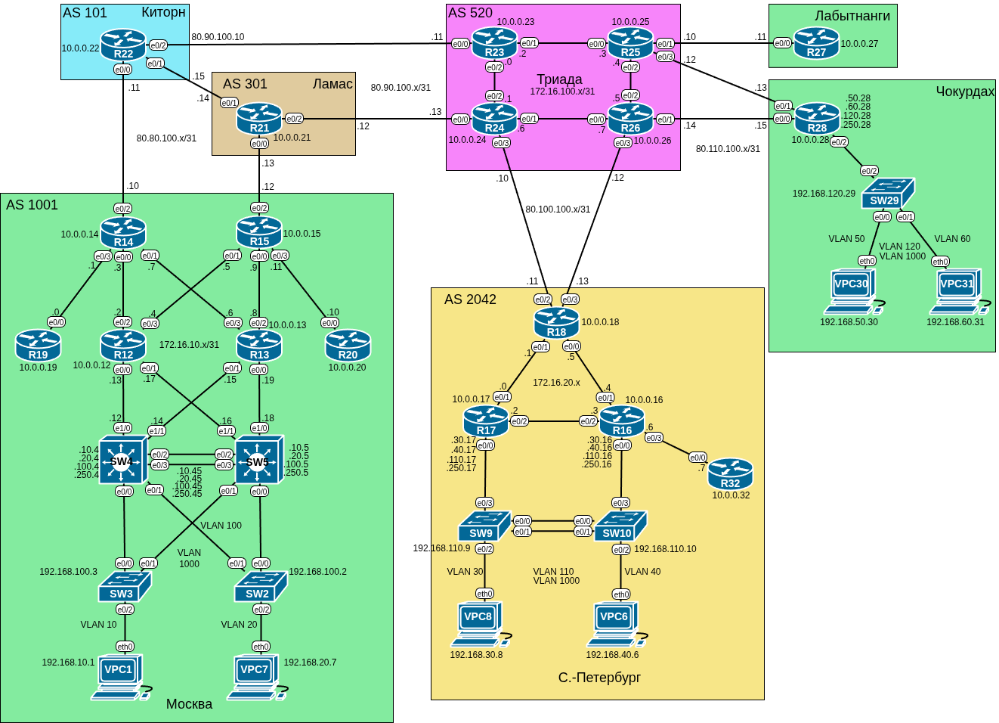

# Домашнее задание №13 «VPN. GRE. DMVPN»

## Цель работы

В данной самостоятельной работе необходимо поднять GRE туннель между офисами
«Москва» и «Санкт-Петербург», настроить DMVPN между офисами «Москва» и «Чокурдах»,
«Лабытнанги».

## Задачи

1. [Настройка GRE.](#настройка-gre)
2. [Настройка DMVPN.](#настройка-dmvpn)
3. [Проверка IP связности.](#проверка-ip-связности)

## Топология

Топология лабораторного стенда собрана в среде EVE-NG.



## Настройка GRE

Настроим GRE между офисами «Москва» и «Санкт-Петербург».

### Настройка туннелей

Создадим на **R15** туннель:

```text
R15(config)#int Tunnel 100
R15(config-if)#
Sep  8 14:56:22.482: %LINEPROTO-5-UPDOWN: Line protocol on Interface Tunnel100, changed state to down
R15(config-if)#  
```

Для туннелей выберем отдельную сеть 172.16.100.0/24, последний октет выберем равным
номеру маршрутизатора.

```text
R15(config-if)#ip address 172.16.100.15 255.255.255.0
```

В качестве адресов source и destination используем лупбэки:

```text
R15(config-if)#tunnel source 10.0.0.15
R15(config-if)#tunnel destination 10.0.0.18
R15(config-if)#
Sep  8 15:17:17.077: %LINEPROTO-5-UPDOWN: Line protocol on Interface Tunnel100, changed state to up
R15(config-if)#
```

Для корректной работы GRE туннеля необходимо изменить значения MTU и MSS (иначе
из-за добавления заголовков инкапсуляции, пакет не влезет в стандартное MTU):

```text
R15(config-if)#ip mtu 1400
R15(config-if)#ip tcp adjust-mss 1360
R15(config-if)#end
R15#
```

Аналогичным образом настроим и на других маршрутизаторах, используя IP-адреса из
таблицы:

| Устройство | Адрес туннеля | Лупбэк    | Номер тоннеля |
| ---------- | ------------- | --------- | ------------- |
| R14        | 172.16.110.14 | 10.0.0.14 | 110           |
| R15        | 172.16.100.15 | 10.0.0.15 | 100           |
| R18        | 172.16.100.18 | 10.0.0.18 | 100           |
| R18        | 172.16.110.18 | 10.0.0.18 | 110           |

Между офисами будет два тоннеля: **R14** - **R18** и **R15** - **R18**.

```text
R18#show int Tunnel 100 | inc Tun
Tunnel100 is up, line protocol is up 
  Hardware is Tunnel
  Tunnel linestate evaluation up
  Tunnel source 10.0.0.18, destination 10.0.0.15
  Tunnel protocol/transport GRE/IP
  Tunnel TTL 255, Fast tunneling enabled
  Tunnel transport MTU 1476 bytes
  Tunnel transmit bandwidth 8000 (kbps)
  Tunnel receive bandwidth 8000 (kbps)
R18#show int Tunnel 110 | inc Tun
Tunnel110 is up, line protocol is up 
  Hardware is Tunnel
  Tunnel linestate evaluation up
  Tunnel source 10.0.0.18, destination 10.0.0.14
  Tunnel protocol/transport GRE/IP
  Tunnel TTL 255, Fast tunneling enabled
  Tunnel transport MTU 1476 bytes
  Tunnel transmit bandwidth 8000 (kbps)
  Tunnel receive bandwidth 8000 (kbps)
R18#
```

### Настройка маршрутов

Теперь осталось только завернуть траффик в туннель, т.е. добавить маршруты до
искомых сетей:

```text
R18(config)#ip route 192.168.10.0 255.255.255.0 172.16.100.15
R18(config)#ip route 192.168.10.0 255.255.255.0 172.16.110.14
R18(config)#ip route 192.168.20.0 255.255.255.0 172.16.100.15
R18(config)#ip route 192.168.20.0 255.255.255.0 172.16.110.14
```

В предыдущих работах для достижения IP связности между клиентскими ПК в разных
офисах мы настраивали редистрибьюцию клиентских сетей в провайдерский eBGP. Например
на **R21** (провайдер «Ламас») мы можем видеть следующие сети:

```text
R21#sh ip rout | inc 192
B     192.168.10.0/24 [20/21] via 80.80.100.12, 01:51:49
B     192.168.20.0/24 [20/21] via 80.80.100.12, 01:51:49
B     192.168.30.0/24 [20/0] via 80.90.100.13, 02:37:56
B     192.168.40.0/24 [20/0] via 80.90.100.13, 02:37:56
B     192.168.100.0/24 [20/21] via 80.80.100.12, 01:51:20
B     192.168.110.0/24 [20/0] via 80.90.100.13, 02:37:56
B     192.168.120.0/24 [20/0] via 80.90.100.13, 02:38:27
R21#
```

Теперь, когда у нас появились туннели, их можно убрать. Настроим фильтрацию
на граничных роутерах.

Создадим префикс-лист для клиентских сетей 192.168.10.0 и 192.168.20.0
(сети управления опустим для упрощения):

```text
R15(config)#ip prefix-list CLIENT_NETS seq 10 permit 192.168.10.0/24
R15(config)#ip prefix-list CLIENT_NETS seq 20 permit 192.168.20.0/24
```

Создадим route-map:

```text
R15(config)#route-map FILTER_CLIENT_NETS deny 10
R15(config-route-map)#match ip address prefix-list CLIENT_NETS
R15(config-route-map)#exit
R15(config)#route-map FILTER_CLIENT_NETS permit 20
R15(config-route-map)#exit
R15(config)#
```

Ограничим с её помощью редистрибьюцию в eBGP провайдера:

```text
R15(config)#router bgp 1001
R15(config-router)#neighbor 80.80.100.13 route-map FILTER_CLIENT_NETS out
R15(config-router)#end
```

Для вступления изменений в силу сделаем soft reset:

```text
R15#clear ip bgp * soft
```

Аналогично поступим на других маршрутизаторах.

Побочным эффектом такой фильтрации 

## Настройка DMVPN

Настроим DMVPN между офисами «Москва», «Чокурдах», «Лабытнанги».

### Настройка хаба

Начнём с HUB - **R15**.

Создадим туннель и укажем режим **multipoint**:

```text
R15(config)#int Tunnel 200
R15(config-if)#tunnel mode gre multipoint
```

Зададим IP-адрес, будем брать из сети 172.16.200.x, где х - номер роутера. Также
укажем WAN-интерфейс:

```text
R15(config-if)#ip address 172.16.200.15 255.255.255.0
R15(config-if)#tunnel source e0/2
R15(config-if)#
Sep  8 17:49:53.175: %LINEPROTO-5-UPDOWN: Line protocol on Interface Tunnel200, changed state to up
R15(config-if)#
```

Подкорректируем MTU и MSS:

```text
R15(config-if)#ip mtu 1400
R15(config-if)#ip tcp adjust-mss 1360
```

Настроим NHRP в туннеле:

```text
R15(config-if)#ip nhrp network-id 200
R15(config-if)#ip nhrp map multicast dynamic
R15(config-if)#end
R15#
```

### Настройка споков

Теперь настроим SPOKE - **R28**.

Создаём туннель:

```text
R28(config)#int Tunnel 200
R28(config-if)#
*Sep  8 17:55:12.640: %LINEPROTO-5-UPDOWN: Line protocol on Interface Tunnel200, changed state to down
```

Назначаем IP-адрес и цепляем туннель к физическому интерфейсу:

```text
R28(config-if)#ip address 172.16.200.28 255.255.255.0
R28(config-if)#tunnel source e0/0
```

Задаём адрес хаба (физический, провайдерский):

```text
R28(config-if)#tunnel destination 80.80.100.12
R28(config-if)#
*Sep  8 17:57:12.147: %LINEPROTO-5-UPDOWN: Line protocol on Interface Tunnel200, changed state to up
```

Корректируем MTU и MSS:

```text
R28(config-if)#ip mtu 1400
R28(config-if)#ip tcp adjust-mss 1360
```

Теперь необходимо настроить NHRP. Задаём идентификатор:

```text
R28(config-if)#ip nhrp network-id 200 
```

Маппинг мультикаст рассылок в адрес хаба (указывается реальный адрес):

```text
R28(config-if)#ip nhrp map multicast 10.0.0.15
```

Указываем туннельный адрес хаба:

```text
R28(config-if)#ip nhrp nhs 172.16.200.15
```

Создаём маппинг для этого туннельного адреса в реальный:

```text
R28(config-if)#ip nhrp map 172.16.200.15 10.0.0.15
R28(config-if)#end
R28#
```

Проверяем, что DMVPN поднялся:

```text
R28#sh ip nhrp
172.16.200.15/32 via 172.16.200.15
   Tunnel200 created 01:19:08, never expire 
   Type: static, Flags: 
   NBMA address: 10.0.0.15 
R28#sh dmvpn
Legend: Attrb --> S - Static, D - Dynamic, I - Incomplete
	N - NATed, L - Local, X - No Socket
	# Ent --> Number of NHRP entries with same NBMA peer
	NHS Status: E --> Expecting Replies, R --> Responding, W --> Waiting
	UpDn Time --> Up or Down Time for a Tunnel
==========================================================================

Interface: Tunnel200, IPv4 NHRP Details 
Type:Spoke, NHRP Peers:1, 

 # Ent  Peer NBMA Addr Peer Tunnel Add State  UpDn Tm Attrb
 ----- --------------- --------------- ----- -------- -----
     1 10.0.0.15         172.16.200.15    UP 00:07:02     S

R28#ping 172.16.200.15
Type escape sequence to abort.
Sending 5, 100-byte ICMP Echos to 172.16.200.15, timeout is 2 seconds:
!!!!!
Success rate is 100 percent (5/5), round-trip min/avg/max = 1/1/4 ms
R28#trace 172.16.200.15
Type escape sequence to abort.
Tracing the route to 172.16.200.15
VRF info: (vrf in name/id, vrf out name/id)
  1 172.16.200.15 4 msec *  2 msec
R28#
```

Настроим аналогично **R27**.

### Проверка тоннелей

Проверим, что на **R15** видны оба тоннеля:

```text
R15#sh ip nhrp        
172.16.200.27/32 via 172.16.200.27
   Tunnel200 created 00:14:14, expire 01:48:23
   Type: dynamic, Flags: unique registered used nhop 
   NBMA address: 80.110.100.11 
172.16.200.28/32 via 172.16.200.28
   Tunnel200 created 00:22:54, expire 01:37:05
   Type: dynamic, Flags: unique registered used nhop 
   NBMA address: 80.110.100.15 
R15#show dmvpn        
Legend: Attrb --> S - Static, D - Dynamic, I - Incomplete
	N - NATed, L - Local, X - No Socket
	# Ent --> Number of NHRP entries with same NBMA peer
	NHS Status: E --> Expecting Replies, R --> Responding, W --> Waiting
	UpDn Time --> Up or Down Time for a Tunnel
==========================================================================

Interface: Tunnel200, IPv4 NHRP Details 
Type:Hub, NHRP Peers:2, 

 # Ent  Peer NBMA Addr Peer Tunnel Add State  UpDn Tm Attrb
 ----- --------------- --------------- ----- -------- -----
     1 80.110.100.11     172.16.200.27    UP 00:14:22     D
     1 80.110.100.15     172.16.200.28    UP 00:23:02     D

R15#
```

### Переход к DMVPN Phase 2

Мы настроили DMVPN Phase 1. Чтобы траффик мог идти не через хаб, а напрямую,
настроим DMVPN Phase 2.

На хабе мы ничего не меняем, на споках убираем адрес назначения:

```text
R27(config-if)#no tunnel destination 80.80.100.12
R27(config-if)#
*Sep  9 14:09:37.967: %LINEPROTO-5-UPDOWN: Line protocol on Interface Tunnel200, changed state to down
```

Меняем адреса привязки с лупбэка на реальный IP:

```text
R27(config-if)#no ip nhrp map multicast 10.0.0.15
R27(config-if)#no ip nhrp map 172.16.200.15 10.0.0.15
R27(config-if)#ip nhrp map multicast 80.80.100.12
R27(config-if)#ip nhrp map 172.16.200.15 80.80.100.12
R27(config-if)#
```

Включаем режим GRE multipoint:

```text
R27(config-if)#tunnel mode gre multipoint
R27(config-if)#
*Sep  9 14:12:02.934: %LINEPROTO-5-UPDOWN: Line protocol on Interface Tunnel200, changed state to up
R27(config-if)#
```

Всё, теперь мы в фазе 2. Аналогичным образом настроим **R28** и проверим, что
траффик между споками может идти напрямую:

```text
R28#trace 172.16.200.27
Type escape sequence to abort.
Tracing the route to 172.16.200.27
VRF info: (vrf in name/id, vrf out name/id)
  1 172.16.200.15 5 msec 2 msec 3 msec
  2 172.16.200.27 4 msec *  6 msec
R28#trace 172.16.200.27
Type escape sequence to abort.
Tracing the route to 172.16.200.27
VRF info: (vrf in name/id, vrf out name/id)
  1 172.16.200.27 2 msec *  2 msec
R28#

R28#sh ip nhrp         
172.16.200.15/32 via 172.16.200.15
   Tunnel200 created 00:01:30, never expire 
   Type: static, Flags: used 
   NBMA address: 80.80.100.12 
172.16.200.27/32 via 172.16.200.27
   Tunnel200 created 00:00:41, expire 01:59:19
   Type: dynamic, Flags: router used nhop 
   NBMA address: 80.110.100.11 
R28#sh dmvpn  
Legend: Attrb --> S - Static, D - Dynamic, I - Incomplete
	N - NATed, L - Local, X - No Socket
	# Ent --> Number of NHRP entries with same NBMA peer
	NHS Status: E --> Expecting Replies, R --> Responding, W --> Waiting
	UpDn Time --> Up or Down Time for a Tunnel
==========================================================================

Interface: Tunnel200, IPv4 NHRP Details 
Type:Spoke, NHRP Peers:2, 

 # Ent  Peer NBMA Addr Peer Tunnel Add State  UpDn Tm Attrb
 ----- --------------- --------------- ----- -------- -----
     1 80.80.100.12      172.16.200.15    UP 00:01:11     S
     1 80.110.100.11     172.16.200.27    UP 00:00:47     D

R28#
```

### Настройка второго хаба

Для резервирования подымем на **R14** второй хаб. Также дополним конфиги на споках:

```text
R28(config-if)#ip nhrp map multicast 80.80.100.10
R28(config-if)#ip nhrp map 172.16.200.14 80.80.100.10 
R28(config-if)#ip nhrp nhs 172.16.200.14
R28(config-if)#ip nhrp registration no-unique
```

Пропинговав **R14** видим, что на нём также появилось оба тоннеля:

```text
R14#sh dmvpn
Legend: Attrb --> S - Static, D - Dynamic, I - Incomplete
	N - NATed, L - Local, X - No Socket
	# Ent --> Number of NHRP entries with same NBMA peer
	NHS Status: E --> Expecting Replies, R --> Responding, W --> Waiting
	UpDn Time --> Up or Down Time for a Tunnel
==========================================================================

Interface: Tunnel200, IPv4 NHRP Details 
Type:Hub, NHRP Peers:2, 

 # Ent  Peer NBMA Addr Peer Tunnel Add State  UpDn Tm Attrb
 ----- --------------- --------------- ----- -------- -----
     1 80.110.100.11     172.16.200.27    UP 00:07:16     D
     1 80.110.100.15     172.16.200.28    UP 00:10:51     D

R14#
```

## Проверка IP связности

Все офисы в лабораторной работе должны иметь IP связность.

Исходно, трафик между клиентскими сетями разных офисов идёт через провайдера.
Так как мы уже указали статические маршруты для GRE на **R15** и **R14**, то
перейдём к настройкам DMVPN тоннеля.

### Редистрибьюция маршрутов в DMVPN

Очевидно, что прописывать статические маршруты для большого количества туннелей
и удалённых офисов неудобно, поэтому для редистрибьюции маршрутов DMVPN настроим
eBGP на хабах и споках.

Настройки хабов:

```text
R15(config)#router bgp 1001
R15(config-router)#neighbor SPOKES peer-group
R15(config-router)#neighbor SPOKES remote-as 1001
R15(config-router)#neighbor SPOKES update-source Tunnel 200     
R15(config-router)#neighbor SPOKES next-hop-self      
R15(config-router)#neighbor SPOKES default-originate
R15(config-router)#bgp listen range 172.16.200.0/24 peer-group SPOKES
```

Настройки споков:

```text
R28(config)#router bgp 1001
R28(config-router)#network 10.0.0.28 mask 255.255.255.255
R28(config-router)#neighbor 172.16.200.14 remote-as 1001
R28(config-router)#neighbor 172.16.200.15 remote-as 1001
R28(config-router)#maximum-paths ibgp 2
```

При таких настройках BGP соседство поднимается, но начинает периодически флапать.

На хабе выводится:

```text
R15#
Sep 10 07:31:21.285: %BGP-5-ADJCHANGE: neighbor *172.16.200.28 Up 
R15#
Sep 10 07:32:42.967: %BGP-3-NOTIFICATION: sent to neighbor *172.16.200.27 4/0 (hold time expired) 0 bytes 
R15#
Sep 10 07:32:42.967: %BGP_SESSION-5-ADJCHANGE: neighbor *172.16.200.27 IPv4 Unicast topology base removed from session  Neighbor deleted
Sep 10 07:32:42.967: %BGP-5-ADJCHANGE: neighbor *172.16.200.27 Down BGP Notification sent
```

А на споке:

```text
R27#
*Sep 10 07:38:14.106: %BGP-5-NBR_RESET: Neighbor 172.16.200.14 reset (Peer closed the session)
*Sep 10 07:38:14.106: %BGP-5-ADJCHANGE: neighbor 172.16.200.14 Down Peer closed the session
*Sep 10 07:38:14.106: %BGP_SESSION-5-ADJCHANGE: neighbor 172.16.200.14 IPv4 Unicast topology base removed from session  Peer closed the session
R27#
*Sep 10 07:38:16.793: %BGP-5-ADJCHANGE: neighbor 172.16.200.15 Up 
R27#
*Sep 10 07:38:28.259: %BGP-5-ADJCHANGE: neighbor 172.16.200.14 Up 
*Sep 10 07:38:28.269: %ADJ-5-PARENT: Midchain parent maintenance for IP midchain out of Tunnel200, addr 172.16.200.14 - looped chain attempting to stack
R27#
```

Это происходит из-за образования петли: маршрут строится через физические (провайдерские)
адреса хабов **R14** и **R15**, которые анонсируются в eBGP провайдера. После установления
тоннельного соединения они редистрибьютятся в iBGP спокам и возникает петля, т.к.
один и тот же адрес становится доступен через сеть провайдера и через тоннель
(причём тоннельный маршрут короче).

Чтобы предотвратить образование петель будем редистрибьютить в туннель только
клиентские сети.

prefix-list для клиентских сетей хабов мы создали ранее, теперь настроим route-map:

```text
R15(config)#route-map OSPF_CLIENT_NETS permit 10
R15(config-route-map)#match ip address prefix-list CLIENT_NETS
R15(config-route-map)#exit
R15(config)#route-map OSPF_CLIENT_NETS deny 20
R15(config-route-map)#exit 
R15(config)#router bgp 1001
R15(config-router)#neighbor SPOKES route-map OSPF_CLIENT_NETS out
R15(config-router)#exit
R15(config)#
```

Теперь флапы исчезли.

### Настройка маршрутизации через DMVPN туннель

Настроим маршрутизацию так, чтобы трафик между клиентскими сетями удалённых офисов
«Чокурдах», «Лабытнанги» и основным офисом «Москва» ходил через DMVPN, а не через
провайдера.

На споках добавим в BGP анонс клиентских сетей

```text
R28(config)#router bgp 1001                                         
R28(config-router)#network 192.168.50.0 mask 255.255.255.0
R28(config-router)#network 192.168.60.0 mask 255.255.255.0
R28(config-router)#end
R28#
```

Проверим, что маршруты редистрибьютятся в туннель:

```text
R15#sh ip bgp neighbors 172.16.200.27 advertised-routes 
BGP table version is 61, local router ID is 10.0.0.15
Status codes: s suppressed, d damped, h history, * valid, > best, i - internal, 
              r RIB-failure, S Stale, m multipath, b backup-path, f RT-Filter, 
              x best-external, a additional-path, c RIB-compressed, 
Origin codes: i - IGP, e - EGP, ? - incomplete
RPKI validation codes: V valid, I invalid, N Not found

Originating default network 0.0.0.0

     Network          Next Hop            Metric LocPrf Weight Path
 *>  192.168.10.0     172.16.10.4             21         32768 ?
 *>  192.168.20.0     172.16.10.4             21         32768 ?

Total number of prefixes 2 
R15#
```

На споке они также видны:

```text
R27#sh ip route | beg 192
B     192.168.10.0/24 [200/21] via 172.16.200.15, 00:04:10
                      [200/21] via 172.16.200.14, 00:04:10
B     192.168.20.0/24 [200/21] via 172.16.200.15, 00:04:10
                      [200/21] via 172.16.200.14, 00:04:10
R27#
```

Так как со спока R27 теперь приходят клиентские сети, то их также нужно добавить
в список фильтрации на хабе, чтобы они не попадали к провайдеру:

```text
R15(config)#ip prefix-list SPOKE_NETS seq 10 permit 192.168.50.0/24
R15(config)#ip prefix-list SPOKE_NETS seq 20 permit 192.168.60.0/24
R15(config)#route-map FILTER_CLIENT_NETS deny 10
R15(config-route-map)#match ip address prefix-list SPOKE_NETS
R15(config-route-map)#exit
```

На споке R28 настроен PBR, чтобы завернуть траффик клиентских сетей в туннель
создадим ACL правило:

```text
R28(config)#ip access-list extended ACL_TO_HUB
R28(config-ext-nacl)# permit ip 192.168.50.0 0.0.0.255 192.168.10.0 0.0.0.255
R28(config-ext-nacl)# permit ip 192.168.50.0 0.0.0.255 192.168.20.0 0.0.0.255
R28(config-ext-nacl)# permit ip 192.168.60.0 0.0.0.255 192.168.10.0 0.0.0.255
R28(config-ext-nacl)# permit ip 192.168.60.0 0.0.0.255 192.168.20.0 0.0.0.255
R28(config-ext-nacl)#exit
```

Добавим его к PBR route-map:

```text
R28(config)#route-map BALANCE permit 5
R28(config-route-map)# match ip address ACL_TO_HUB
R28(config-route-map)# set interface Tunnel200
%Warning:Use P2P interface for routemap setinterface clause
R28(config-route-map)#end
R28#
```

### Проверка маршрутизации

Проверим маршрутизацию между **VPC**:

```text
VPC1> trace 192.168.30.8
trace to 192.168.30.8, 8 hops max, press Ctrl+C to stop
 1   192.168.10.4   0.944 ms  2.242 ms  0.416 ms
 2   172.16.10.15   1.037 ms  0.736 ms  0.961 ms
 3   172.16.10.9   1.016 ms  0.679 ms  0.918 ms
 4   172.16.100.18   2.072 ms  1.477 ms  1.589 ms
 5   172.16.20.4   2.293 ms  2.376 ms  2.867 ms
 6   *192.168.30.8   4.080 ms (ICMP type:3, code:3, Destination port unreachable)
```
Видим, что траффик между VPC офисов «Москва» и «Санкт-Петербург» идёт через GRE
тоннель.

```text
VPC1> trace 192.168.50.30
trace to 192.168.50.30, 8 hops max, press Ctrl+C to stop
 1   192.168.10.4   0.995 ms  0.611 ms  0.743 ms
 2   172.16.10.15   1.149 ms  1.107 ms  0.497 ms
 3   172.16.10.9   1.403 ms  0.867 ms  0.870 ms
 4   172.16.200.28   2.802 ms  2.200 ms  2.625 ms
 5   *192.168.50.30   5.222 ms (ICMP type:3, code:3, Destination port unreachable)
```

Трафиик в клиентскую сеть офиса «Чокурдах» идёт через DMVPN.

VPC30> trace 192.168.10.1
trace to 192.168.10.1, 8 hops max, press Ctrl+C to stop
 1   192.168.50.28   1.308 ms  0.936 ms  0.672 ms
 2   172.16.200.15   2.586 ms  2.653 ms  3.387 ms
 3   172.16.10.4   3.077 ms  4.048 ms  2.678 ms
 4   172.16.10.16   2.863 ms  4.610 ms  2.663 ms
 5   *192.168.10.1   3.614 ms (ICMP type:3, code:3, Destination port unreachable)

## Файлы настроек

Файлы настроек устройств (конфиги) экспортированы в каталог [configs](./configs/).

Готовая лабораторная (экспорт из EVE-NG) - [36_vpn_gre_dmvpn.zip](./36_vpn_gre_dmvpn.zip).
